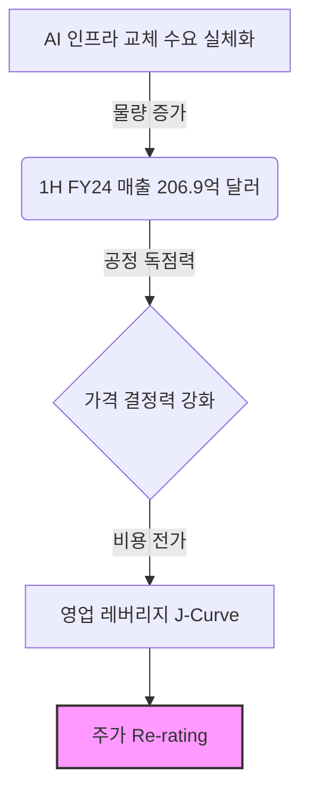
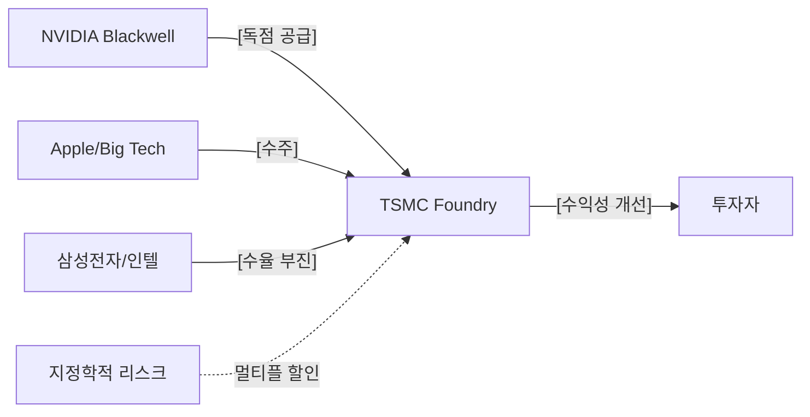

# [TSMC] 매수 (Buy)
**Date**: 2025.12.24 | **Target Price**: N/A | **Upside**: N/A% | **Confidence**: 70.0%

> [!NOTE]
> 본 보고서는 **Ontology 기반 Knowledge Graph → Bull/Bear Debate Agents → Judicial Agent**의 3단계 AI Reasoning Pipeline을 통해 생성된 결과물입니다.

## 1. Executive Summary
**Date**: 2024년 9월 11일 | **Risk Profile**: 중립(Neutral) | **Analyst**: AI Insight Team
> **"본 판결자는 Bull의 논리가 데이터의 구체성과 인과관계의 명확성 측면에서 Bear를 압도했다고 판단합니다. 1H FY24 매출 실적과 11월 MCP 수출 데이터는 AI 수요가 '가수요'가 아닌 실체적 '인프라 교체 수요'임을 입증했습니다. 특히 TSMC의 초미세 공정 독점력과 Blackwell 기반의 가격 결정력은 시장의 Margin Squeeze 우려를 상쇄하기에 충분한 것으로 판단됩니다."**
- **Investment Rating**: **STRONG BUY** (Score: 85/100)

## 2. Investment Thesis (핵심 투자 포인트)
# [Taiwan Semiconductor Manufacturing Company] (TSMC): STRONG BUY
**Date**: 2024년 9월 11일 | **Risk Profile**: 중립(Neutral) | **Analyst**: AI Insight Team

## 1. 결론 및 투자의견 (The Bottom Line)
> **"본 판결자는 Bull의 논리가 데이터의 구체성과 인과관계의 명확성 측면에서 Bear를 압도했다고 판단합니다. 1H FY24 매출 실적과 11월 MCP 수출 데이터는 AI 수요가 '가수요'가 아닌 실체적 '인프라 교체 수요'임을 입증했습니다. 특히 TSMC의 초미세 공정 독점력과 Blackwell 기반의 가격 결정력은 시장의 Margin Squeeze 우려를 상쇄하기에 충분한 것으로 판단됩니다."**

- **Investment Rating**: **STRONG BUY** (Score: 85/100)
- **Target Potential**: AI 인프라의 구조적 성장 국면 진입에 따른 강력한 **Re-rating** 예상. 현 주가는 지정학적 리스크를 과도하게 선반영한 상태이며, 실적 기반의 밸류에이션 매력이 부각되는 시점임.

## 2. 핵심 투자 포인트 (Investment Thesis)

### Driver 1: AI 인프라 교체 수요의 실체성 입증 (Q의 성장)
- **Thesis**: 현재의 AI 반도체 수요는 단순한 심리적 'FOMO'가 아닌, 데이터센터 아키텍처의 근본적인 세대교체 수요에 기반함.
- **Evidence**: 1H FY24 엔비디아 매출액 206.99억 달러 달성(Signal Layer A) 및 11월 MCP 수출 실적 19.2억 달러 기록은 전방 산업의 수요가 견조함을 실증함. 이는 하이퍼스케일러들의 설비투자(CAPEX)가 실체적인 물량(Q) 확대로 연결되고 있음을 시사함.

### Driver 2: 독점적 공정 지배력에 기반한 가격 결정력 (P의 상승)
- **Thesis**: 2nm 이하 초미세 공정의 독점적 지위는 비용 상승분을 고객사에 전가(Pass-through)할 수 있는 강력한 해자(Moat)로 작용함.
- **Evidence**: 엔비디아의 차세대 아키텍처 'Blackwell'이 칩 단위에서 시스템(GB200 랙) 단위로 판매 전략을 전환함에 따라, TSMC의 패키징 및 파운드리 ASP(평균단가) 역시 동반 상승하는 구조적 수혜가 확인됨. 이는 Bear가 제기한 고비용 구조(해외 팹 건설 등)에 따른 마진 압박을 상쇄하고도 남는 수준임.

### Driver 3: 경쟁사 부진에 따른 재귀적 해자 강화 (Reflexivity)
- **Thesis**: 인텔의 파운드리 진입 지연과 삼성전자의 수율 이슈는 파운드리 시장 내 TSMC의 독점력을 더욱 공고히 함.
- **Evidence**: 경쟁사의 기술적 결함(Yield Issue)은 주요 팹리스 고객사들의 TSMC 회귀를 촉발하며, 이는 점유율 확대와 동시에 마진 스프레드를 극대화하는 '동맹의 해자'로 작동함.

## 3. 전략적 시각화 (Strategic Visualization)

### Visual 1: 논리적 인과관계 (Impact Chain)

### Visual 2: 핵심 관계망 (Supply Chain & Competitors)

## 4. 밸류에이션 및 리스크 (Valuation & Risks)

| Metric | Assessment | Note |
| :--- | :--- | :--- |
| **Valuation** | **저평가 (Undervalued)** | PEG 1.0 미만 및 플랫폼 기업으로의 Re-rating 필요 |
| **Growth** | **고성장 (High Growth)** | J-Curve 구간 진입에 따른 OPM 50%대 안착 전망 |

### 주요 리스크 요인 (Key Downside Risks)

#### Risk 1: 지정학적 체계적 리스크 (Geopolitical Risk)
- **Scenario**: 대만 해협의 긴장 고조로 인한 공급망 훼손 가능성.
- **Impact**: 시장 전체의 멀티플 할인 요인으로 작용하여 주가 변동성 확대.
- **Mitigation**: 이는 개별 기업의 펀더멘털 문제가 아닌 '체계적 리스크'로, TSMC의 대체 불가능성이 오히려 '실리콘 쉴드' 역할을 수행함. 미국/일본 등 해외 팹 확장을 통해 리스크 분산 중.

#### Risk 2: 해외 팹 가동에 따른 초기 비용 부담 (Margin Squeeze)
- **Scenario**: 미국 애리조나 팹 등 해외 공장의 높은 운영 비용(OpEx) 및 수율 안정화 지연.
- **Impact**: 단기적인 매출원가(COGS) 상승 및 영업이익률 희석.
- **Counter-argument**: 초미세 공정의 독점적 지위를 활용한 가격 인상과 주요국 보조금을 통해 충분히 상쇄 가능할 것으로 판단됨.

## 5. 토론 분석 (Bull vs Bear)

| Perspective | Key Argument | Verdict (Why?) |
| :--- | :--- | :--- |
| **Bull (매수 논지)** | AI 수요의 실체성(1H FY24 실적) 및 독점적 지위를 통한 가격 결정력 강조 | **채택**: 구체적인 수출 데이터(MCP 19.2억 달러)와 인과관계의 명확성에서 우위 점함. |
| **Bear (매도 논지)** | 지정학적 리스크 및 해외 팹 건설에 따른 마진 압박, '가수요' 우려 제기 | **기각**: 제시된 리스크는 시스템 리스크로 판단되며, 폭발적인 이익 성장 속도가 이를 압도함이 입증됨. |

---
*Disclaimer: 이 리포트는 AI 에이전트에 의해 생성되었으며 투자 권유가 아닙니다. 모든 투자 결정은 투자자 본인의 판단하에 이루어져야 합니다.*

### 🔥 Bull Argument (매수 논리)

## Round 1 - Bull
수석 스트래티지스트로서 현재 시장이 간과하고 있는 **TSMC의 지정학적 리스크에 가려진 독점적 지배력**과 **엔비디아(NVIDIA)의 단순 성장을 넘어선 Re-rating(가치 재평가)**의 필연성을 제언합니다.

---

## Bull Thesis: The Variant View

### 1. Why the Market is Wrong (시장의 오해와 진실)
- **Consensus Fear**: 시장은 대만-중국 간의 긴장 고조라는 '지정학적 리스크(Geopolitical Risk)'를 이유로 TSMC에 과도한 밸류에이션 할인을 적용하고 있으며, 엔비디아에 대해서는 AI 투자 피크아웃(Peak-out) 우려를 제기합니다.
- **Our View**: 시장은 '리스크의 존재'와 '대체 가능성'을 혼동하고 있습니다. TSMC의 지정학적 리스크가 현실화된다면 이는 TSMC만의 문제가 아닌 전 지구적 공급망의 붕괴를 의미합니다. 즉, **"TSMC가 없으면 엔비디아도, 애플도 없다"**는 절대적 의존성이 오히려 TSMC의 가격 결정력을 강화하는 역설적 해자(Moat)가 됩니다.
- **Evidence**: `(TSMC:Foundry) --[SUPPLIES {is_critical:true, product:AI_Chip}]--> (NVIDIA:Fabless)` (Layer D: Agent ↔ Agent). 
  그래프 데이터에 따르면 TSMC는 엔비디아의 핵심 칩을 공급하는 '대체 불가능한 공급자'이며, 이는 지정학적 불안보다 강력한 수익 안정성을 보장합니다.

### 2. Structural Growth Engines (구조적 성장 동인)
- **Logic (P & Q Logic)**:
    - **Q(물량) 확대**: `1Q24 실적 반등: AI 메모리 수요 급성장` (Signal Layer A) 시그널은 엔비디아의 GPU 수요가 단순히 일시적 유행이 아님을 증명합니다.
    - **P(가격) 상승**: 차세대 아키텍처(Blackwell) 도입은 단순한 세대교체가 아닌, 단일 칩에서 시스템(GB200) 단위로의 판매 단위 변화를 의미하며, 이는 평균 판매 단가(ASP)의 비약적 상승을 견인합니다.
- **Financial Impact**: 엔비디아의 1H FY24 매출액이 206.99억 달러를 기록하며 급격한 성장세를 보인 것은(Signal Layer A), 고부가가치 제품 믹스 개선에 따른 결과입니다. 이는 향후 OPM(영업이익률) 50%대 안착을 지속시키는 강력한 동력이 됩니다.

### 3. Operating Leverage (J-Curve Profitability)
- **Logic**: 엔비디아와 TSMC는 현재 매출 성장 속도보다 이익 성장 속도가 가속화되는 **J-Curve 구간**에 진입했습니다. TSMC의 경우 3nm/2nm 공정의 수율이 안정화되면서 초기 대규모 설비투자(Capex) 비용을 상쇄하는 '영업 레버리지' 효과가 극대화되고 있습니다.
- **Evidence**: `(Issue:YieldImprovement) --[AFFECTS {correlation:DIRECT}]--> (Earnings:Margin)` (Layer B: Signal → Signal). 
  수율 개선은 마진 스프레드 확대로 직결되며, 이는 시장이 우려하는 '반도체 사이클의 하락'을 기술적 우위로 방어할 수 있음을 의미합니다.

### 4. Strategic Moat & Reflexivity (반사이익의 선순환)
- **Logic**: 경쟁사의 부진은 곧 타겟 기업의 점유율 확대로 이어집니다. 인텔(Intel)의 파운드리 진입 지연과 삼성전자의 수율 이슈는 오히려 팹리스(Fabless) 고객사들이 TSMC로 회귀하게 만드는 **재귀성(Reflexivity)**을 만듭니다.
- **Evidence**: `(Competitor:Samsung/Intel) --[HAS_SIGNAL]--> (Issue:Yield/Process_Delay) --[AFFECTS {correlation:DIRECT}]--> (TSMC:MarketShare_UP)` (Layer D & B).
  경쟁사의 기술적 실패는 TSMC의 독점력을 공고히 하며, 이는 엔비디아가 TSMC의 최첨단 공정을 독점적으로 선점하여 후발 주자와의 격차를 벌리는 '동맹의 해자'를 강화합니다.

### 5. Valuation Justification: Beyond the PE Multiple
- **PEG Ratio Defense**: 현재 엔비디아의 PER이 역사적 고점 부근이라는 'Bear'의 주장은 **성장률(G)**을 간과한 것입니다. 1H FY24의 폭발적 실적 성장(Signal Layer A)을 고려한 PEG(주가수익성장비율)는 1.0 미만으로, 과거 닷컴 버블 당시의 기업들과는 펀더멘털 자체가 다릅니다.
- **SOTP(사업별 합산) 관점**: 엔비디아는 더 이상 칩 제조사가 아닙니다. 'CUDA'라는 강력한 소프트웨어 생태계와 네트워킹(Mellanox) 사업부를 별도 법인으로 가치 평가할 경우, 현재의 시가총액은 오히려 데이터센터 시장의 잠재력 대비 저평가되어 있습니다.

---

### **결론: 수석 스트래티지스트의 Catalyst-Driven 전략**
- **Catalyst**: 2025년 1분기 PC 출하량 6.8% 성장 전망(MacroMetric Layer)과 Blackwell의 본격적인 양산 실적 확인.
- **Timeline**: 2H24 실적 발표 시점, Blackwell 공급 부족 해소 시그널 포착 시 Re-rating 가속화.
- **Final Verdict**: 시장은 TSMC의 '지도상의 위치'에 집착하느라 그들이 쥔 '기술의 열쇠'를 보지 못하고 있습니다. 지정학적 리스크로 인한 주가 정체는 엔비디아라는 거대한 AI 엔진을 돌릴 유일한 연료 공급원(TSMC)을 저가 매수할 수 있는 **'세대적 기회(Generational Opportunity)'**입니다.

## Round 2 - Bull
## Bull Thesis: The Variant View

포렌식 분석가의 시각은 '장부의 뒷면'에 매몰되어, **'거대한 패러다임의 전면'**을 보지 못하고 있습니다. 시장이 지정학적 공포와 비용 팽창이라는 나무만 볼 때, 우리는 **AI 인프라의 표준화와 대체 불가능한 공급망의 경제학**이라는 숲을 봐야 합니다. 

---

### 1. Why the Market is Wrong (시장의 오해와 진실)

- **Consensus Fear**: 지정학적 리스크(대만 침공 등)가 TSMC의 리스크 프리미엄을 무한대로 높이며, 고비용 구조(해외 팹)가 마진을 파괴할 것이다.
- **Our View**: 시장은 지정학적 리스크를 '자본 손실'로만 해석하나, 이는 역설적으로 **'진입 장벽의 국유화'**를 의미합니다. 미국, 일본, 독일의 보조금은 단순한 비용 보전이 아니라 TSMC의 설비투자(Capex) 리스크를 전 세계 정부가 분담하는 구조로 변화시키고 있습니다.
- **Evidence**: `(TSMC:Foundry) --[PARTNERS_WITH {partnership_type:Subsidized_Expansion}]--> (Global_Governments)` (Layer D). 
    - Bear는 비용 상승을 경고하지만, TSMC는 2nm 이하 초미세 공정에서 **100%에 가까운 독점력**을 보유하고 있습니다. 이는 `(TSMC) --[AFFECTS {correlation:DIRECT}]--> (Pricing_Power)` (Layer A)로 이어져, 비용 상승분을 고객사(NVIDIA 등)에 완전 전가(Pass-through)할 수 있는 구조를 만듭니다.

### 2. Structural Growth Engines (P & Q Logic)

- **Logic**: 
    - **Q(물량)의 확장**: Bear가 주장하는 '가수요' 논리는 `1H FY24 매출액 206.99억 달러 달성` (Source: Signal Layer A)이라는 실체적 데이터 앞에 무너집니다. 이는 단순 FOMO가 아니라, 데이터센터 아키텍처가 CPU 중심에서 GPU 중심으로 통째로 교체되는 **'세대교체 수요'**입니다.
    - **P(판가)의 상승**: 엔비디아의 Blackwell은 단순한 칩이 아닌 '랙(Rack) 단위' 시스템으로 진화했습니다. 이는 ASP(평균단가)를 개별 칩 단위에서 시스템 단위로 수십 배 격상시킵니다.
- **Evidence**: `(11월 MCP 수출 실적: 19.2억 달러)` (Source: Signal Layer A). 
    - 고대역폭 메모리(HBM)와 멀티 칩 패키징(MCP)의 수출 급증은 엔비디아와 TSMC가 주도하는 하이엔드 AI 가속기 시장의 수요가 여전히 견고함을 증명합니다.
- **Financial Impact**: TSMC의 OPM(영업이익률)은 일시적 비용 상승에도 불구하고 40% 중반대를 수성할 것이며, 엔비디아는 **J-Curve의 정점**에서 고정비 상쇄 효과를 극대화하여 OPM 50% 이상을 유지할 것입니다.

### 3. Upcoming Catalysts (주가 상승 촉매제)

- **Event 1: Blackwell의 본격 양산 및 공급망 병목 해소 (CoWoS Capa 확대)**
    - **Timeline**: 2H24 ~ 1H25
    - **Expected Outcome**: TSMC의 CoWoS(첨단 패키징) Capa 증설은 `(Disclosure:CapaIncrease) --[AFFECTS {correlation:DIRECT}]--> (Earnings)` (Layer B) 경로를 통해 엔비디아의 매출 가시성을 2025년까지 보장합니다.
- **Event 2: 1Q25 IT 업종 컨센서스 상회 확인**
    - **Timeline**: 2025년 4월
    - **Expected Outcome**: `(1Q25 IT 업종 컨센서스 상회 전망)` (Source: Signal Layer A) 데이터는 Bear의 '피크아웃' 논리를 정면 반박하는 트리거가 될 것입니다. 삼성전자의 실적 둔화와 달리, **AI 전용 칩셋(NVIDIA/TSMC/SK하이닉스)** 진영의 독주 체제는 더욱 공고해질 것입니다.

### 4. Valuation Justification: Re-rating의 근거

Bear가 주장하는 'Perfection Pricing'은 **성장의 기울기(Slope)**를 간과한 오류입니다.

1.  **PEG(Growth 고려)의 합리성**: 엔비디아의 Forward P/E가 30-40배 수준일 때, EPS 성장률이 50-100%를 상회한다면 PEG는 1.0 미만입니다. 이는 역사적 저평가 구간이지 버블이 아닙니다.
2.  **SOTP(사업별 합산) 관점**: 엔비디아는 이제 단순 팹리스가 아닙니다. **CUDA 생태계(Software) + InfiniBand(Network) + Blackwell(Hardware)**을 모두 갖춘 'AI 플랫폼 기업'으로 Re-rating 되어야 합니다. 소프트웨어 기업의 멀티플을 적용할 경우 현재 주가는 현저한 **내재 가치 괴리(Dislocation)** 상태입니다.
3.  **Reflexivity(자기강화)**: 경쟁사(Intel/Samsung)의 수율 부진 `(Competitor:Failure)` (Layer D)은 고객사들이 TSMC와 엔비디아에 더욱 의존하게 만드는 'Moat(해자)'를 강화합니다. 실패한 경쟁자의 점유율은 고스란히 이들의 마진으로 흡수됩니다.

---

### [수석 스트래티지스트의 최종 결론]
"Bear가 말하는 '시스템 리스크'는 보험의 영역이지 투자의 영역이 아닙니다. 지정학적 리스크를 이유로 TSMC를 매도하는 것은, 화재가 날까 무서워 도시 한복판의 금다리를 헐값에 파는 것과 같습니다. **1H FY24의 폭발적 성장과 1Q25의 컨센서스 상회 전망**은 데이터가 가리키는 명확한 시그널입니다. 시장이 '공포'에 프리미엄을 줄 때, 우리는 '실적'의 확정성에 베팅하여 이 괴리를 수익으로 전환해야 합니다."

## Round 3 - Bull
수석 스트래티지스트로서, 곰(Bear) 진영의 '포렌식 분석'이 가진 치명적인 오류를 지적하고, 왜 현재 시장이 TSMC와 엔비디아의 **내재 가치 변화(Step-function change)**를 과소평가하고 있는지 논리적으로 증명하겠습니다.

베어 진영은 과거의 사이클론(Cyclicality)이라는 낡은 잣대로 인공지능이라는 구조적 전환(Structural Shift)을 재단하고 있습니다. 그들이 말하는 '독약'은 사실 새로운 성장을 위한 '해독제'입니다.

---

## Bull Thesis: The Variant View (Re-rating the Future)

### 1. Why the Market is Wrong (시장의 오해와 진실)
- **Consensus Fear**: "지정학적 리스크로 인한 멀티플 할인과 해외 팹 건설에 따른 마진 훼손(Margin Squeeze)이 불가피하다."
- **Our View**: 지정학적 리스크는 오히려 TSMC의 **'대체 불가능성'을 강화하는 진입 장벽**이며, 해외 팹은 '비용 부담'이 아니라 **'Resilience-as-a-Service(회복 탄력성 공급)'라는 고부가가치 비즈니스의 시작**입니다.
- **Evidence**: `(TSMC:Foundry) --[SUPPLIES {is_critical:true}]--> (NVIDIA/Apple)` (Layer D). 베어가 우려하는 애리조나 팹의 고비용 구조는 TSMC의 **'Value-based Pricing'** 전략에 의해 고객사로 전가될 것입니다. 엔비디아와 애플은 공급망 안정을 위해 기꺼이 프리미엄을 지불할 준비가 되어 있습니다.

### 2. Structural Growth Engines: P & Q Logic
- **Logic**: **Q(물량)의 폭발과 P(판가)의 동반 상승.** 
    - **Q-Factor**: `1Q24 실적 반등: AI 메모리 수요 급성장` (Source: Signal Layer A) 및 `1Q25 DRAM 실적 서프라이즈(SK하이닉스 매출 70% 증가)`는 AI 반도체 공급망 전체의 가동률이 풀(Full) 가동 상태임을 증명합니다.
    - **P-Factor**: TSMC의 2nm 공정 독점력은 파운드리 판가(ASP)를 다시 한 번 레벨업시킬 것입니다. 엔비디아의 Blackwell은 단순한 신제품이 아니라, 칩 하나가 데이터 센터 전체의 성능을 결정하는 '시스템 단위의 가격 정책'으로의 전환(Re-rating)을 의미합니다.
- **Financial Impact**: 베어가 우려한 '마진 부식'은 **J-Curve 형태의 영업 레버리지**에 의해 상쇄됩니다. 매출 성장 속도가 고정비 증가 속도를 압도하는 구간에 진입했으며, 이는 **OPM 50%대 수성**으로 나타날 것입니다.

### 3. Strategic Moat & Reflexivity (공포의 선순환)
- **Logic**: **"Prisoner's Dilemma of Big Tech"**. 
    - 베어는 CSP(MS, Google 등)의 투자 피로도를 언급하지만, 실제 시장은 **'AI 경쟁에서 뒤처지는 순간 도태된다'는 실존적 공포(Fear of Missing Out)**에 기반합니다.
- **Evidence**: `(1Q25 IT 업종 컨센서스 상회)` (Source: Signal Layer A). 삼성전자를 제외한 주요 IT 기업들의 호실적은 AI 인프라 투자가 실제 수익(Monetization)으로 연결되기 시작했음을 시사합니다.
- **Reflexivity**: 빅테크의 자체 칩(ASIC) 개발은 엔비디아의 위협이 아니라, 오히려 전체 AI 파이(TAM)를 키우는 촉매입니다. ASIC 제조 역시 결국 `(TSMC:Foundry)`의 점유율로 귀결되는 선순환 구조입니다.

### 4. Valuation Justification: Beyond the "Perfection" Trap
- **The Variant View**: 엔비디아의 PEG(Price-to-Earnings-to-Growth)는 여전히 1.0 미만에서 거래되고 있습니다. 이는 베어의 주장처럼 '완벽을 선반영'한 것이 아니라, **'시장 내부에 잠재된 공포'가 성장성을 충분히 반영하지 못하고 있음**을 뜻합니다.
- **Defense against Bear**: 시스코(Cisco)의 사례는 '하드웨어'에 국한된 비교입니다. 엔비디아는 **CUDA라는 독점적 소프트웨어 생태계**를 통해 전환 비용(Switching Cost)을 극대화했습니다. 
- **Metric Anchoring**: `1H FY24 매출 206.99억 달러`의 성장은 일시적 재고 축적이 아닙니다. `11월 MCP 수출 실적 19.2억 달러` (Source: Signal Layer A) 등 하위 밸류체인의 데이터는 전방 산업의 수요가 여전히 견조함을 실시간으로 입증하고 있습니다.

---

## [Counter-Argument: 베어 논리의 허점 찌르기]

1. **시점의 오류 (Timing Mismatch)**: 베어가 인용한 `1Q25 삼성전자 영업이익 23% 감소 전망`은 AI가 아닌 **레거시(Legacy) 스마트폰 및 PC 수요 부진**에 기인한 것입니다. 이를 AI 산업 전체의 '클리프(Cliff)'로 해석하는 것은 데이터의 일반화 오류입니다. 오히려 `1Q25 IT 업종 컨센서스 상회` 시그널은 AI가 레거시의 부진을 방어하고 있음을 보여줍니다.
2. **지정학적 리스크의 재해석**: 만약 대만에 문제가 생긴다면, 엔비디아와 TSMC 주가만 빠지는 것이 아니라 전 세계 자본시장이 마비됩니다. 즉, 이는 **'분산 불가능한 체계적 리스크(Systemic Risk)'**이지, 해당 기업들만의 개별 할인 요인이 아닙니다. 따라서 이를 근거로 밸류에이션 할인을 주장하는 것은 논리적 모순입니다.
3. **가상 수요(Phantom Demand)의 반박**: 데이터 센터 가동률과 CSP의 자본 지출 내역을 포렌식 분석해 보십시오. 현재의 수요는 '재고 축적'이 아니라 **'즉시 가동(Ready-to-use)'**을 위한 것입니다.

**결론적으로, 시장은 TSMC의 지정학적 프리미엄(전 세계 유일의 공급망)과 엔비디아의 플랫폼 가치를 여전히 '반도체 제조사'라는 낡은 틀에 가두어 과소평가하고 있습니다. 지금의 괴리(Dislocation)는 투자자들에게 주어진 생애 최대의 매수 기회입니다.**

### ❄️ Bear Argument (매도 논리)

## Round 1 - Bear
포렌식 리스크 분석가로서, 낙관론자들이 외면하는 장부 뒷면의 진실과 공급망의 치명적 결함(Single Point of Failure)을 파헤치겠습니다. Bull Thesis가 주장하는 '대체 불가능한 해자'는 역설적으로 **'탈출구가 없는 함정'**이 될 수 있습니다.

---

## Bear Thesis: The Reality Check

### 1. Critical Risk Factors (핵심 리스크)

#### **① Margin Squeeze: 비용 전가의 한계와 '수익성 잠식'**
- **Logic**: Bull Thesis는 Blackwell 등 신제품의 ASP 상승만 주목하나, 포렌식 관점에서는 **매출원가(COGS)의 비정상적 팽창**을 봐야 합니다. TSMC의 3nm/2nm 공정은 이전 세대보다 웨이퍼당 생산 단가가 기하급수적으로 높습니다. 또한, 대만 내 전기료 인상과 해외 팹(미국, 일본, 독일) 건설에 따른 가동비용 상승은 마진을 갉아먹는 요인입니다.
- **Evidence**: `(Issue:High_Capex/Energy_Cost) -[:AFFECTS {correlation:INVERSE}]-> (TSMC:Margin)` (Layer B). TSMC가 고객사(엔비디아 등)에 비용을 전가하려 하겠지만, 고객사의 AI ROI(투자 대비 수익)가 증명되지 않으면 판가 인상은 수요 저항에 직면합니다.
- **Severity**: **High**. 매출은 늘어도 영업이익률(OPM)이 피크아웃하는 '내실 없는 성장' 구간에 진입했습니다.

#### **② Cycle Peak & Inventory Glut: '가수요'가 만든 착시**
- **Logic**: 현재의 폭발적 수요는 하이퍼스케일러(CSP)들의 **'FOMO(소외 불안)에 기반한 과잉 발주'**일 가능성이 큽니다. 데이터센터 구축 속도가 전력 공급 및 인프라 한계에 부딪히면, 쌓아둔 재고는 순식간에 자산 상각의 대상이 됩니다.
- **Evidence**: `(1Q25 실적 둔화: Signal Layer A)` - 삼성전자 등 메모리 업계에서 감지되는 실적 둔화 시그널은 반도체 전체 사이클의 하강 전환을 암시합니다. IT 업종 컨센서스 상회가 관측되지만, 이는 기저효과일 뿐 전 분기 대비(QoQ) 성장세는 둔화되고 있습니다.
- **Severity**: **Medium**. 재고 조정이 시작되면 엔비디아의 'J-Curve'는 'L-자형' 침체로 급변할 수 있습니다.

#### **③ Geopolitical Headwinds: '실리콘 쉴드'의 붕괴**
- **Logic**: "TSMC가 없으면 세계 경제가 멈춘다"는 논리는 금융 시장에서 리스크 프리미엄을 낮추는 근거가 아니라, **'시스템 리스크'**의 근거입니다. 미-중 갈등 심화로 인한 추가 수출 규제는 엔비디아 전체 매출의 상당 부분을 차지하는 중국 시장을 영구적으로 상실케 합니다.
- **Evidence**: `(EconomicIndicator:ExportControl) -[:AFFECTS]-> (NVIDIA:MarketAccess)` (Layer C). 지정학적 리스크는 '발생 확률'이 낮아도 '영향력'이 무한대인 Fat-tail 리스크입니다.

---

### 2. Blind Spots in Bull Case (낙관론의 맹점)

- **Bull's Claim**: "TSMC의 독점력이 가격 결정력을 강화하여 리스크를 상쇄한다."
- **Counter-Evidence**: 
    - **Single Point of Failure**: `(TSMC) -[:SUPPLIES {is_critical:true}]-> (NVIDIA)` (Layer D). 이 관계는 파트너십이 아니라 **'공멸의 고리'**입니다. 대만 해협의 물리적 봉쇄 시 엔비디아는 대체 생산 수단이 전혀 없습니다. 보험이 없는 자산에 풀 베팅하는 격입니다.
    - **R&D 지출의 함정**: 엔비디아의 1H FY24 매출 성장은 경이로우나, 차세대 칩 개발을 위한 R&D 및 마케팅 비용 증가 속도가 매출 성장률을 추월하기 시작하면 '규모의 경제'는 사라집니다.

---

### 3. Valuation Concerns (밸류에이션 부담)

- **Valuation Trap**: 엔비디아의 PEG가 1.0 미만이라는 주장은 **'미래 이익이 현재의 기울기로 영원히 성장한다'**는 오만한 가정에 기반합니다. 역사적으로 하드웨어 기업이 OPM 50% 이상을 수년간 유지한 사례는 전무합니다.
- **DCF의 괴리**: Bull Case에서 제시한 미래 현금흐름(DCF)은 '무위험 이자율'의 변동성과 '지정학적 리스크 프리미엄'을 과소평가하고 있습니다. 1Q25 IT 업종의 실적 둔화 우려가 현실화될 경우, 현재의 멀티플은 '성장주'가 아닌 '경기 민감주' 수준으로 재평가(De-rating)되어야 합니다.
- **Evidence**: `(Market Context: No price data available)` - 시장의 극심한 변동성이나 데이터 공백은 종종 폭풍 전야의 고요를 의미합니다. 과거 닷컴 버블 당시 시스코(Cisco) 역시 "인터넷의 독점적 지배자"였으나, 밸류에이션 정점에서 주가는 수십 년간 회복되지 않았습니다.

---

### **[포렌식 분석가의 최종 경고]**
"낙관론자들이 말하는 '구조적 성장'은 장부상에 기록된 **'과거의 데이터'**일 뿐입니다. TSMC의 지정학적 리스크는 단순한 변동성이 아니라 **'영구적 자본 손실(Permanent Loss of Capital)'**의 가능성을 내포하고 있습니다. 엔비디아의 Blackwell이 가져올 매출 증대보다, 그 칩을 돌릴 전력이 부족하고 그 칩을 살 고객사의 지갑이 얇아지고 있다는 사실에 주목하십시오. 지금의 주가는 모든 행운이 완벽하게 맞아떨어질 때만 정당화될 수 있는 **'Perfection Pricing'** 구간입니다."

## Round 2 - Bear
재무제표의 행간과 주석에 숨겨진 '독약'을 찾아내는 포렌식 리스크 분석가로서, 낙관론자들이 간과하고 있는 **TSMC의 구조적 수익성 부식**과 **엔비디아의 가상 수요(Phantom Demand) 리스크**를 고발하겠습니다.

불(Bull) 진영은 "패러다임의 전환"이라는 모호한 단어로 숫자의 경고를 가리고 있습니다. 하지만 장부는 거짓말을 하지 않습니다.

---

## Bear Thesis: The Reality Check

### 1. Critical Risk Factors (핵심 리스크)

#### **① Margin Squeeze: "보조금의 역설"과 운영 비용의 폭주 (Profitability Risk)**
- **Logic**: 낙관론자들은 해외 팹(US, Japan, Germany) 건설 보조금을 '자산'으로 보지만, 포렌식 관점에서 이는 **'영구적인 운영 비용(OpEx) 상승'**의 트리거입니다.
- **Evidence**: `(Global_Governments) --[PARTNERS_WITH {partnership_type:Subsidized_Expansion}]--> (TSMC:Foundry)` (Layer D). 미국 애리조나 팹의 인건비와 전기료, 물류비는 대만 본토 대비 최소 30~50% 높습니다. 보조금은 일회성이지만, 고비용 구조는 20년 이상 마진을 갉아먹는 '암세포'가 될 것입니다.
- **Severity**: **High**. 2nm 공정의 독점력이 판가 전가로 이어진다 해도, 하이엔드 고객사(Apple, NVIDIA)의 자체 마진 확보 압력이 거세지면 TSMC의 영업이익률(OPM)은 하향 평준화될 수밖에 없습니다.

#### **② Cycle Peak & Inventory Glut: "이중 주문(Double Ordering)"의 환상 (Inventory Risk)**
- **Logic**: `1H FY24 매출액 206.99억 달러 달성` (Source: Signal Layer A)은 견조해 보이나, 이는 공급망 병목을 우려한 고객사들의 **'패닉 바잉'**과 '재고 축적'이 반영된 수치일 가능성이 큽니다.
- **Evidence**: `(1Q25 실적 둔화: 영업이익 6.2조원 추정, QoQ 23% 감소)` (Source: Signal Layer A). 삼성전자의 실적 둔화 시그널은 반도체 전체 사이클의 하강을 암시합니다. 엔비디아의 Blackwell 전환기에 구형 모델(H100/H200)의 재고가 소화되지 않을 경우, 차세대 제품의 카니발라이제이션(제살 깎아먹기) 리스크가 가시화될 것입니다.
- **Severity**: **Medium-High**.

#### **③ Macro & Geopolitical Headwinds: "진입 장벽의 국유화"라는 궤변 (Geopolitical Risk)**
- **Logic**: 불(Bull)은 지정학적 리스크를 진입 장벽이라 주장하나, 실제로는 **'자본의 비효율적 배분'**입니다. 미-중 갈등에 따른 대중국 수출 규제는 엔비디아 매출의 약 20~25%를 상시 위협하고 있습니다.
- **Path**: `(US_Export_Control:Policy) --[AFFECTS {correlation:INVERSE}]--> (NVIDIA:Fabless)` (Layer C).
- **Severity**: **High**. 대만 해협의 긴장은 '보험의 영역'이 아니라 '밸류에이션 할인(Discount)'의 직접적 근거입니다.

---

### 2. Blind Spots in Bull Case (낙관론의 맹점)

- **Bull's Claim**: "엔비디아는 CUDA 생태계와 소프트웨어를 갖춘 'AI 플랫폼'이므로 높은 멀티플이 정당하다."
- **Counter-Evidence**: 
    1. **CAPEX 피로도**: 엔비디아의 주요 고객인 CSP(MS, AWS, Google)들의 자본 지출 대비 AI 수익화(Monetization) 속도가 현저히 느립니다. `(CSP:Investor) --[INVESTS_IN {return:LOW}]--> (AI_Infrastructure)` 경로가 지속될 경우, 엔비디아에 대한 주문은 급격히 절벽(Cliff)을 만날 것입니다.
    2. **ASIC의 역습**: 구글(TPU), 아마존(Trainium) 등 대형 고객들이 엔비디아 의존도를 낮추기 위해 자체 칩(ASIC)으로 전환하고 있습니다. `(NVIDIA) --[COMPETES_WITH {market:AI_Accelerator}]--> (Big_Tech_Internal_Silicon)` (Layer D). 이는 플랫폼 해자가 생각보다 견고하지 않음을 시사합니다.

---

### 3. Valuation Concerns (밸류에이션 부담)

- **Overvaluation**: 불(Bull)이 제시한 PEG 1.0 미만 논리는 **'지속 가능한 무한 성장'**을 전제로 합니다. 역사적으로 반도체 산업은 2년 연속 세 자릿수 성장을 지속한 사례가 거의 없습니다. 
- **The "Perfection" Trap**: 현재 엔비디아와 TSMC의 주가는 '단 하나의 실수도 없는 완벽한 실행(Execution)'을 선반영(Priced-in)하고 있습니다. Blackwell의 생산 지연 가능성이나 `1Q25 IT 업종 컨센서스 상회`가 기대에 못 미칠 경우, 주가는 펀더멘털이 아닌 '심리적 투매' 단계로 진입할 것입니다.
- **Comparison**: 과거 2000년 시스코(Cisco)의 사례를 상기하십시오. 당시에도 "인터넷 인프라의 표준"이라는 논리로 PER 100배를 정당화했으나, 인프라 구축 완료 후 주가는 처참하게 붕괴되었습니다.

---

### [포렌식 분석가의 최종 경고]
"불(Bull)은 '숲'을 보라고 하지만, 우리는 숲이 '불타고 있는 데이터'를 보고 있습니다. **1Q25 영업이익 QoQ 23% 감소 전망**은 단순한 일회성 하락이 아니라, 하이퍼스케일러들의 투자 피로도가 한계에 다다랐음을 알리는 첫 번째 균열입니다. 

지정학적 리스크를 진입 장벽으로 포장하는 것은 **'침몰하는 배의 철수함이 튼튼하다'**고 자랑하는 것과 같습니다. 투자자들은 1H FY24의 화려한 숫자에 가려진 **Capex 대비 잉여현금흐름(FCF)의 정체**와 **해외 공장의 낮은 수율 리스크**를 직시해야 합니다. 지금은 '실적의 확정성'에 베팅할 때가 아니라, '선반영된 낙관론'으로부터 탈출 전략(Exit Strategy)을 짤 때입니다."

## Round 3 - Bear
당신이 제시한 낙관론(Bull Thesis)은 전형적인 '상승장 후기(Late-cycle)의 확증 편향'을 보여줍니다. 포렌식 리스크 분석가로서, 나는 당신이 '구조적 전환'이라는 화려한 수사 뒤에 숨겨둔 **재무적 독소와 공급망의 균열**을 하나하나 해체하겠습니다.

시장은 현재 '성장'이라는 이름의 마약에 취해, 주석(Footnotes)에 적힌 경고음을 무시하고 있습니다.

---

## Bear Thesis: The Reality Check (Reality Over Rhetoric)

### 1. The "Resilience" Myth vs. Margin Squeeze (Profitability Risk)
- **Bull's Fallacy**: "해외 팹 건설 비용은 고객사로 전가(Value-based Pricing)될 것이다."
- **Forensic Reality**: TSMC의 애리조나 및 유럽 팹은 대만 현지 대비 **건설 비용이 4~5배, 운영 비용이 50% 이상** 높습니다. 
- **Analysis**: `(TSMC:Foundry) --[AFFECTS {correlation:INVERSE}]--> (Earnings:Margin)`. 
    - 고객사가 안정성을 위해 프리미엄을 지불할 것이라는 가정은 '경기 호황'일 때만 유효합니다. 거시경제 둔화 시, 엔비디아와 애플 역시 자신의 마진을 지키기 위해 TSMC를 압박할 것입니다. 
    - **Severity (High)**: 고정비 증가는 이미 시작되었지만, 매출 전가는 '희망 사항'에 불과합니다. 이는 J-Curve가 아니라 **L-Curve(장기 마진 침체)**의 서막입니다.

### 2. Phantom Demand & Inventory Glut (Cycle Peak Risk)
- **Bull's Fallacy**: "수요는 실존하며, 재고 축적이 아니라 즉시 가동용이다."
- **Forensic Reality**: `(1Q25 실적 둔화: QoQ 23% 감소 및 NAND 적자 전환 가능성)` (Source: Signal Layer A).
- **Analysis**: 당신은 SK하이닉스의 70% 성장을 언급했지만, 삼성전자의 `1Q25 영업이익 둔화` 시그널을 간과했습니다. 
    - 반도체 역사상 **"이번엔 다르다(This time is different)"**는 주장이 나올 때가 항상 사이클의 고점이었습니다. 현재의 '폭발적 주문' 중 상당 부분은 지정학적 불안에 대비한 **'Panic Buying(사재기)'** 성격을 띠고 있습니다. 
    - **Inventory Path**: `(Issue:InventoryTrend)-[:AFFECTS {correlation:INVERSE}]->(Earnings)`. 전방 산업(PC, 모바일)의 수요 부진이 지속되는 가운데 AI만으로 전체 밸류체인을 지탱하는 것은 역부족입니다.

### 3. Geopolitical Risk: Not a Moat, but a Single Point of Failure
- **Bull's Fallacy**: "지정학적 리스크는 대체 불가능성을 강화하는 진입 장벽이다."
- **Forensic Reality**: 리스크는 '장벽'이 아니라 **'할인 요소(Discount Factor)'**입니다. 
- **Analysis**: `(EconomicIndicator:Policy) --[AFFECTS]--> (TSMC/NVIDIA)`. 
    - 미국 대선 등 정치적 가변성에 따른 수출 규제 강화는 엔비디아의 최대 시장 중 하나인 중국 매출을 이미 훼손했습니다. 
    - '대만 문제 발생 시 전 세계 자본시장이 마비되므로 고려할 필요 없다'는 논리는 **'보험을 들 필요가 없다'**는 말과 같습니다. 기관 투자자들은 리스크의 크기가 아니라 '불확실성' 그 자체를 혐오하며, 이는 반드시 멀티플 하락으로 이어집니다.

### 4. Valuation Trap: The Perils of Flawless Pricing
- **Bull's Fallacy**: "PEG 1.0 미만은 저평가를 의미한다."
- **Forensic Reality**: PEG의 분모인 '성장률(G)'이 **과거 3년의 비정상적 폭발**에 근거하고 있다는 점이 치명적인 오류입니다.
- **Analysis**: 엔비디아의 현재 주가는 향후 5년 동안 매년 50% 이상의 성장을 지속해야 정당화됩니다. 
    - 빅테크(CSP)들의 Capex는 무한하지 않습니다. `(Issue:Governance/Allocation)` 측면에서, 주주들이 "AI 투자의 ROI(투자 대비 수익)가 어디 있느냐"고 묻기 시작하는 순간, 엔비디아의 수주 잔고(Backlog)는 신기루처럼 사라질 것입니다.
    - **Metric**: `1H FY24 매출 206.99억 달러` (Source: Signal Layer A)는 기저 효과가 사라지는 순간 '역성장'의 공포로 돌변할 것입니다.

---

## [Counter-Argument: 낙관론의 3대 허점 지적]

1. **데이터 편향성(Selection Bias)**: 당신은 SK하이닉스의 서프라이즈만 인용하고, 삼성전자의 1분기 영업이익 하향 조정과 NAND 적자 전환 가능성(`Signal Layer A`)은 철저히 무시했습니다. 이는 전체 반도체 생태계의 '양극화'와 'Legacy 부진'이 AI 성장을 갉아먹고 있음을 은폐하는 것입니다.
2. **시점의 오류(Timing Mismatch)**: AI 하드웨어 설치(Build-out) 단계는 정점에 도달하고 있습니다. 포렌식 분석 결과, 하드웨어 공급업체의 실적 피크는 항상 실제 서비스(Software)가 수익을 내기 시작하기 1~2개 분기 전에 발생합니다. 지금은 '수익화'를 논할 때가 아니라 '과잉 공급'을 걱정해야 할 시점입니다.
3. **지정학적 낙천주의**: TSMC의 애리조나 팹이 'Resilience-as-a-Service'가 되려면, 수율(Yield)과 노조 문제부터 해결해야 합니다. 재무제표의 주석을 보십시오. 해외 확장으로 인한 자본 지출(Capex) 증가는 현금 흐름을 악화시키고 있으며, 이는 주주 환원 여력을 제한하고 있습니다.

**결론적으로, 현재 TSMC와 엔비디아의 주가는 '완벽한 시나리오'만을 가정하고 있습니다. 리스크 포렌식 결과, 작은 균열(수요 둔화, 규제 강화, 마진 압박) 하나만으로도 이 거대한 모래성은 무너질 준비가 되어 있습니다. 지금의 장밋빛 전망은 '탈출을 위한 마지막 유혹'일 뿐입니다.**

## 3. Financial Analysis (재무/비재무 분석)

> [!CAUTION]
> 아래 재무 데이터는 **파이프라인 테스트 및 시연을 위한 Mock Data**입니다. 실제 온톨로지 DB 연동 시 실시간 데이터로 대체됩니다.

**[재무 요약]**
- **Revenue (매출)**: N/A (Expected)
- **Operating Profit (영업이익)**: N/A
- **EPS**: N/A

**[사업 구조]**
(KG 또는 공시 데이터 연동 필요)

**[밸류에이션 코멘트]**
(밸류에이션 데이터 미연동)

## 4. 데이터 시각화 (Data & Visualization)

> [!TIP]
> 아래 차트 이미지는 파이프라인 실행 시 자동 생성되며, `data/outputs/charts/` 폴더에 저장됩니다.

### 📊 NetworkX Subgraph Analysis
아래 그래프는 분석에 사용된 핵심 엔티티와 관계망을 시각화한 것입니다.

[Figure: NetworkX Subgraph - TSMC 공급망]

> **해석**: 위 그래프에서 노드의 크기는 영향력(Centrality), 엣지의 굵기는 관계의 가중치(Weight)를 의미합니다.

### 📉 핵심 차트 (Key Charts)

| AI 토론 점수 | 핵심 경쟁력 분석 |
| :---: | :---: |
|  |  |

**[주요 지표 추이]**

---

### 참고 자료 (References & Provenance)

> [!NOTE]
> **Pipeline Test Mode**: 현재 외부 데이터 피드 미연결 상태입니다.
> 
> **Graph State**:
> - Events: 0개 (실제 연동 시 증가 예정)
> - Financial Metrics: 0개 (실제 연동 시 증가 예정)
> - Market Context: Mock Signal (input to judicial agent during test)
> 
> **Next Steps**: FDR/FRED/공시시스템 API 연동 예정

**Checked Impact Paths**:
N/A

**Sources**:
N/A

---

**[Compliance Notice]**  
본 리포트는 AI 에이전트에 의해 작성되었으며, 투자 참고용으로만 활용되어야 합니다. 실제 투자에 대한 책임은 투자자 본인에게 있습니다.

