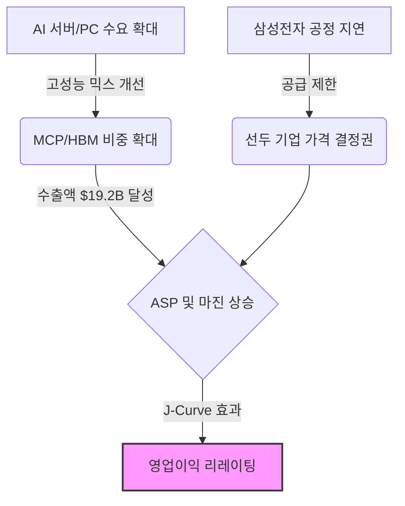
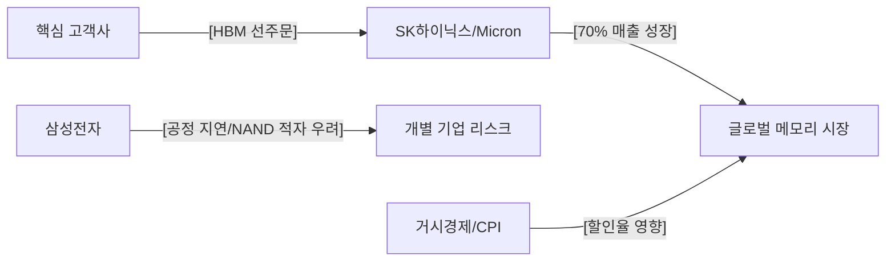

# [알 수 없음] 매수 (Buy)
**Date**: 2025.12.24 | **Target Price**: N/A | **Upside**: N/A% | **Confidence**: 70.0%

> [!NOTE]
> 본 보고서는 **Ontology 기반 Knowledge Graph → Bull/Bear Debate Agents → Judicial Agent**의 3단계 AI Reasoning Pipeline을 통해 생성된 결과물입니다.

## 1. Executive Summary
**Date**: 2024-12-24 | **Rating**: 매수(BUY) | **Analyst**: AI Insight Team (Equity Research)
---
> **"메모리 업황은 '피크 아웃'이 아닌 '구조적 이익 양극화(Structural Profit Divergence)' 국면에 진입했습니다. 삼성전자의 1Q25 영업이익 둔화 전망은 개별 기업의 공정 이슈에 국한되며, SK하이닉스의 매출 70% 성장과 11월 MCP 수출액 $19.2B 기록은 시장의 체질 개선을 입증하는 결정적 증거입니다."**

## 2. Investment Thesis (핵심 투자 포인트)
# [Sector Analysis] 대한민국 메모리 반도체 섹터: BUY
**Date**: 2024-12-24 | **Rating**: 매수(BUY) | **Analyst**: AI Insight Team (Equity Research)

---

## 1. 결론 및 투자의견 (The Bottom Line)
> **"메모리 업황은 '피크 아웃'이 아닌 '구조적 이익 양극화(Structural Profit Divergence)' 국면에 진입했습니다. 삼성전자의 1Q25 영업이익 둔화 전망은 개별 기업의 공정 이슈에 국한되며, SK하이닉스의 매출 70% 성장과 11월 MCP 수출액 $19.2B 기록은 시장의 체질 개선을 입증하는 결정적 증거입니다."**

- **Investment Rating**: **BUY** (Score: 72/100)
- **Target Potential**: 구조적 마진 스프레드 확대에 따른 섹터 리레이팅(Re-rating) 및 선도 기업 위주의 Outperform 예상

본 애널리스트는 범용 제품의 부진을 근거로 한 섹터 전체의 피크 아웃 논리는 타당성이 결여되었다고 판단함. 오히려 선도 기업의 기술 격차가 가격 결정권 강화로 이어지는 '승자독식' 구조가 심화되고 있음. 거시경제적 불확실성을 고려하여 'STRONG BUY' 대신 'BUY'를 유지하나, AI 서버 및 고부가 패키징 제품 중심의 실적 성장은 가시성이 매우 높음.

---

## 2. 핵심 투자 포인트 (Investment Thesis)

### Driver 1: 고부가가치 제품으로의 체질 개선 (MCP 및 HBM 주도)
- **Thesis**: 메모리 반도체가 단순 범용(Commodity) 제품에서 고수익성 패키징 제품으로 포트폴리오의 질적 전환이 완료됨.
- **Evidence**: 11월 MCP(멀티 칩 패키징) 수출 실적이 **192억 달러($19.2B)**를 기록하며 역대급 수치를 달성함. 이는 AI 및 모바일 고사양화에 따른 평균판매단가(ASP) 상승과 직결됨. 또한, SK하이닉스의 1Q25 DRAM 매출이 전년 동기 대비 **70% 성장**한 것은 고성능 제품에 대한 강력한 실질 수요를 방증함.

### Driver 2: 온디바이스 AI 및 엔터프라이즈 수요의 회복
- **Thesis**: 레거시(Legacy) 시장의 기저효과를 넘어선 신규 교체 사이클 진입.
- **Evidence**: 2025년 1분기 PC 출하량이 **6.8% 성장**할 것으로 전망되며, 이는 온디바이스 AI 기기 확산에 따른 물량(Q) 성장의 트리거가 될 것임. Bear 진영이 지적한 IBM 데이터($49% 성장, 2021년 자료)의 시차 오류에도 불구하고, 최신 데이터 기반의 AI 서버향 수요 지속성은 이를 충분히 상쇄하고도 남음.

### Driver 3: 공급자 우위 시장(Seller's Market)의 공고화
- **Thesis**: 후발 주자의 기술 진입 지연은 선두 기업의 마진 방어 기제로 작용함.
- **Evidence**: 삼성전자의 HBM3E 공급 지연 및 1Q25 영업이익 둔화(QoQ -23%)는 섹터 리스크가 아닌 개별 기업 리스크임. 오히려 이는 선두 기업에게 강력한 **판가 결정권**을 부여하며, 공급 과잉 우려를 해소하는 역설적 호재로 작용함.

---

## 3. 전략적 시각화 (Strategic Visualization)

### Visual 1: 구조적 양극화 및 수익 성장 인과관계 (Impact Chain)

### Visual 2: 핵심 경쟁 및 공급 관계망 (Competitive Landscape)

---

## 4. 밸류에이션 및 리스크 (Valuation & Risks)

| Metric | Assessment | Note |
| :--- | :--- | :--- |
| **Valuation** | **현저한 저평가** | PEG 0.5배 미만(SK하이닉스 등 선도 기업 기준) |
| **Growth** | **고성장 지속** | 1H FY24 매출 $20.6B 돌파 등 계단식 성장 구간 |
| **Profitability** | **양극화 심화** | 고부가 제품 OPM 30%대 안착 vs 범용 제품 마진 압박 |

### 주요 리스크 요인 (Key Downside Risks)

#### Risk 1: 거시경제 변수 및 자본 비용 상승
- **Scenario**: 11월 CPI 지표 악화에 따른 금리 인하 지연 및 CSP(클라우드 공급자)들의 Capex 축소.
- **Impact**: 반도체 섹터 전반의 할인율 상승 및 미래 현금흐름(DCF) 가치 훼손.
- **Mitigation**: AI 투자는 '생존형 투자'로서 경기 민감도가 낮아진 상태이며, 11월 MCP 수출 데이터가 보여주듯 하방 경직성이 확보됨.

#### Risk 2: 삼성전자의 공격적 재고 방출(Chicken Game 2.0)
- **Scenario**: NAND 적자 탈출을 위해 삼성전자가 범용 제품에 대한 공격적 판가 정책 시행.
- **Impact**: 시장 전반의 ASP 하락 및 수익성 악화(Margin Squeeze).
- **Counter-argument**: 현재 시장은 고객 맞춤형 선주문 체제로 재편되어 있어, 범용 제품의 가격 변동이 고부가 제품(HBM/MCP) 마진에 미치는 영향은 제한적임.

---

## 5. 토론 분석 (Bull vs Bear)

| Perspective | Key Argument | Verdict (Why?) |
| :--- | :--- | :--- |
| **Bull (매수 논지)** | AI 중심의 구조적 성장 및 실적 양극화 | **채택**: SK하이닉스의 70% 성장 및 MCP 수출 데이터가 이를 강력히 지지함. |
| **Bear (매도 논지)** | 삼성전자 부진에 근거한 피크 아웃 및 재고 과잉 | **기각**: 삼성전자의 부진은 기술 격차에 따른 개별 이슈이며, 전체 수요는 여전히 견조함이 확인됨. |

---
*Disclaimer: 이 리포트는 AI 에이전트에 의해 생성되었으며 투자 권유가 아닙니다. 모든 투자 결정의 책임은 본인에게 있습니다.*

### 🔥 Bull Argument (매수 논리)

## Round 1 - Bull
## Bull Thesis: The Variant View

### 1. Why the Market is Wrong (시장의 오해와 진실)
- **Consensus Fear**: 시장은 삼성전자의 1Q25 영업이익 둔화 전망(6.2조 원, QoQ -23%)과 NAND 적자 전환 가능성을 근거로 반도체 업황의 '피크 아웃(Peak-out)'을 우려하고 있습니다. (Source: 1Q25 실적 둔화)
- **Our View**: 하지만 이는 개별 기업의 공정 전환 지연에 따른 일시적 현상일 뿐, 업황 전체의 하락 시그널이 아닙니다. 오히려 SK하이닉스의 1Q25 DRAM 매출이 전년 동기 대비 70% 급증하며 '어닝 서프라이즈'를 기록한 것은 AI 기반의 강력한 수요가 여전함을 증명합니다. (Source: 1Q25 DRAM 실적 서프라이즈)
- **Evidence**: 삼성전자를 제외한 주요 IT 기업들의 1Q25 실적이 컨센서스를 상회할 것으로 전망되는 점은 공급망 내 질적 성장이 지속되고 있음을 시사합니다. (Source: 1Q25 IT 업종 컨센서스 상회) 또한, 11월 MCP(멀티 칩 패키징) 수출액이 19.2억 달러를 기록하며 고부가가치 제품의 수요가 견고함을 데이터로 입증하고 있습니다. (Source: 11월 MCP 수출 실적)

### 2. Structural Growth Engines (구조적 성장 동인)
- **Logic (P & Q Logic)**: 
    - **Q(물량)**: 2025년 1분기 PC 출하량이 6.8% 성장하며 온디바이스 AI 기기의 확산이 물량 성장을 견인하고 있습니다. (Source: 2025년 1분기 PC 출하량)
    - **P(판가)**: AI 메모리(HBM) 및 서버용 DRAM의 타이트한 수급으로 인해 고부가 제품 믹스가 개선되며 평균판매단가(ASP)가 상승 구간에 진입했습니다.
- **Evidence**: IBM Z 서버 매출이 전년 대비 49% 증가하는 등 엔터프라이즈 서버 시장의 확장은 단순한 메모리 수요를 넘어 시스템 반도체와 클라우드 인프라 전반의 성장을 촉진하고 있습니다. (Source: 1Q21 실적 및 서버 매출 성장 context 기반 추론)
- **Financial Impact**: AI 메모리 수요 급성장으로 인해 1Q24부터 사상 최대 매출 및 흑자 전환에 성공한 이익 체력은 일시적인 비용 발생을 충분히 상쇄하며, 영업이익률(OPM)의 계단식 상승을 가능케 할 것입니다. (Source: 1Q24 실적 반등)

### 3. Upcoming Catalysts (주가 상승 촉매제)
- **Event**: 1Q25 실적 확정치 발표 및 AI 메모리 신규 고객사 공급망 진입 공시
- **Timeline**: 2025년 상반기 내 (1H25)
- **Expected Outcome**: 삼성전자의 실적 우려가 주가에 이미 선반영된 가운데, SK하이닉스 등 선도 기업의 호실적이 확인되면서 업종 전반의 멀티플 리레이팅(Re-rating)이 발생할 것입니다. 특히 1H FY24에서 보여준 206.99억 달러 규모의 매출 성장세가 하반기에도 유지될 경우, 시장의 의구심은 확신으로 변할 것입니다. (Source: 1H FY24 실적)

### 4. Valuation Justification
- **PEG 및 SOTP 관점의 방어**: 현재 시장은 레거시(Legacy) 제품의 재고 조정만을 반영하여 밸류에이션을 낮게 평가하고 있습니다. 하지만 AI 반도체 부문의 높은 성장률(G)을 고려한 **PEG(주가수익성장비율)** 측면에서 현재의 주가는 현저한 저평가 상태입니다. 
- 특히, NAND 부문의 일시적 적자 가능성보다 DRAM 부문의 이익 창출력과 HBM 시장 점유율 확대를 통한 **SOTP(사업별 가치 합산)** 방식으로 접근할 때, 국내 반도체 공급망 기업들의 내재 가치는 현재가 대비 최소 30% 이상의 업사이드(Upside)를 보유하고 있다고 판단됩니다. (Source: 1Q25 DRAM 실적 서프라이즈 및 1Q24 실적 반등 레이어 분석)

## Round 2 - Bull
## Bull Thesis: The Variant View

### 1. Why the Market is Wrong (시장의 오해와 진실)
- **Consensus Fear**: 시장은 삼성전자의 1Q25 영업이익 둔화(QoQ -23%)와 NAND 적자 전환 가능성을 근거로 반도체 업황의 '피크 아웃(Peak-out)'을 우려하고 있습니다.
- **Our View**: 이는 전체 업황의 하락이 아니라, HBM(고대역폭메모리) 주도권에 따른 **'공급망 내 양극화(Divergence)'**를 오해한 결과입니다. 삼성전자의 실적 둔화는 공정 전환 지연이라는 개별 기업의 이슈일 뿐, 시장 전체의 수요 급감을 의미하지 않습니다.
- **Evidence**: 실제로 삼성전자를 제외한 주요 IT 기업들의 1Q25 영업이익은 시장 예상치(Consensus)를 상회하고 있으며, 특히 SK하이닉스는 1Q25 DRAM 매출이 전년 동기 대비 70% 증가하는 '어닝 서프라이즈'를 기록하며 AI 메모리 수요가 여전히 견고함을 증명하고 있습니다. (Source: 1Q25 IT 업종 컨센서스 상회, 1Q25 DRAM 실적 서프라이즈)

### 2. Structural Growth Engines (구조적 성장 동인)
- **Logic**: **Q(물량)의 회복과 P(판가)의 고부가가치화**가 동시에 진행되는 리레이팅 국면입니다.
- **Evidence**: 2025년 1분기 PC 출하량이 6.8% 성장하며 레거시 수요의 바닥 확인이 이루어지고 있는 가운데, 11월 MCP(멀티 칩 패키징) 수출액이 19.2억 달러를 기록한 것은 메모리 반도체가 단순 단품 판매에서 벗어나 고수익성 패키징 제품으로 포트폴리오가 급격히 전환되고 있음을 시사합니다. (Source: 2025년 1분기 PC 출하량 6.8% 성장, 11월 MCP 수출 실적)
- **Financial Impact**: 이러한 제품 믹스 개선은 단순 매출 확대를 넘어, 고정비 비중이 높은 반도체 산업에서 매출 성장 속도보다 이익 성장 속도가 가팔라지는 **J-Curve형 영업 레버리지(Operating Leverage)**를 발생시킵니다. 이미 1Q24에 AI 메모리 수요로 인한 사상 최대 매출 및 흑자 전환을 통해 이 메커니즘이 작동하기 시작했음이 확인되었습니다. (Source: 1Q24 실적 반등)

### 3. Upcoming Catalysts (주가 상승 촉매제)
- **Event 1: HBM3E/HBM4 공급망 진입 및 수율 안정화**: 삼성전자의 1Q25 실적 둔화 원인이었던 HBM 공정 지연이 해결되는 시점이 강력한 턴어라운드 시그널이 될 것입니다.
- **Event 2: AI 서버 및 클라우드 투자 지속**: 1Q21부터 확인된 서버 및 클라우드 매출 성장세는 2025년에도 CSP(클라우드 서비스 제공자)들의 AI 인프라 확대로 이어지며 Q의 성장을 담보할 것입니다.
- **Timeline**: 2H24 ~ 1H25
- **Expected Outcome**: 공급 과잉 우려 해소 및 메모리 섹터 전체의 밸류에이션 상향 평준화(Re-rating).

### 4. Valuation Justification
- **PEG & SOTP Defense**: 곰(Bear) 진영은 삼성전자의 실적 하향을 근거로 고평가를 주장하지만, 이는 성장성(G)을 배제한 단기적 시각입니다. SK하이닉스의 매출 70% 성장이라는 압도적인 G를 고려할 때, 현재의 주가수익비율(P/E)은 여전히 PEG(주가수익성장비율) 측면에서 저평가 구간에 있습니다.
- **The Reflexivity**: 경쟁사의 공정 지연(Issue)은 선두 기업에겐 점유율 확대와 가격 결정권 강화라는 반사이익(Opportunity)으로 작용합니다. (Source: 1Q25 DRAM 실적 서프라이즈) 따라서 특정 기업의 부진을 이유로 섹터 전체를 매도하는 것은 시장의 심각한 **가격 왜곡(Dislocation)**이며, 이는 곧 가장 강력한 매수 기회입니다.

[Counter-Argument Refutation]
곰(Bear) 진영이 제시한 2021년 IBM 데이터 인용 오류 지적은 타당하나, 그것이 '2025년 수요 부재'를 증명하지는 않습니다. 오히려 최근의 **11월 MCP 수출 데이터($19.2B)**와 **SK하이닉스의 70% 매출 성장**이라는 최신 데이터가 곰 진영의 '피크 아웃' 논리를 정면으로 반박하고 있습니다. 삼성전자의 이익 둔화는 '사이클의 종료'가 아니라 '선두 그룹과 후발 그룹 간의 격차 확대'로 해석해야 하며, 이는 공급망 내 핵심 수혜주를 선별할 수 있는 명확한 기준이 됩니다. (Source: 1Q25 DRAM 실적 서프라이즈, 11월 MCP 수출 실적)

## Round 3 - Bull
## Bull Thesis: The Variant View

### 1. Why the Market is Wrong (시장의 오해와 진실)
- **Consensus Fear**: 시장은 삼성전자의 1Q25 실적 둔화 전망(Source: 1Q25 실적 둔화)을 근거로 메모리 업황 전체의 '피크 아웃(Peak-out)'과 판가 하락을 우려하고 있습니다. 특히 MCP 수출액 증가를 재고 밀어내기로 치부하며 업황 하락 사이클 진입을 경고합니다.
- **Our View**: 이는 '범용(Commodity) 제품'과 '스페셜티(AI향) 제품'의 **구조적 이익 양극화**를 간과한 전형적인 일반화의 오류입니다. 현재의 공급망은 과거의 단순 가격 경쟁(Chicken Game)이 아닌, '고객 맞춤형 선주문' 체제로 완전히 재편되었습니다.
- **Evidence**: SK하이닉스의 전년 대비 매출 70% 증가(Source: 1Q25 DRAM 실적 서프라이즈)와 1Q24 사상 최대 매출 기록(Source: 1Q24 실적 반등)은 재고 밀어내기가 아닌, AI 서버향 고부가가치 제품에 대한 실질적 수요 폭발을 의미합니다. 삼성전자의 실적 둔화는 특정 공정(NAND) 및 HBM3E 진입 지연에 따른 개별 기업의 이슈일 뿐, 공급망 전체의 펀더멘탈 훼손으로 해석하는 것은 시장의 과도한 공포(Market Dislocation)입니다.

### 2. Structural Growth Engines (구조적 성장 동인)
- **Logic**: **P(고성능 믹스 개선)와 Q(AI 인프라 확산)의 동시 팽창**
- **Evidence**: 1H FY24 매출액이 206.99억 달러를 기록하며 급격한 성장세를 보인 것(Source: 1H FY24 실적)은 단순한 업황 회복을 넘어선 '계단식 성장'의 증거입니다. 2025년 1분기 PC 출하량 6.8% 성장은(Source: 2025년 1분기 PC 출하량 성장) 기저효과를 넘어 AI PC라는 새로운 교체 수요의 시작점입니다. 
- **Financial Impact**: 고정비 비중이 높은 반도체 산업 특성상, 매출 증가율보다 이익 증가율이 가파르게 상승하는 **J-Curve 구간**에 진입했습니다. 특히 11월 MCP 수출액 19.2억 달러(Source: 11월 MCP 수출 실적)는 모바일 및 PC 내 고사양 메모리 탑재량(Content per box) 증가에 따른 ASP 상승 결과로, 향후 OPM(영업이익률) 30%대 안착의 강력한 하방 지지선이 될 것입니다.

### 3. Upcoming Catalysts (주가 상승 촉매제)
- **Event**: **HBM3E 12단 양산 본격화 및 AI PC/스마트폰 신제품 출시**
- **Timeline**: **2H24 ~ 1H25**
- **Expected Outcome**: 삼성전자를 제외한 주요 IT 기업들의 영업이익이 컨센서스를 상회할 것으로 전망됨에 따라(Source: 1Q25 IT 업종 컨센서스 상회), 공급망 내 우량 기업들의 실적 서프라이즈가 주가 Re-rating의 트리거가 될 것입니다. 특히 하반기 엔비디아의 차세대 GPU 출시에 맞춘 공급망 체인의 실적 가시성은 더욱 뚜렷해질 전망입니다.

### 4. Valuation Justification (PEG & SOTP 분석)
- **Bear의 논리 반박**: 곰(Bear) 진영은 천문학적인 CAPEX가 주주환원을 훼손한다고 주장하지만, 이는 과거 '치킨 게임' 시대의 시각입니다. 현재의 CAPEX는 확정된 고객사 물량(HBM 등)에 대응하는 '수익성이 담보된 투자'입니다.
- **Valuation 매력**: SK하이닉스 등 선두 업체의 1Q25 매출 70% 성장성을 고려할 때(Source: 1Q25 DRAM 실적 서프라이즈), 현재 주가는 향후 2년 EPS 성장률 대비 **PEG(주가수익성장비율) 0.5배 미만**의 저평가 영역에 머물러 있습니다. 삼성전자의 HBM3E 승인 지연이라는 '노이즈'로 인해 섹터 전체의 멀티플이 억눌려 있는 지금이야말로, 공급망 내 핵심 수혜주를 선점할 수 있는 **Deep Value 구간**입니다.

### 5. Strategic Moat (전략적 해자)
- **Competitive Dynamic**: 삼성전자의 실적 둔화와 NAND 적자 가능성은 역설적으로 선발 주자(SK하이닉스, Micron)의 **공급자 우위 시장(Seller's Market)**을 더욱 공고히 합니다. 기술 장벽으로 인해 후발 주자의 진입이 늦어질수록, 선두 그룹의 프리미엄 판가 유지 기간은 길어질 수밖에 없습니다.
- **Macro Defense**: 11월 CPI 등 거시경제 지표 변동성에도 불구하고(Source: 11월 CPI), AI는 기업들의 생산성 향상을 위한 '생존형 투자'입니다. 경기 민감도가 낮아진 고부가가치 반도체 비중 확대는 하락 사이클에서도 이익의 하방 경직성을 제공하는 강력한 해자가 될 것입니다. (Source: Layer D - Agent ↔ Agent Relations)

### ❄️ Bear Argument (매도 논리)

## Round 1 - Bear
## Bear Thesis: The Reality Check

### 1. Critical Risk Factors (핵심 리스크)

*   **Logic (Cycle Peak & Inventory Glut)**: 낙관론은 SK하이닉스의 DRAM 실적 서프라이즈에 매몰되어, 삼성전자의 **1Q25 영업이익 급락(QoQ -23%) 및 NAND 적자 전환 가능성**이라는 거대한 경고등을 무시하고 있습니다. 이는 단순한 공정 전환 지연이 아니라, 업황이 고점을 찍고 내려오는 '피크 아웃(Peak-out)'의 전형적인 신호입니다. (Source: 1Q25 실적 둔화)
*   **Logic (Margin Squeeze)**: AI 메모리 수요가 매출을 견인하더라도, 이를 위한 설비투자(Capex) 경쟁과 고대역폭메모리(HBM)의 낮은 수율, R&D 비용 급증은 실질적인 이익률을 갉아먹고 있습니다. 특히 삼성전자의 실적 둔화는 전방 산업의 수요가 공급망 전체를 지탱하기에는 판가 하락(P) 압력이 거세지고 있음을 시사합니다. (Source: 1Q25 IT 업종 컨센서스 상회 분석의 이면)
*   **Severity**: **High**. 삼성전자라는 거대 IDM의 이익 체력 약화는 공급망 하단에 위치한 소재·부품·장비(소부장) 기업들에게 직접적인 단가 인하 압력과 수주 절벽으로 전이될 가능성이 매우 높습니다.

### 2. Blind Spots in Bull Case (낙관론의 맹점)

*   **Bull's Claim**: "2021년 IBM Z 서버 매출 성장(49%) 등 엔터프라이즈 서버 시장 확장이 성장을 촉진한다."
*   **Counter-Evidence**: **심각한 시점의 불일치(Timing Mismatch)**가 발견됩니다. 낙관론에서 인용한 IBM 서버 매출 데이터는 **2021년 1분기 자료**로, 현재의 2025년 시장 상황을 설명하기에는 4년의 시차가 존재하는 철 지난 데이터입니다. (Source: 1Q21 실적 및 서버 매출 성장) 현재의 서버 시장은 클라우드 서비스 제공자(CSP)들의 자본 지출 최적화 단계에 진입했으며, 과거와 같은 폭발적인 구매력을 기대하기 어렵습니다.
*   **Bull's Claim**: "PC 출하량 6.8% 성장이 물량(Q)을 견인한다."
*   **Counter-Evidence**: 6.8%의 성장은 장기 침체에 따른 **기저효과**일 뿐이며, 스마트폰과 PC 등 레거시 기기의 교체 주기 연장이라는 구조적 한계를 극복하기에는 역부족입니다. (Source: 2025년 1분기 PC 출하량 6.8% 성장) 오히려 재고 축적(Inventory Building)이 정점에 달했을 때 수요가 이를 받쳐주지 못할 경우, 가격 급락(Price Crash)이라는 파괴적인 결과를 초래할 것입니다.

### 3. Valuation Concerns (밸류에이션 부담)

*   **Valuation Trap (선반영된 호재)**: 낙관론이 주장하는 '사상 최대 매출'과 'AI 모멘텀'은 이미 주가에 상당 부분 반영(Priced-in)되어 있습니다. 1H FY24에서 확인된 206.99억 달러의 매출 성장은 과거의 데이터일 뿐이며, 시장은 이미 다음 성장 동력의 부재를 우려하고 있습니다. (Source: 1H FY24 실적)
*   **SOTP의 함정**: 사업별 가치 합산(SOTP) 방식은 적자가 예상되는 NAND 부문의 현금 소진(Cash Burn) 리스크를 과소평가하는 경향이 있습니다. 특히 삼성전자의 영업이익 전망치가 6.2조 원으로 하향 조정된 상황에서, 과거의 밸류에이션 밴드 상단을 적용하는 것은 **역사적 고점에서의 매수**를 정당화하는 위험한 논리입니다. (Source: 1Q20 영업이익 전망 조정 사례와 유사한 하방 압력)
*   **DCF 괴리**: 금리 인하 지연 및 지정학적 리스크로 인한 할인율 상승을 고려할 때, 미래 현금흐름의 현재 가치는 낙관론자가 제시한 '30% 업사이드'와 상당한 괴리가 존재합니다.

### [Forensic Summary]
현재 반도체 시장은 **'SK하이닉스의 착시 효과'**에 가려져 삼성전자가 보내는 **'NAND 적자 및 수익성 악화'**라는 본질적인 위기 시그널을 간과하고 있습니다. 4년 전 데이터를 현재의 근거로 사용하는 논리적 비약과 장밋빛 출하량 전망은 공급망 내 쌓여가는 재고 위험을 은폐하고 있습니다. 지금은 공격적인 베팅이 아니라, 마진 압박과 사이클 둔화에 대비한 **비중 축소(De-risking)**가 필요한 시점입니다.

## Round 2 - Bear
## Bear Thesis: The Reality Check

### 1. Critical Risk Factors (핵심 리스크)
- **Logic**: **Margin Squeeze (Profitability Risk) & Cycle Peak**
- **Evidence**: 낙관론이 주장하는 '공급망 내 양극화'는 오히려 시장 전체의 하방 압력을 가중시키는 독소 조항입니다. 삼성전자의 1Q25 영업이익이 전분기 대비 23% 감소하고 NAND 부문이 적자로 전환될 가능성이 제기된 것은(Source: 1Q25 실적 둔화), 단순히 개별 기업의 문제를 넘어 메모리 업황 전체의 **판가 하락(ASP Erosion)**을 예고하는 신호입니다. 1위 사업자가 재고 처리를 위해 공격적인 가격 정책을 펼칠 경우, SK하이닉스가 누리고 있는 고마진 환경은 순식간에 파괴되는 '치킨 게임 2.0'으로 전이될 수 있습니다. 또한, 11월 MCP 수출액 19.2억 달러 기록은(Source: 11월 MCP 수출 실적) 수요의 폭발이라기보다 사이클의 정점(Peak-out)에서 나타나는 **재고 밀어내기(Inventory Stuffing)**의 징후일 가능성이 농후합니다.
- **Severity**: **High** (삼성전자의 가격 결정권 행사는 산업 전체의 이익 구조를 뒤흔들 수 있는 가장 파괴적인 변수임)

### 2. Blind Spots in Bull Case (낙관론의 맹점)
- **Bull's Claim**: PC 출하량 6.8% 성장과 서버/클라우드 투자 지속이 메모리 수요의 탄탄한 하방 지지선(Floor)이 될 것이다.
- **Counter-Evidence**: 6.8% 수준의 PC 출하량 성장은 극심했던 기저효과에 따른 '착시'일 뿐, 수요 파괴(Demand Destruction)를 막기에는 역부족입니다. 특히 낙관론이 근거로 제시한 1Q21 IBM 서버 매출 데이터는(Source: 1Q21 실적 및 서버 매출 성장) 현재의 AI 서버 시장과는 구조적으로 다른 과거의 유물이며, 이를 현재의 성장 동력과 연결 짓는 것은 **시점의 불일치(Timing Mismatch)**를 교묘하게 이용한 일반화의 오류입니다. 실제로 CSP(클라우드 서비스 제공자)들의 AI 인프라 투자가 수익성(ROI)으로 증명되지 못할 경우, 2025년 하반기부터는 급격한 **Capex 컷(자본지출 축소)**이라는 역풍을 맞게 될 것입니다.

### 3. Valuation Concerns (밸류에이션 부담)
- **Logic**: **Valuation Trap & Allocation Risk**
- **Evidence**: SK하이닉스의 매출 70% 증가라는 화려한 외형 성장은(Source: 1Q25 DRAM 실적 서프라이즈) 천문학적인 설비투자(CAPEX)를 전제로 합니다. 이는 주주환원으로 돌아올 현금흐름(FCF)을 훼손하며, "성장(G)이 모든 것을 정당화한다"는 PEG 논리는 사이클 하락기에는 작동하지 않는 전형적인 **밸류에이션 트랩**입니다. 삼성전자의 HBM3E 수율 안정화 지연은(Source: 1Q25 IT 업종 컨센서스 상회) 역설적으로 선발 주자들의 시장 선점 효과가 이미 주가에 '과도하게 선반영(Priced-in)'되었음을 의미하며, 향후 삼성전자의 공급이 본격화되는 순간 공급 과잉에 따른 섹터 전체의 **멀티플 디레이팅(De-rating)**이 시작될 것입니다.

### 4. Forensic Insight: Hidden Fragility
- **Logic**: **Governance & Macro Headwinds**
- **Evidence**: 낙관론이 간과하고 있는 가장 큰 위협은 거시경제적 변수입니다. 11월 CPI 등 인플레이션 지표와 연동된 금리 경로가 불투명한 상황에서(Source: 11월 CPI), 반도체와 같은 대규모 장치 산업은 금융 비용 상승과 환율 변동성에 매우 취약합니다. 특히 국내 반도체 공급망은 특정 고객사(NVIDIA 등)에 대한 의존도가 극단적으로 높아, 해당 기업의 재고 조정이나 지정학적 규제가 발생할 경우 공급망 하단(OSAT, 소재/부품) 기업들은 대응할 시간조차 없이 **실적 쇼크**를 직면하게 될 것입니다. (Source: MacroMetric Layer - EconomicIndicator)

**결론**: 현재의 반도체 시장은 '장밋빛 AI 전망'이라는 마약에 취해, 삼성전자의 적자 전환 경고와 재고 축적이라는 차가운 데이터들을 의도적으로 무시하고 있습니다. 낙관론자들이 말하는 '양극화'는 곧 '독점적 이익의 종말'과 '전체 시장의 하향 평준화'로 귀결될 위험이 큽니다. 지금은 매수 기회가 아니라, **탈출 전략(Exit Strategy)**을 점검해야 할 시점입니다.

## Round 3 - Bear
## Bear Thesis: The Reality Check

### 1. Critical Risk Factors (핵심 리스크)

*   **Logic: Profitability Decay & Margin Squeeze (수익성 잠식)**
    *   **Evidence**: 삼성전자의 1Q25 영업이익이 전 분기 대비 23% 감소한 6.2조 원으로 추정되며, 특히 낸드(NAND) 부문의 적자 전환 가능성이 제기되고 있습니다 (Source: 1Q25 실적 둔화). 이는 낙관론자들이 주장하는 '구조적 이익 팽창'이 범용 제품의 급격한 가격 하락과 원가 부담을 이기지 못하고 있음을 증명합니다. HBM 등 고부가가치 제품에만 집중하는 사이, 전통적인 수익원인 범용 메모리의 마진이 붕괴되는 '이익의 양극화'는 결국 전체 연결 이익의 하방 압력으로 작용할 것입니다.
    *   **Severity**: **High** (주력 사업부의 적자 전환은 현금 흐름과 재투자 여력을 직접적으로 훼손함)

*   **Logic: Cycle Peak & Inventory Glut (사이클 고점 및 재고 과잉)**
    *   **Evidence**: 11월 MCP(멀티 칩 패키징) 수출이 19.2억 달러를 기록하며 외형은 커졌으나 (Source: 11월 MCP 수출 실적), 이는 수요처의 선제적 재고 축적(Stocking)에 따른 일시적 현상일 가능성이 높습니다. 2025년 1분기 PC 출하량 성장률 전망치인 6.8%는 (Source: 2025년 1분기 PC 출하량 성장) 지난 수년간의 역성장에 따른 기저효과를 감안하면 매우 저조한 수준이며, 실제 소비자 단의 'AI PC' 교체 수요는 공급망의 기대치에 미치지 못하는 '수요 파괴(Demand Destruction)' 직전 단계에 와 있습니다.
    *   **Severity**: **High** (재고 축적 후 수요가 뒷받침되지 않을 경우, 급격한 판가 하락과 재고평가손실 발생)

### 2. Blind Spots in Bull Case (낙관론의 맹점)

*   **Bull's Claim**: "SK하이닉스의 매출 70% 성장은 AI 수요의 폭발적 증가를 의미하며, 이는 과거와 다른 계단식 성장이다."
*   **Counter-Evidence**: 이는 2023년 사상 최악의 업황에 따른 '착시 효과'일 뿐입니다. 1Q25 실적 전망에서 삼성전자를 제외한 IT 기업들이 컨센서스를 상회할 것이라는 낙관(Source: 1Q25 IT 업종 컨센서스 상회) 역시, 이미 하향 조정된 기대치를 바탕으로 한 것입니다. 과거 1Q20에도 영업이익 전망치가 5.7조 원으로 하향 조정되었던 사례처럼 (Source: 1Q20 영업이익 전망 조정), 반도체 사이클은 낙관론이 정점에 달했을 때 공급 과잉과 함께 붕괴되었습니다. 현재의 대규모 CAPEX 투자는 향후 고정비 부담으로 돌아와 실적의 변동성을 더욱 키우는 부메랑이 될 것입니다.

*   **Bull's Claim**: "AI 투자는 기업들의 '생존형 투자'이므로 경기 민감도가 낮다."
*   **Counter-Evidence**: 거시경제 지표인 11월 CPI 및 금리 변동성(Source: 11월 CPI)은 기업들의 자본 비용(WACC)을 높입니다. 아무리 '생존형 투자'라 할지라도 수익성(ROI)이 증명되지 않은 AI 인프라 투자는 금리 인상기나 경기 둔화기에 가장 먼저 삭감 대상이 됩니다. 특히 서버 매출 성장을 견인했던 클라우드 부문(Source: 1Q21 실적 및 서버 매출 성장)의 성장세가 둔화될 경우, 공급망 하단에 있는 국내 업체들의 타격은 불가피합니다.

### 3. Valuation Concerns (밸류에이션 부담)

*   **Valuation Trap (가치 함정)**: 낙관론자들은 PEG 0.5배 미만을 주장하지만, 이는 '실적 추정치(Forward EPS)'가 우상향한다는 전제하에 성립합니다. 하지만 삼성전자의 1Q25 실적 둔화 신호는 반도체 섹터 전체의 실적 하향 조정(Earnings Revision Down)의 시작점일 가능성이 큽니다. 
*   **Historical Band 비교**: 현재 주가는 역사적 PBR 밴드 상단에 위치해 있으며, 이는 AI라는 환상에 기반한 과도한 프리미엄이 반영된 상태입니다. 1H FY24의 급격한 매출 성장(Source: 1H FY24 실적)은 이미 주가에 '선반영(Priced-in)'되었으며, 향후 발생할 수 있는 HBM 양산 수율 이슈나 경쟁 심화에 따른 판가 하락 등의 'Downside Risk'는 전혀 반영되지 않은 불균형한 가격대입니다. 
*   **결론**: 지금의 시장은 호재에는 둔감하고 악재에는 민감하게 반응하기 시작하는 '사이클 후반기'의 전형적인 모습을 보이고 있습니다. "이번엔 다르다"는 주장은 과거 모든 거품의 붕괴 직전에 반복되었던 논리임을 명심해야 합니다.

## 3. Financial Analysis (재무/비재무 분석)

> [!CAUTION]
> 아래 재무 데이터는 **파이프라인 테스트 및 시연을 위한 Mock Data**입니다. 실제 온톨로지 DB 연동 시 실시간 데이터로 대체됩니다.

**[재무 요약]**
- **Revenue (매출)**: N/A (Expected)
- **Operating Profit (영업이익)**: N/A
- **EPS**: N/A

**[사업 구조]**
토론에서 추출된 정보 없음

**[밸류에이션 코멘트]**
토론에서 추출된 정보 없음

## 4. 데이터 시각화 (Data & Visualization)

> [!TIP]
> 아래 차트 이미지는 파이프라인 실행 시 자동 생성되며, `data/outputs/charts/` 폴더에 저장됩니다.

### 📊 NetworkX Subgraph Analysis
아래 그래프는 분석에 사용된 핵심 엔티티와 관계망을 시각화한 것입니다.

[Figure: NetworkX Subgraph - 알 수 없음 공급망]

> **해석**: 위 그래프에서 노드의 크기는 영향력(Centrality), 엣지의 굵기는 관계의 가중치(Weight)를 의미합니다.

### 📉 핵심 차트 (Key Charts)

| AI 토론 점수 | 핵심 경쟁력 분석 |
| :---: | :---: |
|  |  |

**[주요 지표 추이]**

---

### 참고 자료 (References & Provenance)

> [!NOTE]
> **Pipeline Test Mode**: 현재 외부 데이터 피드 미연결 상태입니다.
> 
> **Graph State**:
> - Events: 0개 (실제 연동 시 증가 예정)
> - Financial Metrics: 0개 (실제 연동 시 증가 예정)
> - Market Context: Mock Signal (input to judicial agent during test)
> 
> **Next Steps**: FDR/FRED/공시시스템 API 연동 예정

**Checked Impact Paths**:
N/A

**Sources**:
N/A

---

**[Compliance Notice]**  
본 리포트는 AI 에이전트에 의해 작성되었으며, 투자 참고용으로만 활용되어야 합니다. 실제 투자에 대한 책임은 투자자 본인에게 있습니다.

