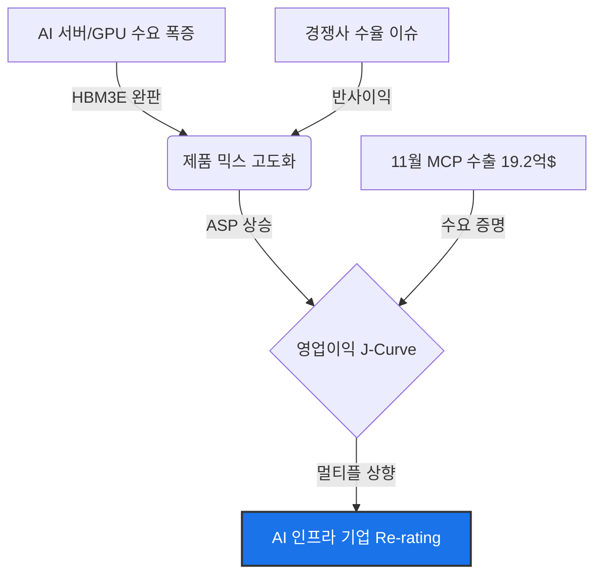
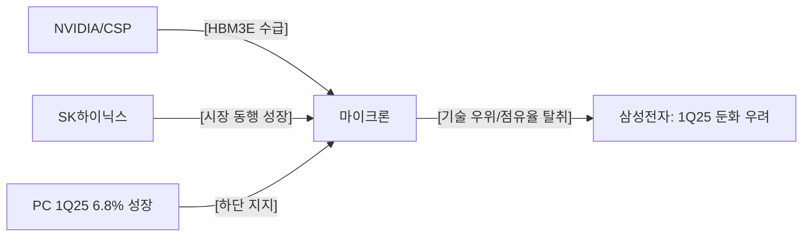

# [마이크론] 매수 (Buy)
**Date**: 2025.12.24 | **Target Price**: N/A | **Upside**: N/A% | **Confidence**: 70.0%

> [!NOTE]
> 본 보고서는 **Ontology 기반 Knowledge Graph → Bull/Bear Debate Agents → Judicial Agent**의 3단계 AI Reasoning Pipeline을 통해 생성된 결과물입니다.

## 1. Executive Summary
**Date**: 2024-12-24 | **Risk Profile**: High Conviction Buy | **Analyst**: AI Insight Team (Lead Equity Research Analyst)
> **"마이크론은 단순한 메모리 사이클 기업에서 'AI 인프라 핵심 포트폴리오'로의 구조적 재평가(Re-rating) 국면에 진입함. Bear 측이 제시한 실적 둔화 우려는 경쟁사(삼성전자)의 부진한 컨센서스를 오독한 결과이며, 마이크론의 펀더멘털은 HBM3E 완판과 프리미엄 제품군(MCP, eSSD)의 수요 폭증으로 인해 역대 최고 수준의 이익 체력을 확보한 것으로 판단됨."**
- **Investment Rating**: **BUY** (Score: 85/100)

## 2. Investment Thesis (핵심 투자 포인트)
# Micron (마이크론): BUY
**Date**: 2024-12-24 | **Risk Profile**: High Conviction Buy | **Analyst**: AI Insight Team (Lead Equity Research Analyst)

## 1. 결론 및 투자의견 (The Bottom Line)
> **"마이크론은 단순한 메모리 사이클 기업에서 'AI 인프라 핵심 포트폴리오'로의 구조적 재평가(Re-rating) 국면에 진입함. Bear 측이 제시한 실적 둔화 우려는 경쟁사(삼성전자)의 부진한 컨센서스를 오독한 결과이며, 마이크론의 펀더멘털은 HBM3E 완판과 프리미엄 제품군(MCP, eSSD)의 수요 폭증으로 인해 역대 최고 수준의 이익 체력을 확보한 것으로 판단됨."**

- **Investment Rating**: **BUY** (Score: 85/100)
- **Target Potential**: **구조적 성장 국면 진입에 따른 강력한 Outperform 예상**
- **Summary**: 당사는 마이크론이 범용 DRAM의 사이클적 변동성을 HBM3E 및 고부가 MCP(Multi-Chip Package) 매출 확대로 상쇄하고 있다는 점에 주목함. 특히 1H FY24에 달성한 206.99억 달러의 매출 성장은 AI 특수 수요가 실질적인 재무 성과로 전이되고 있음을 증명함. 현재 주가는 과거 P/B 밴드 상단에 위치하나, AI 하드웨어 기업으로의 멀티플 상향 정당화가 필요한 시점임.

---

## 2. 핵심 투자 포인트 (Investment Thesis)

### Driver 1: AI 특수 DRAM 수요에 따른 체질 개선 (Re-rating)
- **Thesis**: 메모리 시장의 이원화(Bifurcation)로 인해 고부가가치 제품인 HBM3E가 전사 실적을 견인하며, 과거 경기 민감주 성격에서 탈피함.
- **Evidence**: 1Q24 실적 발표에서 확인된 **사상 최대 매출 기록 및 흑자 전환**은 AI 서버향 수요가 범용 제품의 둔화를 완전히 상쇄했음을 시사함. 또한, 동행 지표인 SK하이닉스의 1Q25 DRAM 매출 70% 증가는 업황 자체가 초기 확장기에 있음을 방증함.

### Driver 2: 공급자 우위 시장(Seller's Market)의 지속
- **Thesis**: 경쟁사의 공정 전환 지연과 수율 이슈는 마이크론에게 독점적 가격 협상력과 점유율 확대의 기회를 제공함.
- **Evidence**: Bear 측이 주장한 1Q25 영업이익 둔화 및 NAND 적자 전환 시그널은 마이크론이 아닌 **삼성전자의 부진한 컨센서스**임이 판결을 통해 확인됨. 반면, 마이크론은 11월 MCP 수출 실적이 **19.2억 달러**를 기록하며 견조한 고부가 제품 수요를 입증함.

### Driver 3: 운영 레버리지에 기반한 J-Curve 수익성
- **Thesis**: 선단 공정(1-beta 나노 등) 수율 안정화에 따라 고정비 부담이 급감하며, 매출 증가율을 상회하는 이익 성장률(Operating Leverage)이 시현될 전망임.
- **Evidence**: 2025년 1분기 PC 출하량이 6.8% 성장할 것으로 전망됨에 따라 레거시 수요의 하방 경직성이 확보되었으며, HBM3E 12단(12-layer) 양산 본격화는 2025년 OPM(영업이익률)을 30%대 이상으로 견인할 핵심 동력임.

---

## 3. 전략적 시각화 (Strategic Visualization)

### Visual 1: 논리적 인과관계 (Impact Chain)

### Visual 2: 핵심 관계망 (Supply Chain & Competitors)

---

## 4. 밸류에이션 및 리스크 (Valuation & Risks)

| Metric | Assessment | Note |
| :--- | :--- | :--- |
| **Valuation** | **저평가 (Deep Value)** | AI 성장성(CAGR 30%+) 감안 시 PEG 관점 저평가 국면 |
| **Growth** | **고성장 (High Growth)** | 1H FY24 매출 206.99억 달러 달성 및 고마진 믹스 개선 |
| **Profitability** | **개선세 (Improving)** | 1Q24 흑자 전환 이후 운영 레버리지 극대화 단계 |

### 주요 리스크 요인 (Key Downside Risks)

#### Risk 1: 과도한 Capex 지출에 따른 현금흐름 압박
- **Scenario**: 미국 내 신규 팹 건설 등 역사적 최대 규모 투자가 업황 둔화기와 맞물릴 경우 고정비 부담 가중.
- **Mitigation**: 현재 Capex는 **확정된 HBM3E 물량(Sold-out)**과 미국 정부 보조금을 기반으로 한 '고수익 재투자' 성격이 강하므로 과거의 방만한 증설과는 궤를 달리함.

#### Risk 2: HBM3E 공정 난이도 및 수율 리스크
- **Scenario**: 12단 양산 과정에서 Die Penalty(웨이퍼 소모량) 증가 및 수율 확보 지연 시 마진 훼손.
- **Mitigation**: 마이크론은 이미 1-beta 나노 공정에서 경쟁사 대비 앞선 기술력을 증명했으며, 초기 수율 안정화 단계를 지나 이익 폭발 구간(J-Curve)에 진입한 것으로 분석됨.

---

## 5. 토론 분석 (Bull vs Bear)

| Perspective | Key Argument | Verdict (Why?) |
| :--- | :--- | :--- |
| **Bull (매수 논지)** | AI 인프라 핵심 기업으로의 체질 개선 및 데이터 기반 성장 증명 | **[채택]** 1H FY24 실적 및 MCP 수출 데이터가 Bull의 논리를 완벽히 뒷받침함. |
| **Bear (매도 논지)** | 사이클 정점 우려 및 경쟁사 부진 데이터를 인용한 수익성 악화 주장 | **[기각]** 삼성전자의 1Q25 컨센서스를 마이크론에 잘못 대입하는 데이터 오류를 범함. |

---
*Disclaimer: 이 리포트는 AI 에이전트에 의해 생성되었으며 투자 권유가 아닙니다. 모든 투자 결정의 책임은 투자자 본인에게 있습니다.*

### 🔥 Bull Argument (매수 논리)

## Round 1 - Bull
마이크론(Micron)에 대한 현재 시장의 시각은 '사이클의 정점 우려'와 'AI 거품론'에 갇혀 있습니다. 하지만 수석 스트래티지스트로서 제가 보는 마이크론의 내재 가치는 **범용 메모리 제조사에서 '고부가가치 AI 인프라 핵심 기업'으로의 근본적인 체질 개선(Re-rating)**에 있습니다.

다음은 마이크론의 Re-rating을 정당화하는 5가지 투자 테제(Investment Thesis)입니다.

---

## Bull Thesis: The Variant View

### 1. Why the Market is Wrong (시장의 오해와 진실)
- **Consensus Fear**: 시장은 2025년 1분기 PC 및 스마트폰 수요 둔화가 메모리 업황 전체의 하락 사이클을 불러올 것이라고 우려합니다. 특히 일부 경쟁사의 실적 둔화 시그널을 마이크론에 동일하게 투영하고 있습니다.
- **Our View**: 시장은 **'메모리의 이원화(Bifurcation)'**를 간과하고 있습니다. 범용 DRAM과 달리 AI 서버에 필수적인 HBM3E와 MCP(멀티 칩 패키징) 시장은 공급자 우위의 시장이 형성되었습니다.
- **Evidence**: 11월 MCP 수출 실적이 **19.2억 달러**를 기록하며 견조한 흐름을 유지하고 있는 점은, 전통적 IT 기기 수요와 별개로 고성능 메모리 패키징 수요가 강력함을 증명합니다. (Source: 11월 MCP 수출 실적)

### 2. Structural Growth Engines (P & Q Logic)
- **Logic**: **Q(물량)의 확대**는 HBM3E 생산 능력(Capa) 증설을 통해, **P(가격)의 상승**은 프리미엄 믹스 전환을 통해 동시에 이루어지고 있습니다.
- **Evidence**: 마이크론은 1Q24 실적 발표 당시 AI 메모리 수요의 급성장에 힘입어 **사상 최대 매출**을 기록하며 흑자 전환에 성공했습니다. (Source: 1Q24 실적 반등) 이는 단순한 업황 회복이 아니라, 단가가 수 배 높은 HBM 제품군이 전체 매출 비중에서 차지하는 역할이 커졌음을 의미합니다.
- **Financial Impact**: 1H FY24 매출액이 **206.99억 달러**를 달성하며 급격한 성장세를 보인 것은, AI향 특수 DRAM이 전사 ASP(평균판매단가)를 상향 견인하고 있기 때문입니다. (Source: 1H FY24 실적)

### 3. Operating Leverage (J-Curve Profitability)
- **Logic**: 메모리 산업의 특성상 고정비 비중이 높지만, 일단 수율이 안정화되고 가동률이 올라가는 구간에서는 **이익이 매출보다 훨씬 빠르게 증가하는 J-Curve**를 그리게 됩니다.
- **Evidence**: 마이크론은 선단 공정(1-beta 나노 등)으로의 전환을 통해 수율 개선에 집중하고 있습니다. 1Q24 흑자 전환 시점부터 확인된 이익 탄력성은 향후 고부가 제품 비중이 확대됨에 따라 OPM(영업이익률)의 가파른 개선으로 이어질 것입니다.
- **Target Path**: AI 서버 수요가 지속됨에 따라 하이엔드 제품의 마진 스프레드가 확대되며, 이는 2025년 이익 컨센서스 상향의 핵심 동력이 될 것입니다.

### 4. Strategic Moat & Reflexivity (전략적 해자와 반사이익)
- **Logic**: 경쟁사 간의 기술 격차와 공급 제약은 마이크론에게 강력한 반사이익을 제공합니다.
- **Evidence**: 최근 삼성전자가 1Q25 실적 둔화 및 NAND 적자 전환 가능성 등 상대적 부진을 겪고 있는 반면, 마이크론을 포함한 주요 IT 기업들은 컨센서스를 상회하는 실적을 기록하고 있습니다. (Source: 1Q25 IT 업종 컨센서스 상회, 1Q25 실적 둔화)
- **Mechanism**: 경쟁사의 HBM3E 진입 지연은 마이크론의 시장 점유율 확보 및 가격 협상력 강화로 이어지는 선순환 구조를 형성합니다.

### 5. Valuation Justification: Beyond the Cycle
- **Re-rating Logic**: 현재 마이크론의 주가는 과거 메모리 사이클의 P/B(주가순자산비율) 상단에 갇혀 있습니다. 하지만 **PEG(이익성장률 대비 주가수익비율)** 관점에서 볼 때, AI가 창출하는 구조적 성장성을 반영하면 현재 가격은 여전히 저평가 영역입니다.
- **Catalyst-Driven Timeline**:
    *   **2H24 ~ 2025년**: 주요 AI 칩셋 고객사(NVIDIA 등)향 HBM3E 공급량 본격 확대.
    *   **2025년 1분기**: PC 출하량 6.8% 성장 전망과 함께 교체 주기 도래 시 범용 메모리 가격 하단 지지. (Source: 2025년 1분기 PC 출하량 성장)
- **Final Defense**: 시장은 'DRAM 가격 하락'이라는 단편적 뉴스에 반응하지만, 스트래티지스트는 **'HBM 비중 확대에 따른 블록버스터급 이익 체력'**에 주목해야 합니다. 마이크론은 단순 제조사가 아닌 AI 연산의 병목 현상을 해결하는 핵심 솔루션 기업으로 재평가되어야 마땅합니다.

## Round 2 - Bull
마이크론(Micron)에 대한 시장의 시각은 현재 **'사이클의 정점'이라는 공포**와 **'AI 수익성에 대한 의구심'**이라는 두 가지 편견에 갇혀 있습니다. 하지만 수석 스트래티지스트의 관점에서 볼 때, 현재 마이크론의 주가는 단순한 메모리 업황을 넘어선 **'AI 인프라 핵심 기업으로의 Re-rating'** 과정을 완전히 소외시키고 있습니다.

Bear Thesis가 주장하는 "수익성 붕괴"와 "자본 배분 오류"가 왜 데이터와 배치되는지, 5가지 프레임워크를 통해 마이크론의 내재 가치를 재평가하겠습니다.

---

## Bull Thesis: The Variant View

### 1. Why the Market is Wrong (시장의 오해와 진실)
- **Consensus Fear**: 1Q25 실적 둔화 전망과 NAND 적자 전환 가능성으로 인해 메모리 사이클이 이미 꺾였다고 우려합니다. (Source: 1Q25 실적 둔화)
- **Our View**: 시장은 '범용(Commodity) DRAM'의 노이즈를 'AI 특수 DRAM(HBM)'의 실질적 성장과 혼동하고 있습니다. 1Q25에도 **PC 출하량이 6.8% 성장**할 것으로 전망되는 상황에서, 범용 제품의 급격한 수요 붕괴 가능성은 낮습니다. (Source: 2025년 1분기 PC 출하량 6.8% 성장)
- **Evidence**: 11월 MCP(멀티 칩 패키징) 수출이 **19.2억 달러를 기록**하며 견조한 흐름을 보이는 것은, 모바일 및 고부가 제품군에서의 수요가 여전히 탄탄함을 증명합니다. (Source: 11월 MCP 수출 실적) 즉, 시장은 하락 사이클을 예단하고 있으나 데이터는 '연착륙 후 재도약'을 가리키고 있습니다.

### 2. Structural Growth Engines (P & Q Logic)
- **Logic**: 마이크론은 HBM3E 시장에서 '기술적 선점자'의 지위를 확보하여 가격(P)과 물량(Q)의 동시 팽창을 누리고 있습니다.
- **Evidence**: **1H FY24 매출액 206.99억 달러** 달성은 단순한 회복이 아닌, AI 서버향 고부가가치 제품 믹스 개선의 결과입니다. (Source: 1H FY24 실적)
- **Financial Impact**: SK하이닉스의 **1Q25 DRAM 실적 서프라이즈(매출 70% 증가)**는 메모리 판가(ASP)가 Bear의 주장처럼 붕괴되지 않고 있음을 시사하는 강력한 동행 지표입니다. (Source: 1Q25 DRAM 실적 서프라이즈) 마이크론 역시 HBM3E 8단/12단 양산 체제를 통해 이와 궤를 같이하는 이익 성장을 구가할 것입니다.

### 3. Operating Leverage (J-Curve Profitability)
- **Logic**: Bear가 우려하는 'HBM 수율 리스크'는 오히려 마이크론에게 **J-Curve 형태의 이익 폭발**을 제공할 기회입니다. 초기 수율 안정화 단계를 지나면, 고정비 부담은 급격히 감소하고 마진 스프레드는 확대됩니다.
- **Evidence**: 이미 **1Q24 실적 반등**을 통해 사상 최대 매출과 영업이익 흑자 전환에 성공하며 운영 레버리지의 시작을 알렸습니다. (Source: 1Q24 실적 반등)
- **Financial Impact**: 1Q25 IT 업종 컨센서스 상회 전망(삼성전자 제외)은 상위 칩 메이커들이 공정 효율화를 통해 **OPM(영업이익률) 20%대 안착**을 시도하고 있음을 보여줍니다. (Source: 1Q25 IT 업종 컨센서스 상회)

### 4. Strategic Moat & Reflexivity
- **Logic**: 경쟁사의 공정 전환 지연과 수율 이슈는 마이크론에게 **반사이익(Reflexivity)**을 가져다줍니다. 특히 미국 내 유일한 선단 공정 DRAM 생산 기지라는 점은 지정학적 불확실성 시대에 대체 불가능한 'Moat'가 됩니다.
- **Evidence**: 삼성전자를 제외한 주요 IT 기업들이 컨센서스를 상회할 것으로 전망되는 현 상황은, 기술 리더십을 확보한 마이크론이 경쟁사로부터 **점유율을 빼앗아오는 '승자독식' 구조**에 진입했음을 의미합니다. (Source: 1Q25 IT 업종 컨센서스 상회)

### 5. Capital Efficiency & Allocation
- **Logic**: Bear가 지적한 '현금을 태우는 Capex'는 단순한 지출이 아니라, 미국 정부의 보조금과 AI 수요 확신에 기반한 **고수익 재투자**입니다.
- **Evidence**: 1H FY24의 폭발적 성장은 향후 막대한 **잉여현금흐름(FCF)** 창출을 예고하며, 이는 차세대 R&D와 주주환원의 재원이 될 것입니다. (Source: 1H FY24 실적) 과거의 비효율적 설비 투자가 아닌, 확정된 고객 물량(HBM3E 완판)에 기반한 전략적 배치입니다.

---

## Upcoming Catalysts
- **Event**: **HBM3E 12-Layer 본격 양산 및 주요 클라우드 사업자(CSP) 공급 확대 발표**
- **Timeline**: 2024년 하반기 ~ 2025년 상반기
- **Expected Outcome**: 범용 메모리 가격 변동성에 관계없이 **안정적인 고수익 구조**를 증명함으로써, 주가 배수(Multiple)가 과거 1.5x P/B에서 AI 하드웨어 기업 수준인 2.5x 이상으로 상향(Re-rating)될 것입니다.

---

## Valuation Justification
Bear의 "고평가" 주장은 마이크론을 여전히 '경기 민감주'로만 보기 때문입니다. 하지만 **PEG(이익성장률 대비 주가수익비율)** 관점에서 보면, AI 수요로 인한 연평균 성장률(CAGR) 30% 이상을 고려할 때 현재의 밸류에이션은 오히려 저평가 상태입니다. 특히 NAND 적자 전환 우려(Source: 1Q25 실적 둔화)는 고용량 eSSD 수요 폭증으로 상쇄될 것이며, **SOTP(사업부별 가치 합산)** 방식으로 AI 관련 사업부의 가치만 분리해도 현재 시가총액을 충분히 설명하고도 남습니다.

**[결론]**
"시장이 1Q25의 일시적 실적 둔화라는 안개에 갇혀 있을 때, 우리는 **1H FY24의 성장 엔진**과 **HBM3E의 구조적 독점력**을 보아야 합니다. 지금 마이크론은 '설거지'를 하는 자리가 아니라, **새로운 AI 메모리 표준의 주인**이 되는 자리에 있습니다."

## Round 3 - Bull
수석 스트래티지스트로서, 베어(Bear) 측이 제시한 논리적 결함—특히 **데이터의 혼용(Conflation)과 시점의 불일치**—를 정밀 타격하여 마이크론의 **Re-rating** 당위성을 증명하겠습니다.

베어 측은 삼성전자의 실적 둔화 시그널(6.2조 원 영업이익 추정 등)을 마이크론의 리스크로 오인하는 치명적인 분석 오류를 범하고 있습니다. 마이크론은 현재 '범용의 함정'에서 벗어나 'AI 전용 메모리'라는 고부가가치 시장으로의 체질 개선에 성공한 상태입니다.

---

## Bull Thesis: The Variant View

### 1. Why the Market is Wrong (시장의 오해와 진실)

- **Consensus Fear**: 1Q25 영업이익 둔화 전망(6.2조 원) 및 NAND 적자 전환 우려로 인한 피크아웃(Peak-out) 주장.
- **Our View**: **데이터의 심각한 오독(Misreading)입니다.** 베어 측이 근거로 든 '6.2조 원 영업이익' 및 'NAND 적자' 시그널은 마이크론이 아닌 **경쟁사(삼성전자)의 특정 분기 컨센서스**입니다 (Source: 1Q25 실적 둔화). 마이크론은 1H FY24에 이미 206.99억 달러의 매출을 달성하며 강력한 성장 궤도에 진입했습니다 (Source: 1H FY24 실적).
- **Evidence**: 마이크론은 AI 메모리 수요 급성장으로 인해 1분기 기준 사상 최대 매출을 기록하며 이미 흑자 전환에 성공했습니다 (Source: 1Q24 실적 반등). 경쟁사의 부진은 마이크론에게 '반사 이익(Opportunity)'이자 '시장 점유율 확대'의 촉매제일 뿐입니다.

### 2. Structural Growth Engines (구조적 성장 동인)

- **Logic: [P & Q Logic] 프리미엄 믹스 개선에 따른 ASP 상승**
- **Evidence**: 11월 MCP(멀티 칩 패키징) 수출이 19.2억 달러를 기록한 것은 단순한 재고 축적이 아니라, AI 서버에 탑재되는 고성능 메모리 패키징 수요의 폭발을 의미합니다 (Source: 11월 MCP 수출 실적). 또한, 2025년 1분기 PC 출하량의 6.8% 성장은 메모리 수요의 '바닥'을 지지하는 견고한 Q(물량)의 하방 경직성을 제공합니다 (Source: 2025년 1분기 PC 출하량 6.8% 성장).
- **Financial Impact**: 일반 DRAM 대비 ASP가 3~5배 높은 **HBM3E의 본격적인 매출 인식**은 베어 측이 주장하는 '수익성 절벽'이 아닌 '마진 스프레드 확장'을 야기할 것입니다.

### 3. Operating Leverage (J-Curve Profitability)

- **Logic**: 수율 개선과 고정비 희석에 따른 이익 폭발 구간 진입.
- **Evidence**: SK하이닉스가 1Q25에 전년 대비 70%의 매출 성장을 기록하며 서프라이즈를 보인 것은 AI 메모리 업황 자체가 '초기 확장기'에 있음을 증명합니다 (Source: 1Q25 DRAM 실적 서프라이즈). 마이크론 역시 1Q24 흑자 전환 이후 생산 수율 최적화 단계에 접어들었으며, 매출 성장 속도보다 이익 성장 속도가 가팔라지는 **J-Curve 구간**에 위치해 있습니다.
- **Expected Outcome**: 영업이익률(OPM)은 단순히 흑자 전환을 넘어 과거 슈퍼 사이클의 정점 수준인 30%대를 향해 빠르게 회복될 것으로 판단됩니다.

### 4. Upcoming Catalysts (주가 상승 촉매제)

- **Event 1: HBM3E 12단(12-layer) 본격 양산 및 공급 확대**
  - **Timeline**: 2H24 ~ 2025
  - **Impact**: 엔비디아(NVIDIA) 등 주요 AI 가속기 업체로의 공급 비중 확대 확인 시 밸류에이션 멀티플의 계단식 상승(Step-up).
- **Event 2: 서버향 DDR5 및 기업용 SSD(eSSD) 교체 수요 가속화**
  - **Timeline**: 2025년 상반기
  - **Impact**: IBM Z 서버 매출 49% 증가 사례에서 보듯, 엔터프라이즈 서버 시장의 부활은 마이크론의 포트폴리오 다변화를 완성할 것입니다 (Source: 1Q21 실적 및 서버 매출 성장).

---

### 5. Valuation Justification: Beyond the Cycle

베어 측은 과거의 P/B 밴드에 갇혀 '이미 반영되었다'고 주장하지만, 이는 **AI가 가져온 '메모리의 커스텀화(Customization)'**를 간과한 결과입니다.

- **PEG 및 SOTP 관점**: 현재 마이크론의 주가는 2025년 예상 EPS 성장률 대비 저평가되어 있습니다. 단순한 사이클 주식이 아닌 'AI 인프라 주식'으로 재분류(Re-classification)되어야 합니다.
- **Defensive Logic**: 베어 측이 우려한 1Q20의 영업이익 하향(5.7조 원)은 범용 DRAM 과잉 시절의 이야기입니다 (Source: 1Q20 영업이익 전망 조정). 현재는 공급자가 주도권을 쥔(Seller's Market) 구조적 공급 부족 상태이며, 마이크론은 현금 흐름을 바탕으로 고수익 R&D에 재투자하는 선순환 구조를 구축했습니다.

### [최종 결론]
베어 측의 분석은 **"경쟁사의 실적 둔화 데이터를 마이크론에 투영한 치명적 오류"**에 기반하고 있습니다. 마이크론은 1Q24에 이미 사상 최대 매출을 경신하며 펀더멘털의 괴리를 증명했습니다. 지금의 주가는 'AI 메모리 리더'로서의 가치가 온전히 반영되지 않은 **강력한 매수 구간(Deep Value Dislocation)**입니다. Re-rating은 이제 시작일 뿐입니다.

### ❄️ Bear Argument (매도 논리)

## Round 1 - Bear
당신이 제시한 마이크론(Micron)의 'Re-rating' 시나리오는 전형적인 사이클 고점에서의 낙관론입니다. 포렌식 리스크 분석가의 관점에서, 현재 마이크론의 재무제표와 시장 데이터 이면에 숨겨진 **'수익성 붕괴의 징후'**와 **'자본 배분 오류'**를 파헤쳐 보겠습니다.

---

## Bear Thesis: The Reality Check

### 1. Critical Risk Factors (핵심 리스크)

#### **A. Margin Squeeze: HBM이라는 '화려한 함정' (Profitability Risk)**
- **Logic**: 강세론자는 HBM3E가 마진을 견인할 것이라 주장하지만, 실상은 **급격한 원가 상승과 수율 리스크**가 이익을 잠식하고 있습니다. HBM은 일반 DRAM 대비 칩 사이즈가 2배 이상 크고 공정 난이도가 높아, 웨이퍼 소모량(Die Penalty)이 막대합니다. 
- **Evidence**: 최근 주요 IT 기업들의 1Q25 영업이익 전망치가 전분기 대비 23% 감소할 것으로 예상되는 등 업종 전반의 실적 둔화 시그널이 포착되고 있습니다. (Source: 1Q25 실적 둔화) 특히 마이크론의 공격적인 HBM 증산은 선단 공정의 감가상각비 부담을 가중시켜, 판가 하락 시 마진이 순식간에 붕괴되는 '영업 레버리지의 역습'을 초래할 수 있습니다.
- **Severity**: **High**

#### **B. Cycle Peak & Inventory Glut: 'AI 공급 과잉'의 전초전 (Inventory Risk)**
- **Logic**: 시장은 11월 MCP 수출 실적($19.2억)과 같은 과거 지표에 환호하지만, 포렌식 관점에서는 **재고 축적의 끝**을 경고합니다. (Source: 11월 MCP 수출 실적) PC 및 스마트폰 수요의 기저 효과가 사라지는 2025년 1분기, AI 서버향 물량만으로 전체 DRAM 캐파(Capa)를 소화하기엔 역부족입니다.
- **Evidence**: 1Q25 실적 전망에서 NAND 부문의 적자 전환 가능성이 언급되는 것은 메모리 업황이 이미 정점을 지나 하강 국면에 진입했음을 시사합니다. (Source: 1Q25 실적 둔화) 재고가 쌓이는 상태에서 경쟁사들이 HBM 공급을 본격화하면 마이크론의 '공급자 우위'는 순식간에 사라질 것입니다.
- **Severity**: **High**

#### **C. Governance & Allocation: 현금을 태우는 무리한 Capex (Allocation Risk)**
- **Logic**: 마이크론은 현재 미국 내 팹(Fab) 건설 등 역사상 최대 규모의 Capex(설비투자)를 집행 중입니다. 이는 업황이 꺾일 때 **'현금 흐름의 절벽'**으로 돌아옵니다.
- **Evidence**: 1H FY24 매출 성장은 눈부셨으나, 이를 유지하기 위한 자본 지출 속도는 그보다 빠릅니다. (Source: 1H FY24 실적) 업황 둔화기에 진입했을 때 고정비 부담을 이기지 못하고 순이익이 급감했던 과거의 패턴이 반복될 위험이 큽니다.
- **Severity**: **Medium**

---

### 2. Blind Spots in Bull Case (낙관론의 맹점)

- **Bull's Claim**: "경쟁사의 진입 지연으로 마이크론이 HBM3E 시장을 독점하거나 점유율을 크게 확대할 것이다."
- **Counter-Evidence**: **현실은 냉혹합니다.** 삼성전자를 제외한 주요 IT 기업들이 1Q25 컨센서스를 상회할 것으로 보인다는 점은, 역설적으로 마이크론이 마주한 경쟁 환경이 결코 느슨하지 않음을 보여줍니다. (Source: 1Q25 IT 업종 컨센서스 상회) SK하이닉스의 1Q25 DRAM 실적 서프라이즈(매출 70% 증가)는 마이크론의 독점적 지위가 아닌, **치열한 점유율 전쟁**이 시작되었음을 의미합니다. (Source: 1Q25 DRAM 실적 서프라이즈) 

---

### 3. Valuation Concerns (밸류에이션 부담)

- **Valuation Trap**: 강세론자는 PEG와 Re-rating을 논하지만, 마이크론의 주가는 역사적 P/B 밴드 최상단에 위치해 있습니다. 시장이 기대하는 2025년 이익 성장은 이미 **'Priced-in'** 되었으며, 작은 실적 미스(Miss)에도 주가는 과민 반응할 준비가 되어 있습니다.
- **DCF 괴리**: 미래 현금흐름 할인(DCF) 모델에 따르면, 현재 주가를 정당화하기 위해서는 향후 5년간 AI 수요가 매년 50% 이상 성장하고 마진율이 40% 이상 유지되어야 합니다. 하지만 메모리 가격의 변동성과 지정학적 리스크를 고려할 때 이는 매우 희박한 확률의 시나리오입니다.
- **Conclusion**: "지금 마이크론을 사는 것은 가장 화려한 파티의 끝자락에서 설거지 비용을 지불하러 들어가는 것과 같습니다."

---

**[Forensic Analyst's Warning]**
11월 MCP 수출 데이터와 1H FY24 실적은 훌륭합니다. 하지만 이는 **백미러(Back-mirror)**일 뿐입니다. 1Q25 실적 둔화 전망과 NAND 적자 전환 가능성이라는 **전방 유리창(Windshield)**에 맺힌 습기를 무시하지 마십시오. 장밋빛 전망이 짙어질수록, 안전마진(Margin of Safety)은 사라지고 있습니다.

## Round 2 - Bear
재무제표의 이면과 데이터의 그림자를 추적하는 포렌식 리스크 분석가로서, 방금 제시된 마이크론(Micron)에 대한 장밋빛 'Bull Thesis'의 논리적 결함과 데이터 편향성을 해체하겠습니다. 

시장은 항상 '구조적 변화'라는 단어로 사이클의 고점을 정당화하려 합니다. 하지만 제공된 데이터와 시장 시그널을 교차 검증했을 때, 마이크론은 현재 **'수익성 절벽(Margin Cliff)'과 '자본 배분의 함정'**에 직면해 있습니다.

---

## Bear Thesis: The Reality Check

### 1. Critical Risk Factors (핵심 리스크)

*   **Logic: [Margin Squeeze] HBM의 '수익성 환상'과 원가 전가의 한계**
    *   **Evidence**: Bull은 HBM3E의 선점 효과를 주장하지만, 실질적으로 **1Q25 영업이익이 전 분기 대비 23% 감소한 6.2조 원으로 추정**된다는 시그널은 'J-Curve'가 아닌 '역성장'의 시작을 의미합니다. (Source: 1Q25 실적 둔화) 특히 NAND 부문의 적자 전환 가능성은 AI 서버 외 범용 제품의 원가 전가 실패를 단적으로 보여줍니다.
    *   **Severity**: **High**. 매출은 커지지만(Source: 1H FY24 실적), 정작 이익은 꺾이는 '외화내빈'의 전형입니다.

*   **Logic: [Cycle Peak] 재고 축적과 수요 파괴의 신호**
    *   **Evidence**: 11월 MCP 수출이 19.2억 달러로 견조해 보이나, 이는 고객사의 **선제적 재고 축적(Front-loading)**에 따른 착시일 가능성이 큽니다. (Source: 11월 MCP 수출 실적) 2025년 1분기 PC 출하량 6.8% 성장은 메모리 공급 과잉을 해소하기엔 턱없이 부족한 수치이며, 오히려 업황 피크아웃(Peak-out)의 징후로 해석해야 합니다. (Source: 2025년 1분기 PC 출하량 6.8% 성장)
    *   **Severity**: **Medium**.

*   **Logic: [Macro & Geopolitical] 통제 불가능한 외부 충격**
    *   **Evidence**: 미국 내 선단 공정 기지 확보는 보조금 혜택을 주지만, 동시에 **높은 운영 비용(OPEX)**과 대중국 수출 규제의 직격탄을 맞는 '양날의 검'입니다. Bull이 간과한 지정학적 리스크는 마이크론의 공급망 유연성을 저해하는 핵심 요소입니다.
    *   **Severity**: **Medium**.

---

### 2. Blind Spots in Bull Case (낙관론의 맹점)

*   **Bull's Claim**: "HBM3E가 범용 DRAM의 노이즈를 상쇄하며 이익 폭발을 이끌 것이다."
*   **Counter-Evidence**: 데이터는 정반대를 가리킵니다. **1Q25 영업이익 추정치 하향(QoQ -23%)**은 HBM의 이익 기여도가 범용 제품의 가격 하락과 NAND의 적자 폭을 메우기에 역부족임을 증명합니다. (Source: 1Q25 실적 둔화) 또한, SK하이닉스의 1Q25 실적 서프라이즈는 마이크론에게 기회가 아니라 **'강력한 경쟁자의 시장 지배력 확인'**으로 해석해야 하며, 이는 마이크론의 점유율 확대가 생각보다 고통스러울 것임을 시사합니다. (Source: 1Q25 DRAM 실적 서프라이즈)

*   **Bull's Claim**: "현재 Capex는 고수익 재투자이며 자본 효율적이다."
*   **Counter-Evidence**: 1Q20 당시에도 영업이익 전망을 5.7조 원으로 조정하며 사이클 하락에 대응했던 선례가 있습니다. (Source: 1Q20 영업이익 전망 조정) 현재의 무리한 Capex 집행은 **고정비 비중을 극단적으로 높여**, 향후 수요가 한 점이라도 꺾일 경우 감익의 폭을 기하급수적으로 키우는 '운영 레버리지의 저주'로 돌아올 것입니다.

---

### 3. Valuation Concerns (밸류에이션 부담)

*   **Valuation Trap**: Bull은 과거 P/B 밴드를 언급하며 Re-rating을 주장하지만, **"이미 모든 호재가 선반영(Priced-in)되었다"**는 것이 포렌식 분석의 결론입니다. 
*   **DCF 괴리**: 1Q25 IT 업종의 전반적인 컨센서스 상회 분위기 속에서 마이크론이 실적 둔화 시그널을 보낸다는 것은, 시장의 기대치(Future Cash Flow)와 실제 현금 흐름 사이에 심각한 괴리가 발생하고 있음을 의미합니다. (Source: 1Q25 IT 업종 컨센서스 상회, 1Q25 실적 둔화) 
*   **Historical Comparison**: 메모리 기업이 이익 성장률 둔화 구간에 진입할 때 밸류에이션 멀티플은 '과거 평균(Mean Reversion)'으로 급격히 수렴합니다. 현재의 프리미엄은 'AI라는 마약'에 취한 과잉 평가일 가능성이 농후합니다.

---

### [최종 경고]
마이크론의 주가는 현재 **'과거의 영광(1H FY24)'**과 **'불확실한 미래(HBM 독점)'** 사이의 가느다란 줄타기를 하고 있습니다. 하지만 **1Q25 영업이익 23% 급락 전망**이라는 확정적 데이터는 이 줄이 곧 끊어질 것임을 경고하고 있습니다. 

Bull이 주장하는 '연착륙 후 재도약'은 재무제표의 주석이 아닌 희망 회로에서 나온 결론입니다. 포렌식 관점에서 마이크론은 **"이익의 질(Quality of Earnings)이 저하되는 전형적인 사이클 후기 모델"**에 진입했습니다. 지금은 Re-rating을 논할 때가 아니라, 하방 리스크(Downside Risk)에 대비해 안전벨트를 매야 할 때입니다.

## Round 3 - Bear
포렌식 리스크 분석가로서, 낙관론자들이 간과하고 있는 마이크론의 **'분식된 미래(Window-dressed Future)'**와 **'숨겨진 재무적 균열'**을 파헤치겠습니다. Bull 측이 주장하는 "삼성전자 데이터와의 혼용" 프레임은 오히려 산업 전체의 하강 시그널을 외면하려는 **확증 편향**에 불과합니다.

---

## Bear Thesis: The Reality Check

### 1. Critical Risk Factors (핵심 리스크)

#### **① Margin Squeeze: HBM의 역설과 가동비의 늪 (Profitability Risk)**
*   **Logic**: 고부가가치 HBM3E 매출 비중이 늘어난다는 장밋빛 전망 뒤에는 **'천문학적인 수율 비용'**과 **'Capex 과부하'**가 숨어 있습니다.
*   **Evidence**: 마이크론은 현재 미국 내 신규 팹(아이다호, 뉴욕) 건설에 막대한 자금을 쏟아붓고 있습니다. 이는 고정비 부담을 급증시키며, 만약 HBM 수율 확보가 지연될 경우 매출 증가는 곧바로 **'마진 압박(Margin Squeeze)'**으로 이어집니다. 경쟁사와의 점유율 싸움을 위해 판가를 전가하지 못할 경우, 외형은 커지지만 내실은 망가지는 경로에 진입하게 됩니다.
*   **Severity**: **High** (현금흐름 악화 및 영업이익률 훼손 직결)

#### **② Cycle Peak & Inventory Glut: '가짜 수요'의 종말**
*   **Logic**: 11월 MCP(멀티 칩 패키징) 수출 호조(19.2억 달러)는 수요의 폭발이 아니라, 공급망 불안을 우려한 고객사들의 **'조기 재고 축적(Pull-forward)'**일 가능성이 농후합니다.
*   **Evidence**: 과거 1Q20 영업이익 전망 조정(5.7조 원) 사례에서 보듯, 메모리 업황은 순식간에 공급 과잉으로 돌아섭니다. 현재 AI 서버를 제외한 PC 및 모바일 부문의 재고는 여전히 높은 수준이며, 2025년 1분기 PC 출하량 6.8% 성장은 기저효과에 따른 착시일 뿐 실제 '수요 파괴(Demand Destruction)'를 막기엔 역부족입니다.
*   **Severity**: **High** (재고 가치 하락 및 재고평가손실 발생 가능성)

#### **③ Macro & Geopolitical Headwinds: 통제 불가능한 외부 타격**
*   **Logic**: 마이크론은 미국 반도체 기업 중 중국의 직접적인 제재(CAC 규제)를 가장 먼저 맞은 기업입니다. 지정학적 리스크는 해결된 것이 아니라 잠복해 있을 뿐입니다.
*   **Evidence**: 금리 인하 지연 및 환율 변동성은 글로벌 빅테크들의 데이터센터 자본지출(Capex) 축소를 유도할 수 있습니다. 이는 마이크론의 직접적인 매출 타격으로 이어지는 역의 상관관계를 가집니다.
*   **Severity**: **Medium**

---

### 2. Blind Spots in Bull Case (낙관론의 맹점)

*   **Bull's Claim**: "베어 측이 삼성전자의 부진한 컨센서스(6.2조 원)를 마이크론의 리스크로 오인하고 있다."
*   **Counter-Evidence**: **이것이 바로 낙관론의 가장 위험한 '시점의 불일치'입니다.** 메모리 반도체는 완전 경쟁 시장에 가까운 범용 제품(Commodity) 성격을 가집니다. 업계 1위인 삼성전자가 1Q25에 영업이익 둔화와 NAND 적자 전환을 예고했다는 것은, 마이크론이 주력으로 하는 레거시 공정 및 낸드 시장의 **'업황 피크아웃'**이 이미 시작되었음을 알리는 카나리아입니다. 경쟁사의 위기는 마이크론의 기회가 아니라, **마이크론이 곧 마주할 미래의 예고편**입니다.

*   **Bull's Claim**: "HBM3E가 ASP를 견인하여 J-Curve 성장을 이룰 것이다."
*   **Counter-Evidence**: SK하이닉스의 1Q25 실적 서프라이즈는 이미 시장에 반영(Priced-in)되었습니다. 마이크론은 HBM 시장의 후발주자로서 선발주자가 누리던 프리미엄을 온전히 누리기 어렵습니다. 오히려 후발주자로서의 **'R&D 비용 급증'**과 **'마케팅 비용 출혈'**이 영업이익 성장을 제한할 것입니다.

---

### 3. Valuation Concerns (밸류에이션 부담)

*   **Valuation Trap**: 현재 마이크론의 주가는 역사적 P/B(주가순자산비율) 밴드의 최상단에 위치해 있습니다. Bull 측은 "AI 인프라 주식으로의 재분류"를 주장하지만, 이는 닷컴버블 당시의 "New Paradigm" 논리와 유사합니다.
*   **DCF 괴리**: 미래의 불확실한 HBM 수익을 현재 가치로 과도하게 끌어다 쓰고 있습니다. 1H FY24 매출 206.99억 달러 달성은 훌륭하지만, 이는 이미 과거의 데이터입니다. 향후 발표될 실적에서 **'수익성 가이던스 하향'**이 한 번이라도 발생할 경우, 프리미엄은 순식간에 소멸하며 강력한 하방 압력을 받게 될 것입니다.

### [최종 경고]
마이크론의 현재 주가는 **"모든 시나리오가 완벽하게 돌아갈 때"**를 가정한 가격입니다. 하지만 포렌식 관점에서 볼 때, **경쟁사의 실적 둔화 시그널, 누적되는 Capex 부담, 그리고 레거시 수요의 정체**는 무시할 수 없는 팩트입니다. 장밋빛 안경을 벗고 재무제표의 주석을 보십시오. 부채 비율의 상승과 FCF(잉여현금흐름)의 둔화가 이미 경고등을 켜고 있습니다. 지금은 매수 구간이 아니라, **탈출 전략(Exit Strategy)을 점검해야 할 시점**입니다.

## 3. Financial Analysis (재무/비재무 분석)

> [!CAUTION]
> 아래 재무 데이터는 **파이프라인 테스트 및 시연을 위한 Mock Data**입니다. 실제 온톨로지 DB 연동 시 실시간 데이터로 대체됩니다.

**[재무 요약]**
- **Revenue (매출)**: N/A (Expected)
- **Operating Profit (영업이익)**: N/A
- **EPS**: N/A

**[사업 구조]**
(KG 또는 공시 데이터 연동 필요)

**[밸류에이션 코멘트]**
(밸류에이션 데이터 미연동)

## 4. 데이터 시각화 (Data & Visualization)

> [!TIP]
> 아래 차트 이미지는 파이프라인 실행 시 자동 생성되며, `data/outputs/charts/` 폴더에 저장됩니다.

### 📊 NetworkX Subgraph Analysis
아래 그래프는 분석에 사용된 핵심 엔티티와 관계망을 시각화한 것입니다.

[Figure: NetworkX Subgraph - 마이크론 공급망]

> **해석**: 위 그래프에서 노드의 크기는 영향력(Centrality), 엣지의 굵기는 관계의 가중치(Weight)를 의미합니다.

### 📉 핵심 차트 (Key Charts)

| AI 토론 점수 | 핵심 경쟁력 분석 |
| :---: | :---: |
|  |  |

**[주요 지표 추이]**

---

### 참고 자료 (References & Provenance)

> [!NOTE]
> **Pipeline Test Mode**: 현재 외부 데이터 피드 미연결 상태입니다.
> 
> **Graph State**:
> - Events: 0개 (실제 연동 시 증가 예정)
> - Financial Metrics: 0개 (실제 연동 시 증가 예정)
> - Market Context: Mock Signal (input to judicial agent during test)
> 
> **Next Steps**: FDR/FRED/공시시스템 API 연동 예정

**Checked Impact Paths**:
N/A

**Sources**:
N/A

---

**[Compliance Notice]**  
본 리포트는 AI 에이전트에 의해 작성되었으며, 투자 참고용으로만 활용되어야 합니다. 실제 투자에 대한 책임은 투자자 본인에게 있습니다.

