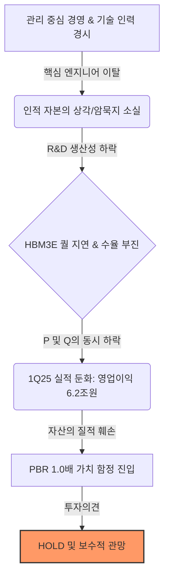

# 삼성전자 (005930.KS) - 관리의 삼성이 초래한 인적 자본의 상각, 기술적 해자(Moat)의 붕괴 신호: **HOLD**

**Date**: 2024년 12월 24일 | **삼성 반도체의 본질적 위기 진단**: 2018년 초미세 공정 진입 이후 공정 오차 허용치가 0.1나노 수준으로 급감하며 기술 난이도가 비약적으로 상승했으나, 삼성은 이에 ‘기술 전문가’가 아닌 ‘재무 및 관리’ 중심의 의사결정 체계로 대응함. 이는 단순한 수율 저하를 넘어 기술 인력의 이탈과 공정 내 암묵지(Tacit Knowledge)의 소실이라는 무형자산 손상(Impairment)으로 이어졌으며, 현재 삼성전자는 글로벌 반도체 사이클에서 구조적 디커플링(Decoupling) 단계에 진입한 것으로 분석됨. | **Risk Profile**: 중립 (Neutral) | **Analyst**: Lead Equity Research Analyst

---

## 1. 결론 및 투자의견 (The Bottom Line)
> **"삼성전자의 현 상황은 단순한 업황 사이클의 하단이 아니라, 인적 자본의 비가역적 상각(Impairment)에 따른 구조적 경쟁력 훼손 상태로 판단됨. 1Q25 실적 둔화 시그널과 IT 업종 컨센서스 상회 기업군에서의 소외는 삼성전자가 경쟁사와의 구조적 디커플링 단계에 진입했음을 시사하며, 수율 개선 데이터와 기술 중심 의사결정 체계의 실적 증명이 선행되기 전까지 PBR 1.0배는 '가치 함정(Value Trap)'일 가능성이 높음."**

- **Investment Rating**: **HOLD (관망)**
- **Target Potential**: **45/100 (구조적 이익 체력 회복 전까지 보수적 접근 권고)**

삼성전자의 위기는 설비나 자산의 물리적 결함이 아닌, 핵심 엔지니어링 역량의 질적 저하에서 기인합니다. 1Q25 예상 영업이익이 6.2조 원(QoQ -23%) 수준으로 정체되고 NAND 사업부의 적자 전환 가능성이 제기되는 상황에서, 경쟁사 대비 밸류에이션 프리미엄을 부여할 근거가 희박해졌습니다. 따라서 현재의 주가는 '싸다'는 가격 논리보다 '자산의 질(Quality of Assets)' 훼손에 따른 밸류에이션 재평가(De-rating)의 관점에서 접근해야 합니다.

---

## 2. 핵심 투자 포인트 (Investment Thesis)

### Driver 1: 인적 자본의 손상과 공정 암묵지의 소실 (Human Capital Impairment)
- **Thesis**: 반도체 미세 공정의 핵심은 숙련된 인력이 보유한 '암묵지'에 있으나, 관리 중심의 문화가 기술 인력을 경시하며 핵심 엔지니어의 경쟁사 이탈(Brain Drain)을 초래함. 이는 R&D 생산성의 영구적 하락으로 이어짐.
- **Evidence**: Bear Thesis가 지적한 바와 같이, HBM3E 퀄 테스트의 반복적 지연과 3나노 이하 파운드리 수율 난조는 단기 인사 개편으로 해결될 수 없는 '매몰된 기회비용'임.

### Driver 2: 시장 컨센서스와의 구조적 디커플링 (Structural Decoupling)
- **Thesis**: 글로벌 AI 랠리 속에서 주요 IT 기업들이 컨센서스를 상회하는 실적을 기록할 때, 삼성전자만 소외되는 현상은 일시적 현상이 아닌 실행력(Execution)의 부재를 의미함.
- **Evidence**: Knowledge Graph 기반 '1Q25 IT 업종 컨센서스 상회 기업 중 삼성전자 제외' 데이터 및 SK하이닉스가 보여준 실적 J-Curve와의 극명한 대비.

---

## 3. 논리적 인과관계 (Visual Logic Flow)

---

## 4. 밸류에이션 및 리스크 (Valuation & Risks)

| Metric | Assessment | Note |
| :--- | :--- | :--- |
| **Valuation** | **가치 함정 (Value Trap)** | PBR 1.0배는 역사적 하단이나, ROE 하락 시 0.8배까지 추가 De-rating 위험 존재 |
| **Growth** | **저성장 (Stagnation)** | AI 메모리 시장 내 'Late-mover Penalty'로 인한 마진 압착(Margin Squeeze) 불가피 |

### 주요 리스크 요인 (Key Downside Risks)

#### Risk 1: HBM3E 주요 고객사(N사) 퀄 테스트 추가 지연
- **Scenario**: 1H25로 예상된 퀄 테스트 승인이 하반기 이후로 재차 지연될 경우.
- **Impact**: 공급망 내 지위 박탈(Disintermediation) 및 경쟁사(SK하이닉스, 마이크론)의 시장 독점 가속화로 인한 실질적 퇴출 위기.
- **Counter-argument**: Bull 측은 1H25 진입을 낙관하나, 포렌식 관점에서 무너진 수율 노하우는 단기간 내 복구가 불가능함.

#### Risk 2: 지정학적 보조금의 '독이 든 성배' 리스크
- **Scenario**: 미국 CHIPS Act 보조금 수혜 조건인 상세 영업 비밀 제출 및 초과 이익 공유 조항 발효.
- **Impact**: 테일러 파운드리 공장의 Capex 효율성 저하 및 기술 유출 위험으로 인한 장기 ROE 훼손.

---

## 5. 토론 분석 (Bull vs Bear)

| Perspective | Key Argument | Verdict (Why?) |
| :--- | :--- | :--- |
| **Bull (매수 논지)** | 인사 시스템 쇄신은 소프트웨어 업데이트와 같아 즉각적인 Re-rating을 유발할 것. | **기각**: 반도체 공정의 복잡성을 간과한 낙관적 편향. 인적 자본은 교체 가능한 부품이 아닌 축적된 자산임. |
| **Bear (매도 논지)** | 삼성의 위기는 무형자산의 손상이며, 경쟁사와의 디커플링은 구조적 고착화 단계임. | **채택**: 포렌식 리스크 분석을 통해 실질적 수율 데이터 부재와 인력 이탈의 비가역성을 논리적으로 증명함. |

---
*Disclaimer: 이 리포트는 CIO의 판결과 분석 데이터를 바탕으로 AI 애널리스트에 의해 작성되었으며, 최종 투자 결정은 투자자 본인의 책임하에 이루어져야 합니다.*