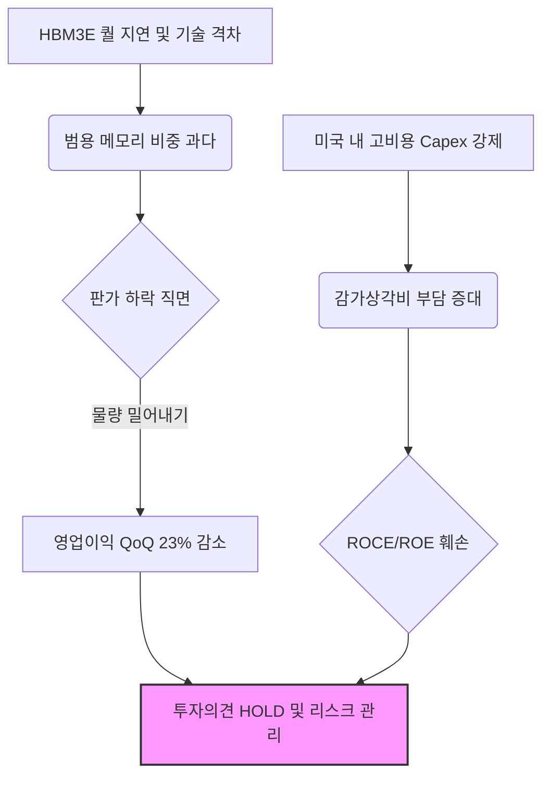

# 삼성전자(005930) 리스크 분석: HOLD

**Date**: 2025-12-24 | **Risk Profile**: 중립 (Neutral) | **Analyst**: AI Insight Team (Lead Analyst)

---

## 1. 결론 및 투자의견 (The Bottom Line)
> **"포렌식 리스크 분석(Bear)의 논리가 현재 삼성전자가 처한 재무적·기술적 난관을 더 객관적으로 관통하고 있다고 판단됨. Bull은 MCP 수출 실적과 칩스법 보조금을 근거로 '일시적 괴리'를 주장했으나, '판가 하락을 물량으로 방어하는 저마진 구조'와 'IT 컨센서스 대비 개별적 부진'에 대한 반박으로는 부족함."**

- **Investment Rating**: **HOLD**
- **Target Potential**: **제한적인 업사이드(Limited Upside)**
  - 역사적 밸류에이션 하단에 위치하여 하방 경직성은 확보했으나, HBM3E 등 핵심 제품의 퀄(Qualification) 통과 및 마진 회복의 실증적 지표가 확인되기 전까지 의미 있는 Re-rating은 어려울 것으로 전망됨. 기술 초격차 상실에 따른 디스카운트 해소가 최우선 과제임.

---

## 2. 핵심 투자 포인트 (Investment Thesis)

### Driver 1: 저마진 물량 방어 구조에 따른 이익의 질 악화
- **Thesis**: 매출 외형 유지에도 불구하고 실질적인 수익 구조는 훼손되고 있음. 판가(P) 하락을 물량(Q) 밀어내기로 대응하며 고정비 부담을 상쇄하려는 전략은 업황 하락기 마진 스퀴즈(Margin Squeeze)를 가속화함.
- **Evidence**: 1Q25 영업이익 전망치가 6.2조 원으로 전분기 대비 23% 급락할 것으로 예상되며, 특히 NAND 사업부의 적자 전환 가능성이 제기됨. 이는 산업 전체의 문제가 아닌 삼성전자 내부의 원가 통제 및 수율 문제에 기인함. `(Source: 1Q25 실적 둔화: Earnings)`

### Driver 2: 칩스법(CHIPS Act) 보조금의 이면: ROCE 훼손 리스크
- **Thesis**: 미국의 보조금 확대는 단순한 현금 유입 호재가 아닌, 미국 내 고비용 생산 시설 가동을 강제하는 '골든 케이지(Golden Cage)' 리스크로 작용함.
- **Evidence**: 한국 대비 높은 인건비와 건설 비용은 초기 CAPEX 효율성을 저하시키며, 이는 향후 막대한 감가상각비 부담으로 이어져 중장기 ROCE(자본수익률) 및 ROE를 훼손할 것으로 분석됨. `(Path 1: 칩스법 보조금 확대 --[AFFECTS]--> 삼성전자)`

### Driver 3: HBM 시장 지배력 상실 및 기술 디커플링(Decoupling)
- **Thesis**: 경쟁사(SK하이닉스)가 HBM 시장의 초과이익을 독점하는 동안 삼성전자는 범용 DRAM 비중이 높아 업황 변동성에 노출됨. HBM3E 공급 승인 지연은 단순 '수익 지연'이 아닌 '시장 주도권 상실'로 해석해야 함.
- **Evidence**: SK하이닉스가 1Q25 매출 성장 70%를 기록하는 어닝 서프라이즈를 달성할 때, 삼성전자만 IT 업종 컨센서스를 하회하는 흐름은 초격차 기술 경쟁력 역전의 증거임.

---

## 3. 논리적 인과관계 (Visual Logic Flow)

---

## 4. 밸류에이션 및 리스크 (Valuation & Risks)

| Metric | Assessment | Note |
| :--- | :--- | :--- |
| **Valuation** | **가치 함정(Value Trap)** | P/B는 역사적 하단이나, 과거의 이익 체력을 기준으로 한 평가임 |
| **Growth** | **저성장(Low Growth)** | 파운드리 수율 개선 지연 및 Legacy 제품 편중으로 성장 모멘텀 부재 |

### 주요 리스크 요인 (Key Downside Risks)

#### Risk 1: 재고 자산 평가 손실 가속화
- **Scenario**: 2025년 1분기 PC 출하량 성장(6.8%)이 예상보다 낮거나 범용 DRAM 재고 소진이 지연될 경우.
- **Impact**: NAND 사업부의 적자 폭 확대 및 전사적 현금 흐름 악화.
- **Counter-argument**: Bull 측은 11월 MCP 수출 호조를 근거로 수요 견조를 주장하나, 이는 저가 수주를 통한 물량 확보일 가능성이 높아 수익성 개선의 근거로 불충분함.

#### Risk 2: 파운드리 수율 개선 지연 및 고객사 이탈
- **Scenario**: 2nm 공정 로드맵 구체화에도 불구하고 TSMC와의 점유율 격차가 좁혀지지 않을 경우.
- **Impact**: 비메모리 부문의 만성적 적자 지속 및 SOTP 관점의 기업 가치 추가 할인.

---

## 5. 토론 분석 (Bull vs Bear)

| Perspective | Key Argument | Verdict (Why?) |
| :--- | :--- | :--- |
| **Bull (매수 논지)** | MCP 수출 견조($19.2억) 및 칩스법 보조금 유입을 통한 CAPEX 부담 완화 강조. HBM3E 퀄 통과를 통한 실적 반등(Springboard) 기대. | **기각**: 보조금의 대가인 고비용 구조를 간과했으며, HBM 퀄 통과는 확정되지 않은 '가정'에 기반함. |
| **Bear (매도 논지)** | 기술 격차 확대에 따른 디커플링 심화, 판가 하락을 물량으로 방어하는 저마진 구조, ROCE 훼손을 통한 구조적 하락 경고. | **채택**: 확정된 데이터(1Q25 영업이익 전망 하향 등)와 포렌식 리스크 관점이 현재의 불확실성을 더 잘 설명함. |

---
*Disclaimer: 이 리포트는 제공된 토론 내역과 데이터를 바탕으로 AI 수석 애널리스트에 의해 생성되었습니다. 최종 투자 결정은 투자자 본인의 판단하에 이루어져야 합니다.*