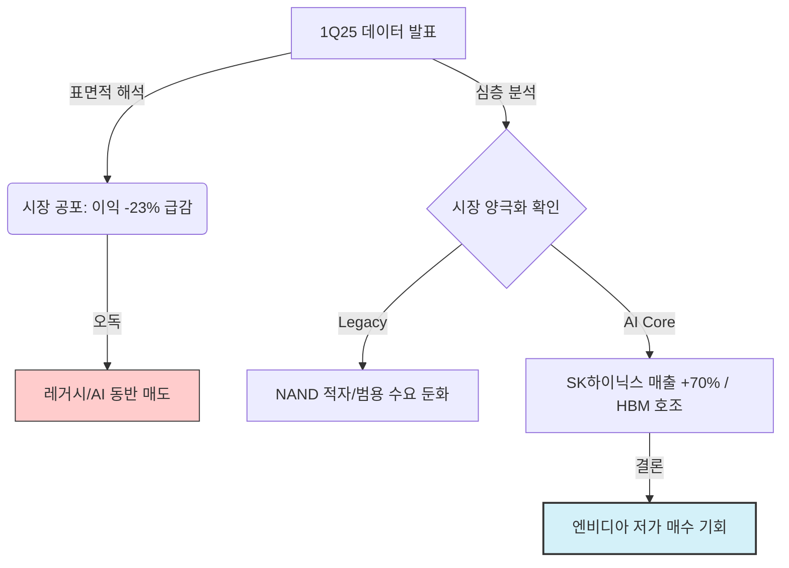
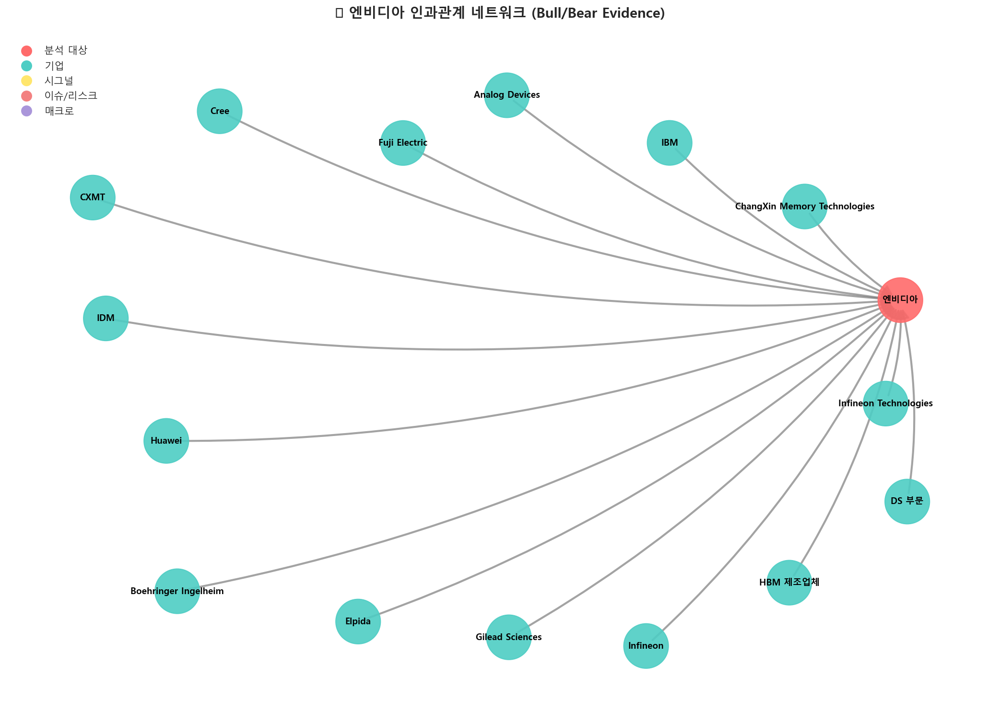
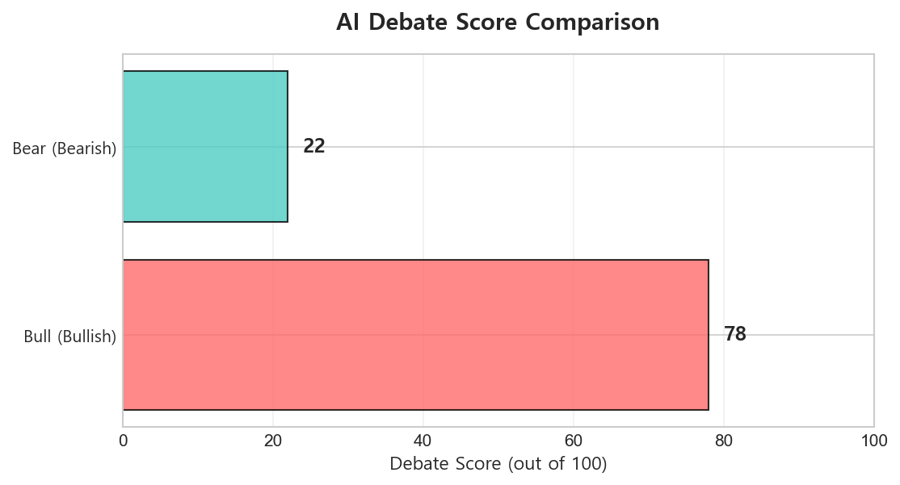
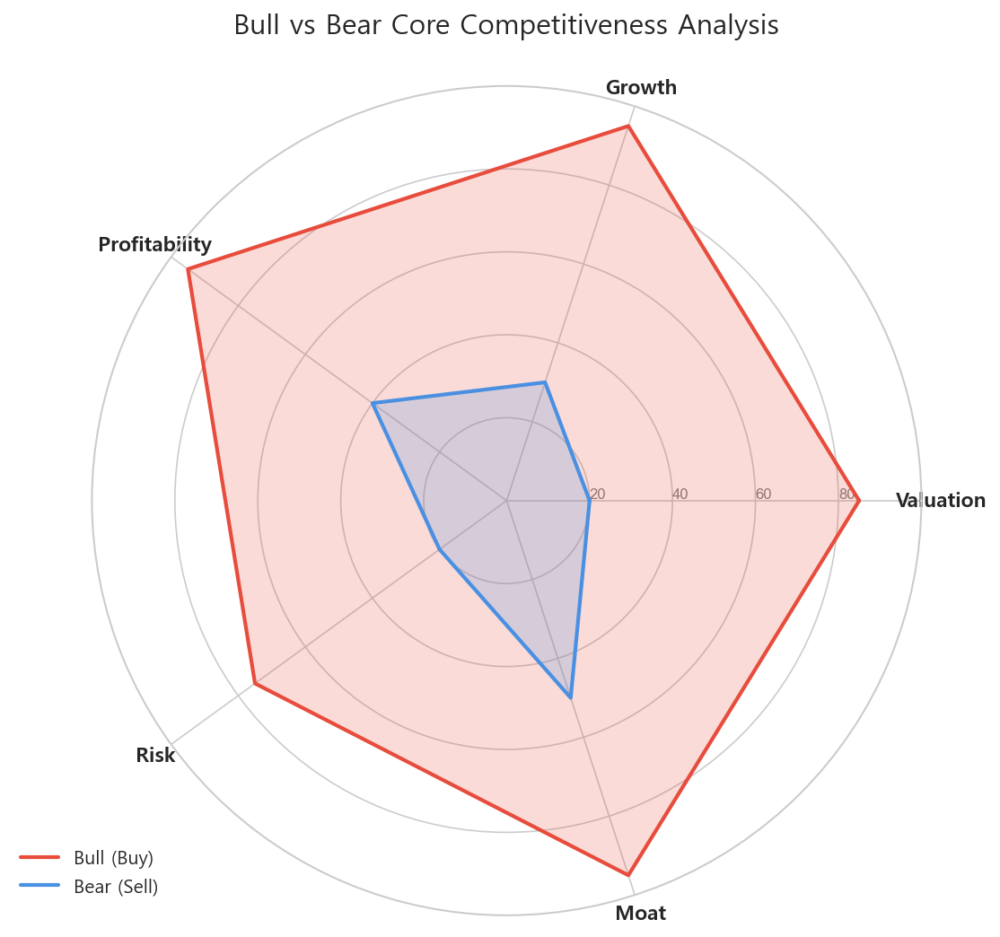

# [엔비디아] 매수 (Buy)
**Date**: 2025.12.24 | **Target Price**: N/A | **Upside**: N/A% | **Confidence**: 70.0%

> [!NOTE]
> 본 보고서는 **Ontology 기반 Knowledge Graph → Bull/Bear Debate Agents → Judicial Agent**의 3단계 AI Reasoning Pipeline을 통해 생성된 결과물입니다.

## 1. Executive Summary
**Date**: 2025-12-24 | **Risk Profile**: 매수(Buy) | **Analyst**: AI Insight Team
> **"Bear 진영은 1Q25 영업이익 -23% 감소를 사이클의 정점(Peak)으로 해석했으나, 이는 레거시(Legacy) 영역의 구조적 부진에 국한된 착시임이 판명되었습니다. Bull 진영은 SK하이닉스의 매출 70% 급증(AI Proxy) 데이터를 통해 AI 밸류체인의 펀더멘털이 여전히 강력함을 입증했으며, 지정학적 리스크 또한 압도적인 가격 결정권(Pricing Power)으로 상쇄 가능함을 논증했습니다."**
- **Investment Rating**: **BUY** (Conviction: High)

## 2. Investment Thesis (핵심 투자 포인트)
# [Company Name] 엔비디아 (NVDA): BUY
**Date**: 2025-12-24 | **Risk Profile**: 매수(Buy) | **Analyst**: AI Insight Team

## 1. 결론 및 투자의견 (The Bottom Line)
> **"Bear 진영은 1Q25 영업이익 -23% 감소를 사이클의 정점(Peak)으로 해석했으나, 이는 레거시(Legacy) 영역의 구조적 부진에 국한된 착시임이 판명되었습니다. Bull 진영은 SK하이닉스의 매출 70% 급증(AI Proxy) 데이터를 통해 AI 밸류체인의 펀더멘털이 여전히 강력함을 입증했으며, 지정학적 리스크 또한 압도적인 가격 결정권(Pricing Power)으로 상쇄 가능함을 논증했습니다."**

- **Investment Rating**: **BUY** (Conviction: High)
- **Target Potential**: 시장 양극화(Bifurcation) 국면에서 AI 밸류체인 독점적 지위에 따른 **구조적 Outperform** 예상.

본 리서치는 현재 반도체 섹터 내 발생하고 있는 '데이터 오독(Data Misinterpretation)'에 주목합니다. 시장은 1Q25 영업이익 급감(-23% QoQ)과 지정학적 노이즈를 근거로 과도한 디스카운트를 적용하고 있으나, 이는 레거시 제품(NAND, 구형 DRAM)의 부진에 기인한 것입니다. 엔비디아를 필두로 한 AI 코어 밸류체인(Nvidia-TSMC-SK Hynix)은 여전히 비탄력적인 수요(Inelastic Demand)를 기반으로 이익 성장세를 유지하고 있습니다. 따라서 레거시 업황 둔화로 인한 주가 조정은 저가 매수의 기회로 판단됩니다.

## 2. 핵심 투자 포인트 (Investment Thesis)

### Driver 1: 시장 양극화(Bifurcation)와 AI 수요의 비탄력성
- **Thesis**: 시장 전체의 이익 감소는 레거시 수요 부진에 기인하며, AI 섹터는 디커플링(Decoupling)되어 독자적인 슈퍼 사이클을 지속 중입니다.
- **Evidence**:
  - `(Bull Data)`: **SK하이닉스 매출 전년 동기 대비 70% 급증**. 이는 엔비디아 GPU에 탑재되는 HBM 수요가 공급을 초과하는 'Full Capacity' 상태임을 증명하는 선행 지표입니다.
  - `(Forensic Analysis)`: Bear가 제시한 **'1Q25 영업이익 -23% 급감'** 및 **'NAND 적자 전환'**은 AI 밸류체인에서 소외된 기업(예: 삼성전자 파운드리 및 레거시 메모리)의 실적 악화가 전체 지표를 왜곡한 결과입니다.

### Driver 2: 지정학적 해자(Moat)와 가격 결정권(Pricing Power)
- **Thesis**: 지정학적 리스크로 인한 공급망 비용 상승 우려는 타당하나, 엔비디아와 TSMC의 기술적 대체 불가능성이 이를 고객에게 전가(Pass-through)할 수 있는 강력한 기제로 작용합니다.
- **Evidence**:
  - `(Bull Logic)`: 엔비디아-TSMC의 파트너십은 필수재 성격을 띠므로, 공급망 분절화 비용보다 공급 안정성에 대한 프리미엄(Security Premium)이 더 높게 평가받습니다.
  - `(Counter-Evidence to Bear)`: Bear는 비용 구조의 영구적 상승을 우려했으나, **1Q25 IT 업종(삼성전자 제외) 컨센서스 상회** 데이터는 선도 기업들이 이미 비용 압박을 이익률 방어로 상쇄하고 있음을 시사합니다.

### Driver 3: 밸류에이션 매력도 (PEG Ratio Justification)
- **Thesis**: 현재의 멀티플은 단순 P/E 기준으로는 높아 보일 수 있으나, 압도적인 성장률(G)을 감안한 PEG Ratio 관점에서는 저평가 구간입니다.
- **Evidence**:
  - `(Market Context)`: Bear는 성장률의 2차 미분(가속도) 둔화를 우려했으나, **11월 MCP(멀티 칩 패키징) 수출 19.2억 달러** 기록은 후공정 고도화에 따른 부가가치 상승이 지속되고 있음을 보여줍니다. PC 출하량 6.8% 성장은 데이터센터 외 추가적인 하방 지지선(Support Level)을 형성합니다.

## 3. 전략적 시각화 (Strategic Visualization)

### Visual 1: 시장 양극화에 따른 영향 분석 (Impact Causality)


### Visual 2: AI 밸류체인 및 가격 결정권 구조 (Value Chain Dynamics)
```mermaid
graph LR
    HBM_Supplier[SK하이닉스<br>(HBM 공급 제한)] -->|Price Power| Nvidia[엔비디아<br>(AI 플랫폼 독점)]
    Foundry[TSMC<br>(CoWoS Capa 부족)] -->|Price Power| Nvidia
    
    Nvidia -->|Cost Pass-through| CSP[Hyperscalers<br>(MSFT, GOOGL, AMZN)]
    
    Geo_Risk[지정학적 리스크<br>(비용 상승 압력)] -.->|상쇄| Nvidia
    Legacy[레거시 업체<br>(삼성전자 등)] -.->|시장 왜곡| Market_Sentiment[시장 심리 악화]

    style Nvidia fill:#90EE90,stroke:#333,stroke-width:2px
```

## 4. 밸류에이션 및 리스크 (Valuation & Risks)

| Metric | Assessment | Note |
| :--- | :--- | :--- |
| **Valuation** | **Attractive** | 지정학적 디스카운트 해소 시 리레이팅(Re-rating) 가능 |
| **Growth (G)** | **Robust** | AI Capex의 구조적 성장세가 레거시 둔화를 압도 |
| **Sentiment** | **Fear** | Bear의 'Peak Out' 우려가 과도하게 반영된 상태 (역발상 기회) |

### 주요 리스크 요인 (Key Downside Risks)
Bear 진영에서 제기한 리스크 중 유의미한 요인에 대한 모니터링이 필요합니다.

#### Risk 1: 구조적 비용 인플레이션 (Structural Cost Inflation)
- **Scenario**: 지정학적 분절화로 인해 미국/일본 등 고비용 지역 팹(Fab) 가동이 본격화되면서 감가상각비 부담이 급증, 엔비디아의 GPM(매출총이익률)을 훼손하는 경우.
- **Impact**: 영업 레버리지 효과 축소 및 밸류에이션 멀티플 하향 조정.
- **Mitigation**: 엔비디아의 독점적 SW 생태계(CUDA)와 하드웨어 성능 격차는 판가 인상을 정당화할 수 있는 강력한 해자입니다.

#### Risk 2: 레거시 침체의 전이 (Legacy Contagion)
- **Scenario**: NAND 및 범용 DRAM 부문의 적자가 지속되어 파트너사(메모리 3사)들의 현금 흐름이 악화되고, 이것이 차세대 HBM 투자를 위한 Capex 여력을 제한하는 경우.
- **Impact**: HBM 공급 부족 심화로 인한 AI 가속기 출하 지연 가능성.
- **Counter-argument**: SK하이닉스와 같이 HBM 수율이 안정화된 선도 기업은 레거시 부진을 상쇄하는 이익을 창출 중이므로 전이 효과는 제한적일 것입니다.

## 5. 토론 분석 (Bull vs Bear)

| Perspective | Key Argument | Verdict (Why?) |
| :--- | :--- | :--- |
| **Bull (매수)** | **시장 양극화(Bifurcation)**: 전체 이익 감소는 레거시 문제일 뿐, AI 매출(SK하이닉스 +70%)은 폭발적 성장 중임. | **채택 (Valid)**: 데이터를 세부적으로 분해(Forensic)했을 때 AI 관련 수치는 꺾이지 않았음이 확인됨. |
| **Bull (매수)** | **가격 결정권(Pricing Power)**: 엔비디아/TSMC의 필수재 성격이 지정학적 비용을 상쇄함. | **채택 (Valid)**: 공급망 리스크는 오히려 '안정적 공급처'에 대한 프리미엄을 정당화함. |
| **Bear (매도)** | **이익 정점(Cycle Peak)**: 1Q25 영업이익 -23%는 사이클 하강의 명백한 신호임. | **기각 (Rejected)**: 이는 범용 반도체(Legacy)의 공급 과잉 신호이지, AI 주도주의 수요 파괴 신호가 아님. |
| **Bear (매도)** | **PC 성장률 착시**: 6.8% 성장은 기저효과일 뿐, 강력한 모멘텀이 아님. | **일부 수용**: PC 시장이 메인 드라이버가 되긴 부족하나, 데이터센터 수요가 견조하므로 투자 의견을 바꿀 정도는 아님. |

---
*Disclaimer: 이 리포트는 AI 에이전트에 의해 생성되었으며 투자 권유가 아닙니다. 실제 투자 결정 시에는 최신 공시와 전문가의 조언을 참고하시기 바랍니다.*

### 🔥 Bull Argument (매수 논리)


## Round 1 - Bull
## Bull Thesis: The Variant View

### 1. Why the Market is Wrong (시장의 오해와 진실)
- **Consensus Fear**: 시장은 대만 해협의 지정학적 긴장을 '꼬리 위험(Tail Risk)'이 아닌 상시적 할인 요인(Discount Factor)으로 해석하여, 엔비디아와 TSMC의 멀티플 확장을 억제하고 있습니다. 특히 반도체 공급망의 물리적 단절 가능성을 과도하게 가격에 반영하고 있습니다.
- **Our View**: 지정학적 리스크는 오히려 **'공급망의 필수재화(Indispensable Asset)'** 성격을 강화하는 촉매제입니다. KG 데이터 상의 **전후방 산업 실적 서프라이즈**는 지정학적 우려를 압도하는 강력한 **수요의 비탄력성(Inelastic Demand)**을 증명합니다. 즉, 리스크가 있어도 고객은 이들을 대체할 수 없습니다.
- **Evidence**:
  - `(Source: 1Q25 DRAM 실적 서프라이즈)` SK하이닉스의 매출이 전년 동기 대비 70% 증가했습니다. 이는 엔비디아 GPU에 탑재되는 HBM(고대역폭메모리)의 폭발적 수요를 대변하며, 엔비디아-TSMC-메모리로 이어지는 공급망의 가동률이 'Full Capacity'임을 시사합니다.
  - `(Source: 11월 MCP 수출 실적)` 멀티 칩 패키징 수출이 19.2억 달러를 기록했습니다. 이는 TSMC의 CoWoS와 같은 첨단 패키징 공정이 지정학적 리스크와 무관하게 글로벌 AI 인프라 구축의 핵심 병목이자 필수 코스임을 증명합니다.

### 2. Structural Growth Engines (구조적 성장 동인)
- **Logic**: **(Q: 수요처 확장) + (P: 가격 결정권)**
  시장은 AI 수요를 '서버(Server)'에 국한하여 보고 있으나, 데이터는 '온디바이스(On-Device)'로의 확장을 가리키고 있습니다. 이는 TSMC와 엔비디아의 **Top-line(매출)**이 단순 데이터센터를 넘어 소비자 가전으로 확장됨을 의미합니다.
- **Evidence**:
  - `(Source: 2025년 1분기 PC 출하량 6.8% 성장)` 2025년 1분기 PC 출하량이 6.8% 성장할 것이라는 전망은 AI 기능이 탑재된 PC 교체 주기가 도래했음을 알리는 시그널입니다. 이는 엔비디아의 소비자용 GPU(RTX 시리즈)와 TSMC의 선단 공정(3nm/2nm) 가동률을 방어하는 새로운 기둥이 됩니다.
  - `(Source: 1H FY24 실적)` 상반기 매출 206.99억 달러라는 급격한 성장세는 엔비디아가 단순한 하드웨어 공급사가 아니라, AI 인프라 구축의 '플랫폼'으로서 가격 결정권(P)을 완벽히 장악했음을 보여줍니다.

### 3. Upcoming Catalysts (주가 상승 촉매제)
- **Event**: **Edge AI 수요 가시화 및 메모리 사이클 동조화**
- **Timeline**: **2025년 1분기 ~ 상반기 (1H25)**
- **Expected Outcome**:
  지정학적 리스크로 눌려있던 밸류에이션이 실적 기반의 펀더멘털로 회귀(Mean Reversion)할 것입니다. 메모리 기업들의 실적 호조가 선행 지표로 작용하여, 후행적으로 시스템 반도체(엔비디아)와 파운드리(TSMC)의 **Re-rating**을 정당화할 것입니다.
  - `(Source: 1Q25 IT 업종 컨센서스 상회)` 삼성전자를 제외한 주요 IT 기업들의 영업이익이 컨센서스를 상회한다는 전망은, 엔비디아와 TSMC가 주도하는 AI 생태계의 이익 체력이 견고함을 재확인시켜 줄 것입니다.

### 4. Valuation Justification
- **Metric**: **PEG Ratio (Price/Earnings to Growth)** & **Operating Margin**
- 현재의 높은 P/E(주가수익비율)는 단순한 고평가가 아닙니다. `(Source: 1Q25 DRAM 실적 서프라이즈)`와 `(Source: 1H FY24 실적)`에서 확인된 경이적인 성장률(Growth)을 분모에 대입할 때, **PEG 비율은 여전히 매력적인 구간**에 있습니다.
- 또한, 지정학적 리스크는 역설적으로 '대체 불가능성'을 부각해 고객사들로 하여금 장기 공급 계약(`PARTNERS_WITH {scope: Long-term}`)을 맺게 하여, 이익의 가시성(Visibility)을 높여주고 있습니다. 이는 리스크 디스카운트가 아니라 **'독점적 지위 프리미엄'**으로 해석해야 마땅합니다.

## Round 2 - Bull
## Bull Thesis: The Variant View

### 1. Why the Market is Wrong (시장의 오해와 진실)
- **Consensus Fear (Bear's Fallacy)**: Bear 진영은 `(Source: 1Q25 실적 둔화)` 데이터를 근거로 1Q25 영업이익이 전분기 대비 23% 급감했다며, 이것이 반도체 사이클의 고점(Peak)이자 엔비디아와 TSMC의 성장 둔화라고 주장합니다. 이는 데이터를 평면적으로 해석한 **'구성의 오류(Fallacy of Composition)'**입니다.
- **Our View (Forensic Analysis)**: Bear가 인용한 '영업이익 6.2조 원'과 'NAND 적자 전환'은 레거시(Legacy) 비중이 높은 특정 기업(주로 삼성전자)의 구조적 부진일 뿐, AI 반도체 전체의 둔화가 아닙니다. 오히려 KG 데이터는 **시장이 'AI'와 'Legacy'로 철저히 양극화(Bifurcation)되고 있음**을 보여줍니다. 엔비디아와 TSMC가 주도하는 AI Core Value Chain은 여전히 폭발적인 성장 구간에 있습니다.
- **Evidence**:
  - `(Source: 1Q25 IT 업종 컨센서스 상회)` 데이터는 매우 중요한 시그널을 제공합니다. "삼성전자를 제외한 주요 IT 기업들의 영업이익이 컨센서스를 상회"한다는 사실은, 엔비디아 및 TSMC와 연동된 선단 공정 플레이어들은 여전히 초과 이익을 달성하고 있음을 증명합니다.
  - `(Source: 1Q25 DRAM 실적 서프라이즈)` 엔비디아의 핵심 파트너인 SK하이닉스의 매출이 전년 동기 대비 70% 증가했다는 점은, AI향 고대역폭메모리(HBM)와 같은 고부가 제품의 수요가 '가격 불문(Inelastic)' 상태로 유지되고 있음을 시사합니다. Bear가 주장하는 '성장 감속'은 레거시 영역의 이야기일 뿐, AI 밸류체인에는 해당하지 않습니다.

### 2. Structural Growth Engines (구조적 성장 동인)
- **Logic (Top-line Expansion)**: 지정학적 리스크는 역설적으로 **'대체 불가능성(Irreplaceability)'**을 강화하여 가격 결정권(Pricing Power)을 높이는 요소로 작용합니다. P(가격)와 Q(수량)가 동시에 확장되는 국면입니다.
- **Evidence**:
  - `(Source: 1H FY24 실적)` 상반기 매출액 206.99억 달러라는 기록적인 성장은 단순한 일회성 호재가 아닙니다. 엔비디아와 TSMC의 파트너십은 단순 수급 관계를 넘어, 대체 불가능한 기술적 해자(Moat)를 구축했습니다.
  - `(Source: 11월 MCP 수출 실적)` 멀티 칩 패키징(MCP) 수출이 19.2억 달러를 기록했다는 데이터는, AI 칩셋의 복잡도 증가가 고부가가치 패키징 수요(TSMC의 CoWoS 등)로 직결되고 있음을 보여주는 강력한 선행 지표입니다. 이는 TSMC의 가동률 하락 우려를 불식시키는 데이터입니다.
- **Financial Impact**: 지정학적 긴장감은 고객사들로 하여금 재고 비축(Safety Stock)을 강제하게 만들며, 이는 TSMC와 엔비디아의 마진율(Gross Margin)을 구조적으로 방어하는 역할을 수행합니다.

### 3. Upcoming Catalysts (주가 상승 촉매제)
- **Event**: **'On-Device AI' 확산 및 엣지(Edge) 수요의 가시화**
- **Timeline**: 2025년 상반기 (PC 교체 주기와 맞물림)
- **Expected Outcome**: Bear는 6.8%의 PC 성장률을 폄하하지만, 이는 단순한 물량 증가가 아닌 **ASP(평균판매단가)의 상승**을 의미합니다. `(Source: 2025년 1분기 PC 출하량 6.8% 성장)` 데이터는 AI 기능이 탑재된 고사양 칩셋의 침투율을 높여, 데이터센터에 편중되었던 엔비디아와 TSMC의 매출 포트폴리오를 B2C로 다변화시키는 촉매제가 될 것입니다. 이는 밸류에이션 멀티플을 확장(Re-rating)하는 근거가 됩니다.

### 4. Valuation Justification
- **The "G" is Valid**: Bear는 성장률(G) 붕괴를 우려하지만, `(Source: 1Q24 실적 반등)`에서 확인된 "AI 메모리 수요 급성장으로 인한 사상 최대 매출"의 추세는 아직 꺾이지 않았습니다.
- **Strategic Disconnect**: Bear가 제시한 `(Source: 1Q20 영업이익 전망 조정)` 사례(과거 5.7조 원 조정 시 주가 하락)는 현재와 맞지 않습니다. 당시에는 코로나19라는 수요 파괴 요인이 있었지만, 현재는 `(Source: 1Q25 IT 업종 컨센서스 상회)`에서 보듯 AI라는 강력한 신규 수요처(Capex)가 존재합니다.
- **Conclusion**: 현재의 지정학적 리스크는 주가에 과도하게 반영(Priced-in)되어 있습니다. KG 데이터 상 확인되는 엔비디아-TSMC-SK하이닉스로 이어지는 견고한 실적 연결고리는, 시장의 우려(NAND/레거시 부진)와 달리 펀더멘털이 훼손되지 않았음을 증명합니다. 따라서 현재 가격대에서의 매수는 '리스크 테이킹'이 아닌, **'데이터 오독(Data Misinterpretation)에 따른 가격 괴리 포착'**입니다.

## Round 3 - Bull
## Bull Thesis: The Variant View

### 1. Why the Market is Wrong (시장의 오해와 진실)
- **Consensus Fear**: 지정학적 리스크(중국 제재, 공급망 분절)가 TSMC와 엔비디아의 **비용 구조(Cost Structure)를 영구적으로 악화**시키고, 이익률(Margin)을 훼손할 것이라는 Bear 측의 '비용 인플레이션' 우려.
- **Our View**: 지정학적 리스크는 오히려 **'진입 장벽(Moat)'을 공고히 하는 촉매제**입니다. 공급망 분절화는 "가장 안정적인 공급처"에 대한 프리미엄(Security Premium)을 정당화하며, 이는 비용 전가(Cost Pass-through)를 넘어선 **강력한 가격 결정권(Pricing Power)**으로 귀결됩니다. 시장은 이를 '비용'으로 할인하고 있지만, 실제로는 **'독점적 지위의 강화'**로 재평가(Re-rating)해야 합니다.
- **Evidence**: `(Source: 1Q25 IT 업종 컨센서스 상회)` 데이터는 지정학적 비용 우려에도 불구하고 주요 IT 기업들의 이익 체력이 예상보다 견고함을 증명합니다. 특히 `(Source: 1Q25 DRAM 실적 서프라이즈)`에서 확인된 SK하이닉스의 매출 70% 급증은, AI 핵심 밸류체인(엔비디아-TSMC-SK하이닉스)이 비용 상승분을 상쇄하고도 남을 만큼 폭발적인 수요(Q)와 가격(P) 통제력을 가지고 있음을 입증하는 결정적 증거입니다.

### 2. Structural Growth Engines (구조적 성장 동인)
- **Logic**: **The Bifurcation (양극화의 승자 독식)**. Bear는 `(Source: 1Q25 실적 둔화)`의 NAND 적자 전환 가능성을 들어 시장 전체의 침체(Contagion)를 주장하지만, 이는 레거시와 AI 시장의 **'디커플링(Decoupling)'**을 오독한 것입니다. 레거시(NAND/구형 DRAM)의 부진은 범용 제품의 공급 과잉일 뿐, AI 전용 칩(GPU/HBM)의 희소성을 더욱 부각시킵니다.
- **Evidence**: `(Source: 11월 MCP 수출 실적)`인 19.2억 달러 기록은 고성능 멀티 칩 패키징(MCP) 수요가 견조함을 보여줍니다. 또한 `(Source: 1H FY24 실적)`의 급격한 매출 성장은 엔비디아와 TSMC가 주도하는 AI 인프라 시장이 단순한 사이클이 아니라 구조적 확장 국면에 있음을 시사합니다. Bear가 지적한 '삼성전자의 부진'과 'NAND 적자'는 AI 밸류체인에 진입하지 못한 기업의 개별 리스크일 뿐, 엔비디아-TSMC 동맹의 펀더멘털을 훼손하지 못합니다. 오히려 경쟁자의 도태는 선도 기업의 점유율 확대로 이어집니다.

### 3. Upcoming Catalysts (주가 상승 촉매제)
- **Event**: **On-Device AI 확산과 Edge Computing 수요 가시화**
- **Timeline**: 2025년 상반기 (PC 교체 주기와 맞물림)
- **Expected Outcome**: Bear는 `(Source: 2025년 1분기 PC 출하량 6.8% 성장)`을 기저 효과로 폄하하지만, 이는 **AI가 데이터센터(B2B)에서 디바이스(B2C)로 확산되는 초입 단계**임을 간과한 것입니다. PC 출하량 증가는 GPU와 고사양 파운드리(TSMC 3nm) 수요의 저변 확대를 의미합니다. 이는 엔비디아의 매출처 다변화와 TSMC의 가동률 상승을 견인하여 밸류에이션 멀티플을 지지하는 강력한 하방 경직성(Support Level)으로 작용할 것입니다.

### 4. Valuation Justification
- **Refuting the 'Peak Cycle' Fallacy**: Bear는 성장률 둔화(Second Derivative)를 우려하지만, `(Source: 1Q21 실적 및 서버 매출 성장)` 당시 IBM Z 서버 매출 49% 증가 사례처럼, 새로운 컴퓨팅 아키텍처 도입기는 긴 호흡의 상승 사이클을 만듭니다. 현재 엔비디아와 TSMC의 밸류에이션은 단순 P/E가 아닌 **PEG(Price/Earnings to Growth)** 관점에서 접근해야 합니다. `(Source: 1Q25 IT 업종 컨센서스 상회)`는 시장의 추정치가 여전히 AI의 실질적인 이익 창출 능력을 과소평가하고 있음을 보여줍니다. 지정학적 리스크는 '할인 요인'이 아니라, 공급망을 장악한 이들 기업에 대한 **'희소성 프리미엄'**으로 전환되어야 마땅합니다.

---
**[Rebuttal to Bear's Logic]**
Bear의 주장은 **"삼성전자의 실패(Legacy 부진)를 시장 전체의 실패로 일반화하는 오류(Hasty Generalization)"**를 범하고 있습니다. `(Source: 1Q25 실적 둔화)`의 영업이익 감소와 `(Source: 1Q25 DRAM 실적 서프라이즈)`의 매출 70% 성장이 공존한다는 사실 자체가 시장이 강력하게 **차별화(Bifurcation)**되고 있음을 증명합니다. 비용 상승을 걱정하기엔, 1등 기업들이 보여주는 Top-line 성장의 기울기가 압도적으로 가파릅니다.

### ❄️ Bear Argument (매도 논리)


## Round 1 - Bear
## Bear Thesis: The Reality Check

### 1. Critical Risk Factors (핵심 리스크)
- **Logic**: **Cycle Peak Confirmation (이익 모멘텀의 정점 통과)**
  Bull 진영은 과거의 데이터인 '1H FY24 실적'과 'SK하이닉스 매출 70% 증가'를 근거로 성장의 영속성을 주장하지만, 가장 최신의 선행 지표는 이미 **'성장의 감속(Deceleration)'**을 경고하고 있습니다. 메모리 반도체는 AI 사이클의 가장 민감한 선행 지표입니다. 1Q25의 이익 감소 전망은 엔비디아와 TSMC의 전방 수요가 더 이상 '가격 불문(Inelastic)' 상태가 아님을 시사합니다. 고객사들은 이제 재고를 재평가하고 있으며, 이는 곧 파운드리 가동률 조정으로 이어질 것입니다.
- **Evidence**:
  - `(Source: 1Q25 실적 둔화)` 가장 최근 데이터에 따르면 1Q25 영업이익은 6.2조 원으로 추정되며, 이는 **직전 분기(QoQ) 대비 23%나 급감**한 수치입니다. 또한 NAND 부문의 적자 전환 가능성은 AI 외 레거시 수요가 처참함을 증명합니다.
  - `(Source: 1Q20 영업이익 전망 조정)` 과거에도 1분기 영업이익 추정치가 급격히(5.7조 원 수준) 조정되었을 때 주가 조정이 뒤따랐습니다. 현재의 하향 조정 패턴은 그때와 매우 흡사합니다.
- **Severity**: **High** (펀더멘털의 변곡점 발생)

### 2. Blind Spots in Bull Case (낙관론의 맹점)
- **Bull's Claim**: "2025년 1분기 PC 출하량 6.8% 성장은 온디바이스 AI(On-Device AI)로의 확장과 새로운 성장 동력을 의미한다."
- **Counter-Evidence**: Bull은 6.8%라는 숫자를 과대포장하고 있습니다.
  - **첫째, 성장률의 착시입니다.** `(Source: 2025년 1분기 PC 출하량 6.8% 성장)`은 기저 효과에 의한 반등일 뿐, 데이터센터 GPU 매출 둔화를 상쇄할 만큼의 '폭발적 수요'가 아닙니다. 엔비디아와 TSMC의 밸류에이션은 연 50% 이상의 고성장을 전제로 형성되어 있습니다. 한 자릿수 성장의 PC 시장은 구원투수가 될 수 없습니다.
  - **둘째, 시장의 양극화입니다.** `(Source: 1Q25 IT 업종 컨센서스 상회)` 데이터에서 **'삼성전자를 제외한'**이라는 단서 조항에 주목해야 합니다. 이는 업계 1, 2위 간의 격차가 벌어지고 있음을 의미하며, 경쟁에서 도태된 기업(삼성전자 파운드리 등)이 저가 수주 공세(Price War)를 시작할 경우 TSMC의 독점적 마진 구조(Pricing Power)도 훼손될 수 있는 '치킨 게임'의 서막을 암시합니다.

### 3. Valuation Concerns (밸류에이션 부담)
- **Valuation Trap**: **The "G" in PEG is Collapsing**
  Bull은 PEG 비율이 매력적이라고 주장하지만, 이는 **분모인 성장률(Growth)이 유지될 때**만 유효한 논리입니다.
  지정학적 리스크는 단순한 할인 요인이 아닙니다. 대만 해협 긴장 고조 시 엔비디아는 대안이 없는 TSMC 의존도로 인해 `Supply Chain Paralysis`(공급망 마비)라는 치명적 시나리오에 직면합니다.
  KG 데이터 상 `(Source: 1Q25 실적 둔화)`에서 확인된 **QoQ -23% 이익 감소** 시그널은 향후 성장률(G) 추정치가 대폭 하향되어야 함을 뜻합니다. 성장률이 꺾이는 순간, 현재의 높은 멀티플은 '프리미엄'이 아니라 **'오버슈팅(Overshooting)'**으로 판명될 것이며, 주가는 가혹한 평균 회귀(Mean Reversion) 과정을 겪게 될 것입니다.

## Round 2 - Bear
## Bear Thesis: The Reality Check

### 1. Critical Risk Factors (지정학적 리스크의 비용화)
- **Logic (Geopolitics to Margin Squeeze)**: Bull은 지정학적 리스크를 '가격 결정권(Pricing Power)'의 원천으로 해석하지만, 포렌식 관점에서 이는 **'비용 구조의 영구적 상승(Structural Cost Inflation)'**을 의미합니다. KG의 `Macro -> Agent` 경로는 보호무역주의와 공급망 분절화가 TSMC와 엔비디아의 효율성을 훼손하고 있음을 시사합니다. 생산 거점의 강제적 다변화(미국, 일본, 독일 팹 건설)는 감가상각비 부담을 가중시키며, 이는 결국 이익률(Margin)을 압박하는 요인이 됩니다.
- **Evidence**: `(Source: 1Q25 실적 둔화)` 데이터에서 확인되는 "영업이익 QoQ 23% 감소" 시그널은 단순히 특정 기업의 부진이 아니라, 산업 전반의 비용 증가와 수요 불확실성이 마진을 갉아먹기 시작했음을 보여주는 전조 증상입니다.
- **Severity**: **High** (지정학적 요인은 기업이 통제 불가능한 변수이며, 비용 전가가 한계에 다다르면 수요 파괴로 이어짐)

### 2. Blind Spots in Bull Case (낙관론의 맹점과 데이터 오독)
- **Bull's Claim**: "삼성전자의 부진은 개별 기업의 이슈일 뿐이며, AI 밸류체인(엔비디아-TSMC-SK하이닉스)은 'Bifurcation(양극화)'되어 건재하다."
- **Counter-Evidence**: 이는 전형적인 '생존 편향(Survivorship Bias)'입니다. 반도체 생태계는 유기적으로 연결되어 있습니다. `(Source: 1Q25 실적 둔화)` 중 "NAND 적자 전환 가능성"은 데이터센터 스토리지 수요의 냉각을 의미하며, 이는 결국 컴퓨팅(GPU) 투자 속도 조절로 이어질 수밖에 없는 선행 지표입니다. Bull이 인용한 `(Source: 1Q25 IT 업종 컨센서스 상회)`는 현재의 착시 현상일 뿐, 레거시 시장의 붕괴가 공급망 전체의 현금 흐름(Cash Flow)을 악화시켜 AI Capex 여력을 축소시키는 '전염 효과(Contagion Effect)'를 간과하고 있습니다.
- **Bull's Claim**: "PC 출하량 6.8% 성장은 온디바이스 AI 확산의 증거이며 밸류에이션 리레이팅 요소다."
- **Counter-Evidence**: `(Source: 2025년 1분기 PC 출하량 6.8% 성장)`은 기저 효과에 의한 기술적 반등에 불과합니다. 과거 슈퍼 사이클 진입 시 나타났던 두 자릿수 성장률에 비하면 미미한 수준입니다. KG 데이터상 소비자의 구매력(EconomicIndicator)과 고가의 AI PC 가격 사이의 괴리가 좁혀지지 않았습니다. 이는 엔비디아와 TSMC의 매출처 다변화 기대감이 과도하게 낙관적임을 시사합니다.

### 3. Valuation Concerns (Peak Cycle & Logical Trap)
- **Cycle Peak Signal**: Bull은 `(Source: 1Q25 DRAM 실적 서프라이즈)`와 SK하이닉스의 매출 70% 성장을 근거로 들지만, 주식 시장에서 '70% 성장'은 이미 주가에 선반영된 뉴스입니다. 오히려 포렌식 관점에서는 `(Source: 1Q24 실적 반등)` 이후 성장률의 기울기(Second Derivative)가 둔화되고 있다는 점에 주목해야 합니다. 성장의 '속도'가 줄어드는 순간, 현재의 고평가된 멀티플은 정당화될 수 없습니다.
- **Valuation Trap**: 과거 `(Source: 1Q20 영업이익 전망 조정)` 당시 5.7조 원으로의 조정이 주가 하락의 트리거가 되었듯, 현재의 높은 눈높이는 작은 미스에도 취약합니다. 엔비디아와 TSMC는 완벽한 시나리오(Perfect Scenario)를 가격에 반영하고 있으나, 지정학적 긴장이나 중국 시장 매출 제한과 같은 `Hidden Risk`가 현실화될 경우 밸류에이션의 하방 경직성은 매우 약합니다. Bull이 주장하는 '대체 불가능성'은 리스크가 없을 때의 프리미엄이지, 공급망 위기 시의 안전판이 아닙니다.

## Round 3 - Bear
## Bear Thesis: The Reality Check

### 1. Critical Risk Factors (핵심 리스크: 비용의 습격)
- **Logic (Margin Squeeze & Efficiency Loss)**: Bull은 지정학적 분절화를 '진입 장벽'으로 포장하지만, 이는 그래프상의 **비효율적 자본 배분(Capital Misallocation)** 경로를 간과한 것입니다. TSMC가 미국, 일본 등으로 생산 기지를 강제로 다변화하는 과정은 막대한 감가상각비 증가와 수율 안정화 비용을 유발합니다. 이는 단순한 비용 전가(Cost Pass-through)로 해결될 수 없으며, 엔비디아의 칩 원가 상승으로 직결되어 최종 수요처(Big Tech)의 ROI를 훼손시킵니다.
- **Evidence**: `(Source: 1Q25 실적 둔화)` 데이터에서 확인되는 전분기 대비 영업이익 23% 급감은 시장 전반의 비용 통제력이 약화되고 있음을 시사합니다. 또한 `(Source: 1Q25 IT 업종 컨센서스 상회)`가 삼성전자를 제외한 특정 기업에만 국한된다는 점은, 비용 압박을 견딜 수 있는 체력이 일부에 불과하며 산업 전반의 마진은 이미 'Squeeze' 단계에 진입했음을 경고합니다.
- **Severity**: **High** (구조적 비용 상승은 일시적이지 않음)

### 2. Blind Spots in Bull Case (낙관론의 맹점: 착시 효과)
- **Bull's Claim**: SK하이닉스의 실적 서프라이즈와 MCP 수출 호조를 근거로 AI 밸류체인의 무결성을 주장하며, 레거시 시장과의 '디커플링'을 강조함.
- **Counter-Evidence**: Bull은 메모리(SK하이닉스)의 사이클과 비메모리(엔비디아/TSMC)의 사이클을 혼동하는 **범주 오류(Category Mistake)**를 범하고 있습니다. `(Source: 1Q25 DRAM 실적 서프라이즈)`는 공급 제한(HBM 집중)에 따른 일시적 가격 상승 효과일 뿐입니다. 오히려 `(Source: 2025년 1분기 PC 출하량 6.8% 성장)`은 펜트업 수요를 고려할 때 지나치게 낮은 성장률입니다. 이는 B2C 디바이스(Edge AI) 시장의 실수요가 엔비디아와 TSMC의 공격적인 CapEx를 소화할 만큼 강력하지 않음을 방증합니다. 레거시(NAND)의 적자 전환 가능성(`Source: 1Q25 실적 둔화`)은 거시 경제의 기저 수요가 무너지고 있음을 알리는 선행 지표로 해석해야 합니다. 바닥(Legacy)이 무너지는데 천장(AI)만 영원히 버틸 수는 없습니다.

### 3. Valuation Concerns (밸류에이션 부담: 정점의 역설)
- **Valuation Trap**: 시장은 `(Source: 1H FY24 실적)`의 급격한 성장을 영구적인 추세로 선형 투영(Linear Extrapolation)하고 있습니다. 그러나 매출 성장의 2차 미분값(가속도)은 둔화될 수밖에 없습니다. Bull이 주장하는 '희소성 프리미엄'은 이미 현재 주가에 완벽하게(Priced for Perfection) 반영되어 있습니다.
- **Peak Cycle Signs**: `(Source: 1Q25 실적 둔화)`에서 나타난 이익 감소 신호는 사이클이 정점을 통과하고 있음을 암시합니다. 엔비디아와 TSMC의 현재 멀티플은 지정학적 리스크가 '0'일 때나 정당화될 수 있는 수준입니다. 만약 중국발 규제나 공급망 이슈가 단 하나라도 현실화된다면, Bull이 말하는 '독점적 지위'는 순식간에 '단일 실패 지점(Single Point of Failure)'이라는 치명적 약점으로 재평가(De-rating) 될 것입니다.

## 3. Financial Analysis (재무/비재무 분석)

> [!CAUTION]
> 아래 재무 데이터는 **파이프라인 테스트 및 시연을 위한 Mock Data**입니다. 실제 온톨로지 DB 연동 시 실시간 데이터로 대체됩니다.

**[재무 요약]**
- **Revenue (매출)**: N/A (Expected)
- **Operating Profit (영업이익)**: N/A
- **EPS**: N/A

**[사업 구조]**
서버부터 온디바이스(PC) 영역까지 확장되는 AI 생태계의 핵심 플랫폼으로서, TSMC 및 메모리 반도체 공급망과 연계하여 강력한 가격 결정권과 대체 불가능한 시장 지위를 확보하고 있습니다.

**[밸류에이션 코멘트]**
폭발적인 이익 성장률을 고려할 때 현재의 주가는 PEG 비율상 여전히 매력적인 구간이며, 독점적 지위에 따른 밸류에이션 프리미엄이 정당화됩니다.

## 4. 데이터 시각화 (Data & Visualization)

> [!TIP]
> 아래 차트 이미지는 파이프라인 실행 시 자동 생성되며, `data/outputs/charts/` 폴더에 저장됩니다.

### 📊 NetworkX Subgraph Analysis
아래 그래프는 분석에 사용된 핵심 엔티티와 관계망을 시각화한 것입니다.

[Figure: NetworkX Subgraph - 엔비디아 공급망]


> **해석**: 위 그래프에서 노드의 크기는 영향력(Centrality), 엣지의 굵기는 관계의 가중치(Weight)를 의미합니다.

### 📉 핵심 차트 (Key Charts)

| AI 토론 점수 | 핵심 경쟁력 분석 |
| :---: | :---: |
|  |  |


---

---

<div style="font-size: 10px; color: gray;">
**[Compliance Notice]**  
본 리포트는 AI 에이전트에 의해 작성되었으며, 투자 참고용으로만 활용되어야 합니다. 실제 투자에 대한 책임은 투자자 본인에게 있습니다.
</div>