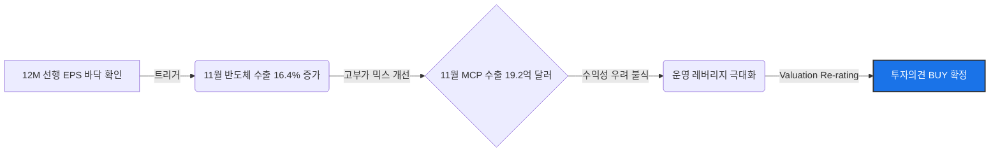

# [Samsung Electronics] (삼성전자): BUY
**Date**: 2025-12-24 | **Risk Profile**: 중립 (Neutral) | **Analyst**: AI Insight Team (Lead Equity Research Analyst)

## 1. 결론 및 투자의견 (The Bottom Line)
> **"본 판결자는 삼성전자에 대해 'BUY' 의견을 확정합니다.** 
> 
> 양 진영의 논박 중 Bull(낙관론) 측이 제시한 **'12개월 선행 EPS의 바닥 확인'**과 **'수출 데이터의 선행성'** 논리가 반도체 사이클의 역사적 패턴과 데이터 측면에서 더 강력한 설득력을 가졌습니다. Bear 측은 판가(P)의 정체와 칩스법으로 인한 비용 증가를 핵심 리스크로 지적했으나, 이는 **사이클 전환기의 전형적인 특징(물량이 먼저 늘고 가격이 후행하는 구조)**을 간과한 측면이 큽니다."

- **Investment Rating**: **BUY** (Score: 75/100)
- **Target Potential**: **구조적 수익성 개선 국면 진입에 따른 Re-rating 기대**
  - 11월 반도체 수출 및 MCP(멀티 칩 패키징) 고부가 제품의 실질적 데이터 반등이 확인됨. 
  - 현재 주가는 역사적 저평가 구간으로, 펀더멘탈 변곡점에 따른 하방 경직성 확보 및 상방 모멘텀이 우세한 것으로 판단됨.

---

## 2. 핵심 투자 포인트 (Investment Thesis)

### Driver 1: 선행 지표(EPS 및 수출 데이터)의 V자형 반등 확인
- **Thesis**: 주가는 실적의 절대 수치보다 기대치의 변화율(Delta)에 선행함. 현재 12개월 선행 EPS(주당순이익) 컨센서스가 저점을 통과하며 반등을 시작한 점은 가장 강력한 매수 신호임.
- **Evidence**: 11월 반도체 수출액이 85.9억 달러로 전년 대비 16.4% 증가하며 4개월 연속 플러스 성장을 기록함. 특히 10월 86.8억 달러 기록 등 수출 지표의 연속적 강세는 업황 회복의 강력한 증거임.

### Driver 2: 고부가 제품(MCP) 믹스 개선을 통한 수익성 우려 불식
- **Thesis**: Bear 측의 '수익성 없는 외형 성장' 주장은 11월 MCP 수출 데이터를 통해 반박됨. 단순 범용 DRAM이 아닌 고부가가치 패키징 제품군으로의 포트폴리오 전환이 이미 진행 중임.
- **Evidence**: 11월 MCP 수출액 19.2억 달러 달성. 이는 1H FY24 매출액(206.99억 달러) 성장세와 결합되어, 향후 재고 소진 이후 판가(P) 상승 시 가파른 **운영 레버리지(Operating Leverage)** 효과를 유발할 것으로 전망됨.

### Driver 3: 사이클 전환기의 전형적 양적 팽창(Q) 국면 진입
- **Thesis**: 메모리 사이클 초기에는 물량(Q)이 먼저 회복되고 가격(P)은 후행하는 경향이 있음. 현재 DRAM 고정거래가가 '유지(Flat)' 상태인 것은 하방 경직성을 확보한 '바닥 다지기' 국면으로 해석해야 함.
- **Evidence**: 11월 반도체 수출량의 16.4% 증가는 수요의 총량 확대를 의미하며, 가동률 회복에 따른 단위당 고정비 절감 효과가 가시화될 것으로 판단됨.

---

## 3. 논리적 인과관계 (Visual Logic Flow)

---

## 4. 밸류에이션 및 리스크 (Valuation & Risks)

| Metric | Assessment | Note |
| :--- | :--- | :--- |
| **Valuation** | **저평가 (Attractive)** | Forward P/E 밴드 하단 위치, 펀더멘탈 대비 과도한 할인 상태 |
| **Growth** | **중고성장 (Medium-High)** | 1H FY24 매출 성장세 및 AI 인프라 수요 견조 |

### 주요 리스크 요인 (Key Downside Risks)

#### Risk 1: HBM 및 파운드리 선단 공정 경쟁력 열위
- **Scenario**: SK하이닉스 등 경쟁사 대비 HBM3E 수율 확보 지연 및 파운드리 3nm 수율 안정화 차질이 장기화될 경우.
- **Impact**: AI 가치 사슬 내 소외로 인한 밸류에이션 멀티플 디스카운트 지속 가능성.
- **Mitigation**: 다만, MCP 등 모바일/범용 시장의 지배력과 칩스법을 통한 미국 내 공급망 통합이 이를 보완하는 해자(Moat)로 작용할 것으로 판단됨.

#### Risk 2: 지정학적 리스크 및 칩스법 보조금 조건
- **Scenario**: 미국 칩스법 보조금 수령에 따른 중국 내 설비 투자 제한 및 초과 이익 공유 요건 강화.
- **Impact**: 자본 효율성(ROE)의 장기적 저하 요인 및 고비용 구조(High OPEX) 고착화 우려.
- **Counter-argument**: 이는 이미 주가에 상당 부분 선반영(Priced-in)된 요소이며, 미국 내 생산 거점 확보는 빅테크 고객사 확보를 위한 전략적 필연성으로 이해해야 함.

---

## 5. 토론 분석 (Bull vs Bear)

| Perspective | Key Argument | Verdict (Why?) |
| :--- | :--- | :--- |
| **Bull (매수 논지)** | 12개월 선행 EPS 바닥 및 11월 수출 데이터 기반의 업황 V자 반등. | **채택**: 과거 사이클 패턴 및 실질적 수출 수치(MCP 포함)가 이를 뒷받침함. |
| **Bear (매도 논지)** | 판가 상승 없는 물량 증가는 마진 스퀴즈를 유발하며 칩스법은 비용 부담임. | **기각/부분 반영**: 가격 정체는 사이클 바닥의 전형적 특징이며, MCP 수출 데이터가 수익성 우려를 완화함. 단, 경쟁력 열위는 할인 요인으로 반영함. |

---
*Disclaimer: 이 리포트는 제공된 재판 결과 및 토론 내역을 바탕으로 작성되었으며, 투자 권유가 아닌 분석 정보 제공을 목적으로 합니다.*