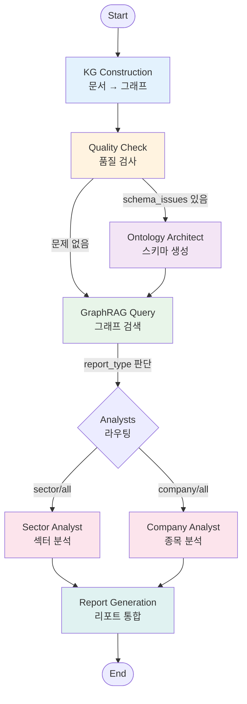
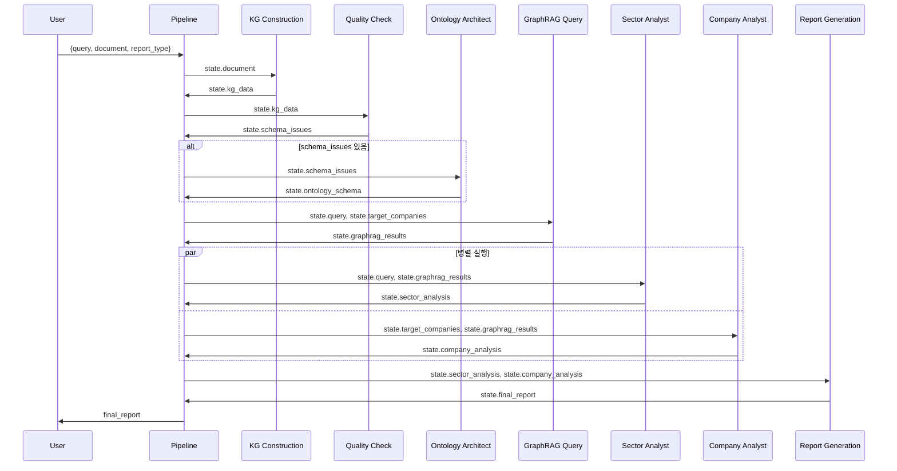

# 시스템 현황 정리 문서

> 작성일: 2025-12-12  
> 버전: v0.1.0  
> 목적: LangGraph 기반 멀티 에이전트 시스템의 현재 상태를 정리하여 향후 고도화 작업의 참고 자료로 활용

---

## 📁 1. 폴더 구조 및 모듈 정의

### 프로젝트 전체 구조

```
25-2-Insightcon/
├── src/
│   ├── agents/           # 에이전트 구현
│   ├── pipeline/         # LangGraph 워크플로우
│   ├── utils/            # 유틸리티 모듈
│   ├── onthology/        # 온톨로지 정의
│   └── crawl/            # 데이터 수집
├── docs/                 # 문서
├── templates/            # 템플릿 파일
├── data/                 # 데이터 파일
├── test/                 # 테스트 코드
└── models/               # 모델 저장
```

### 1.1 `src/agents/` - 에이전트 모듈

각 에이전트는 독립적인 역할을 수행하며, LangGraph 노드로 래핑되어 실행됩니다.

| 파일명 | 클래스명 | 역할 |
|--------|---------|------|
| `kg_construction.py` | `KGConstructionAgent` | 문서에서 엔티티/관계 추출 및 Neo4j 주입 |
| `quality_check.py` | `QualityCheckAgent` | 그래프 품질 검사 (모순, 중복, 누락 탐지) |
| `ontology_architect.py` | `OntologyArchitectAgent` | 온톨로지 스키마 자동 생성 및 적용 |
| `sector_analyst.py` | `SectorAnalystAgent` | 섹터 전체 동향 분석 |
| `company_analyst.py` | `CompanyAnalystAgent` | 개별 종목 상세 분석 |

**모듈 의존성:**
- 모든 에이전트는 `BaseChatModel` (LangChain)을 LLM으로 사용
- `KGConstructionAgent`, `QualityCheckAgent`, `OntologyArchitectAgent`는 `Neo4jClient` 의존
- 분석 에이전트(`SectorAnalyst`, `CompanyAnalyst`)는 GraphRAG 결과를 입력으로 받음

### 1.2 `src/pipeline/` - 워크플로우 모듈

LangGraph 기반 워크플로우를 정의하고 실행합니다.

| 파일명 | 주요 내용 | 역할 |
|--------|---------|------|
| `state.py` | `ReportState` TypedDict | 워크플로우 전체에서 공유되는 중앙 상태 정의 |
| `graph.py` | `create_workflow()`, 라우팅 함수들 | LangGraph 그래프 구성 및 조건부 분기 로직 |
| `nodes.py` | 노드 래퍼 함수들 | 각 에이전트를 LangGraph 노드로 래핑 |

**워크플로우 실행 흐름:**
1. Entry Point: `kg_construction` 노드
2. 조건부 분기를 통한 동적 라우팅
3. 병렬 실행 지원 (sector_analyst, company_analyst)
4. 최종 수렴: `report_generation` 노드

### 1.3 `src/utils/` - 유틸리티 모듈

공통 기능을 제공하는 헬퍼 모듈입니다.

| 파일명 | 주요 클래스/함수 | 역할 |
|--------|----------------|------|
| `neo4j_client.py` | `Neo4jClient` | Neo4j 데이터베이스 연결 및 쿼리 실행 |
| `llm_client.py` | `LLMSelector` | LLM 모델 선택 및 생성 (OpenAI, Gemini 등) |
| `document_loader.py` | `load_document()` | 문서 파일 로드 (PDF, TXT 등) |
| `convert_pdfs.py` | PDF 변환 유틸리티 | PDF를 텍스트로 변환 |

### 1.4 `src/crawl/` - 데이터 수집 모듈

외부 데이터 소스에서 정보를 수집합니다.

| 파일명 | 역할 |
|--------|------|
| `dart_loader.py` | DART (전자공시) 데이터 수집 |
| `ir_loader.py` | IR 자료 수집 |
| `news_loader.py` | 뉴스 데이터 수집 |
| `report_loader.py` | 증권 리포트 수집 |
| `yfinance.py` | Yahoo Finance 데이터 수집 |

### 1.5 `src/onthology/` - 온톨로지 모듈

도메인 온톨로지 정의를 포함합니다.

---

## 🔄 2. Global State 정의

### 2.1 `ReportState` 스키마

워크플로우 전체에서 공유되는 중앙 상태 객체입니다. (`src/pipeline/state.py`)

```python
class ReportState(TypedDict):
    # 입력 필드
    query: str                              # 사용자 질의
    target_companies: Optional[List[str]]   # 분석 대상 기업 목록
    report_type: str                        # "sector" | "company" | "all"
    document: Optional[str]                 # 새로 처리할 문서 (그래프 구축용)
    
    # 온톨로지 관련
    ontology_schema: Optional[Dict]         # 생성된 온톨로지 스키마
    schema_issues: Optional[List[str]]      # 스키마 문제 목록
    
    # 중간 결과
    kg_data: Optional[Dict]                 # Neo4j에서 가져온 지식 그래프 데이터
    graphrag_results: Optional[Dict]        # GraphRAG 검색 결과
    
    # 분석 결과 (병렬 실행 결과)
    sector_analysis: Optional[str]          # 섹터 분석 결과
    company_analysis: Optional[Dict[str, str]]  # 종목별 분석 결과
    
    # 최종 출력
    final_report: Optional[str]             # 최종 생성된 리포트
    
    # 메타데이터 (병렬 실행 시 reducer 필요)
    errors: Annotated[List[str], operator.add]              # 에러 목록
    execution_trace: Annotated[List[str], operator.add]     # 실행 추적 로그
    execution_times: Annotated[List[Dict], operator.add]    # 실행 시간 추적
```

### 2.2 State 필드 설명

#### 입력 필드
- **`query`**: 사용자가 입력한 분석 질의 (예: "반도체 섹터 전망은?")
- **`target_companies`**: 특정 기업을 분석할 경우 기업명 리스트
- **`report_type`**: 리포트 종류
  - `"sector"`: 섹터 전체 분석
  - `"company"`: 특정 기업 분석
  - `"all"`: 섹터 + 기업 분석
- **`document`**: 새로 처리할 문서 (파일 경로 또는 텍스트)
  - 문서가 있으면 그래프 구축 실행
  - 없으면 그래프 구축 스킵

#### 온톨로지 관련
- **`ontology_schema`**: Ontology Architect가 생성한 스키마 정보
- **`schema_issues`**: Quality Check에서 발견한 스키마 문제 목록
  - 문제가 있으면 Ontology Architect로 라우팅

#### 중간 결과
- **`kg_data`**: KG Construction이 생성한 그래프 데이터
  - 구조: `{"entities": {...}, "stats": {...}}`
- **`graphrag_results`**: Neo4j에서 검색한 관련 정보
  - 구조: `{"companies": [...], "products": [...], "metrics": [...]}`

#### 분석 결과
- **`sector_analysis`**: Sector Analyst가 생성한 섹터 분석 텍스트
- **`company_analysis`**: Company Analyst가 생성한 기업별 분석
  - 구조: `{"기업명": "분석 텍스트", ...}`

#### 최종 출력
- **`final_report`**: 모든 분석을 통합한 최종 마크다운 리포트

#### 메타데이터
- **`errors`**: 실행 중 발생한 에러 목록 (병렬 노드에서 추가 가능)
- **`execution_trace`**: 실행 추적 로그 (노드별 완료 메시지)
- **`execution_times`**: 노드별 실행 시간
  - 구조: `[{"kg_construction": 2.5}, {"sector_analyst": 1.3}, ...]`

### 2.3 State 업데이트 규칙

#### Reducer 패턴
LangGraph는 병렬 노드의 결과를 병합할 때 **reducer**를 사용합니다.

- **`Annotated[List, operator.add]`**: 리스트 병합 (extend)
  - 예: `errors`, `execution_trace`, `execution_times`
  - 병렬 노드에서 각각 반환한 리스트를 합침

#### 노드 반환 값
각 노드는 **부분 상태**를 반환합니다. LangGraph가 자동으로 기존 상태와 병합합니다.

```python
# 예시: kg_construction_node 반환값
return {
    'kg_data': result,
    'execution_trace': ["KG Construction completed"]
}
```

---

## 🤖 3. 에이전트별 역할 정의

### 3.1 KG Construction Agent

#### 역할
문서에서 엔티티와 관계를 추출하여 Neo4j 지식 그래프를 구축합니다.

#### 입력
- **State에서**: `document` (문서 텍스트 또는 파일 경로)
- **의존성**: `llm` (LangChain LLM), `neo4j_client`

#### 출력
- **State 업데이트**:
  - `kg_data`: 추출된 엔티티 및 통계
  - `execution_trace`: 실행 로그

#### 주요 메서드
```python
class KGConstructionAgent:
    def extract_entities(document: str) -> Dict[str, Any]
        # 문서에서 엔티티 추출 (LLM 사용)
        # 반환: {"companies": [...], "products": [...], "metrics": [...]}
    
    def inject_to_neo4j(entities: Dict) -> Dict[str, int]
        # Neo4j에 엔티티 및 관계 주입
        # 반환: {"companies": 3, "products": 5, ...}
    
    def process_document(document: str) -> Dict
        # 전체 파이프라인 실행 (추출 + 주입)
```

#### 동작 로직
1. LLM에게 문서를 주고 엔티티 추출 요청
2. JSON 형식으로 파싱 (실패 시 fallback)
3. Neo4j에 노드/관계 생성 (MERGE 사용)
4. 통계 반환

#### 주의사항
- 현재 관계는 **단순 로직** (모든 제품을 모든 기업에 연결)
- TODO: 문서에서 정확한 관계 추출 필요

---

### 3.2 Quality Check Agent

#### 역할
지식 그래프의 품질을 검사하여 모순, 중복, 누락된 링크를 탐지합니다.

#### 입력
- **State에서**: `kg_data` (그래프 업데이트 정보)
- **의존성**: `neo4j_client`

#### 출력
- **State 업데이트**:
  - `schema_issues`: 발견된 스키마 문제 목록
  - `execution_trace`: 검사 결과 로그

#### 주요 메서드
```python
class QualityCheckAgent:
    def check(graph_data: Optional[Dict]) -> Dict[str, Any]
        # 전체 품질 검사 실행
        # 반환: {"issues": [...], "has_issues": bool, ...}
    
    def _check_schema_consistency() -> List[Dict]
        # 스키마 일관성 검사
    
    def _check_duplicates() -> List[Dict]
        # 엔티티 중복 검사
    
    def _check_completeness() -> List[Dict]
        # 관계 완전성 검사
```

#### 검사 항목

1. **스키마 일관성**
   - 필수 노드 타입 존재 확인 (`Company`, `ProductLine`, `Metric`)
   - 스키마 조회 실패 시 경고

2. **엔티티 중복**
   - 동일한 이름의 엔티티가 여러 개 있는지 확인
   - Cypher: `WHERE size(nodes) > 1`

3. **관계 완전성**
   - 고립된 노드 (관계가 없는 노드) 탐지
   - 연결되지 않은 ProductLine 탐지

#### 라우팅 영향
- `schema_issues`가 있으면 → `ontology_architect`로 라우팅
- 문제 없으면 → `graphrag_query`로 라우팅

---

### 3.3 Ontology Architect Agent

#### 역할
증권 리포트 템플릿에서 온톨로지 스키마를 자동으로 추출하고 Neo4j에 적용합니다.

#### 입력
- **파라미터**: `templates` (리포트 템플릿 문서 리스트)
- **의존성**: `llm`, `neo4j_client`, `neo4j_graphrag.SchemaFromTextExtractor`

#### 출력
- **State 업데이트**:
  - `ontology_schema`: 생성된 스키마 정보
  - `schema_issues`: [] (이슈 해결됨)
  - `execution_trace`: 실행 로그

#### 주요 메서드
```python
class OntologyArchitectAgent:
    def generate_schema(templates: List[str]) -> Dict
        # neo4j-graphrag를 사용하여 스키마 자동 생성
        # 반환: {"schema": ..., "neo4j_schema": ..., "cypher_statements": [...]}
    
    def update_schema(new_documents: List[str]) -> Dict
        # 기존 스키마에 새로운 개념 추가
```

#### 동작 로직
1. 템플릿 문서들을 하나의 텍스트로 결합
2. `neo4j_graphrag.SchemaFromTextExtractor` 사용하여 스키마 추출
3. Neo4j 스키마로 변환
4. Cypher 문 생성 및 실행

#### 주의사항
- **neo4j_graphrag는 OpenAI API 필요**: Gemini 사용 시에도 `.env`에 `OPENAI_API_KEY` 설정 필요
- 비동기 실행 (`asyncio.run()`)

---

### 3.4 Sector Analyst Agent

#### 역할
GraphRAG 결과를 기반으로 반도체 섹터 전체 동향을 분석합니다.

#### 입력
- **State에서**: `query`, `graphrag_results`
- **의존성**: `llm`

#### 출력
- **State 업데이트**:
  - `sector_analysis`: 섹터 분석 리포트 (마크다운)
  - `execution_trace`: 실행 로그

#### 주요 메서드
```python
class SectorAnalystAgent:
    def analyze(query: str, graphrag_results: Dict) -> str
        # 섹터 분석 수행
        # 반환: 마크다운 형식의 리포트
    
    def _format_graphrag_results(results: Dict) -> str
        # GraphRAG 결과를 읽기 쉬운 텍스트로 변환
```

#### 분석 항목
1. 섹터 전체 동향
2. 주요 기업 비교
3. 밸류체인 분석
4. 리스크 요인
5. 투자 포인트

#### 프롬프트 구조
```
당신은 반도체 섹터 전문 분석가입니다.

질의: {query}

관련 정보:
{graphrag_results를 텍스트로 변환}

다음을 포함한 섹터 리포트를 작성하세요: ...
```

---

### 3.5 Company Analyst Agent

#### 역할
개별 종목에 대한 상세 분석을 수행합니다.

#### 입력
- **State에서**: `target_companies`, `graphrag_results`
- **의존성**: `llm`

#### 출력
- **State 업데이트**:
  - `company_analysis`: 기업별 분석 결과 (Dict)
  - `execution_trace`: 실행 로그

#### 주요 메서드
```python
class CompanyAnalystAgent:
    def analyze(company_name: str, graphrag_results: Dict) -> str
        # 개별 종목 분석
        # 반환: 마크다운 형식의 리포트
    
    def analyze_multiple(company_names: List[str], graphrag_results: Dict) -> Dict[str, str]
        # 여러 종목 분석 (순차 실행)
        # 반환: {"기업명": "분석 텍스트", ...}
    
    def _extract_company_data(company_name: str, results: Dict) -> str
        # GraphRAG 결과에서 특정 기업 정보 추출
```

#### 분석 항목
1. 사업 구조
2. 주요 제품 및 기술
3. 재무 분석
4. 경쟁 우위
5. 리스크 요인
6. 투자 의견

#### 프롬프트 구조
```
당신은 개별 종목 전문 분석가입니다.

종목: {company_name}

관련 정보:
{해당 기업 관련 정보만 추출}

다음을 포함한 종목 리포트를 작성하세요: ...
```

---

## 📊 4. 데이터 플로우 다이어그램

### 4.1 전체 워크플로우 구조



### 4.2 조건부 분기 로직

#### 1️⃣ Quality Check 후 라우팅
```python
def route_after_quality_check(state: ReportState) -> str:
    schema_issues = state.get('schema_issues', [])
    if schema_issues:
        return "ontology_architect"  # 스키마 문제 있음 → 수정
    return "graphrag_query"          # 문제 없음 → 검색
```

#### 2️⃣ Analysts 병렬 라우팅
```python
def route_to_analysts(state: ReportState) -> List[str]:
    report_type = state.get("report_type", "sector")
    nodes = []
    
    if report_type in ["sector", "all"]:
        nodes.append("sector_analyst")
    
    if report_type in ["company", "all"]:
        nodes.append("company_analyst")
    
    return nodes  # LangGraph가 병렬 실행
```

### 4.3 State 전파 흐름



### 4.4 캐싱 메커니즘

#### GraphRAG Query 캐싱
```python
_graphrag_cache = {}  # 전역 캐시

def _get_cache_key(query: str, target_companies: list) -> str:
    companies_str = ",".join(sorted(target_companies)) if target_companies else ""
    cache_string = f"{query}::{companies_str}"
    return hashlib.md5(cache_string.encode()).hexdigest()

# graphrag_query_node에서 사용
cache_key = _get_cache_key(query, target_companies)
if cache_key in _graphrag_cache:
    return {'graphrag_results': _graphrag_cache[cache_key]}
```

- **캐시 키**: `MD5(query + sorted_companies)`
- **캐시 크기 제한**: 최대 100개 (FIFO)
- **장점**: 동일한 질의 반복 시 Neo4j 쿼리 생략

---

## 🔍 5. 노드별 실행 시간 추적

### 5.1 `track_execution_time` 데코레이터

모든 노드는 실행 시간을 자동으로 추적합니다.

```python
@track_execution_time("kg_construction")
def kg_construction_node(state: ReportState) -> ReportState:
    # ... 노드 로직 ...
    return result
```

#### 동작 원리
1. 노드 시작 시 시간 기록
2. 노드 실행 (성공 또는 실패)
3. 종료 시 시간 계산
4. State에 추가:
   - `execution_times`: `[{"kg_construction": 2.5}]`
   - `execution_trace`: `["kg_construction completed in 2.5s"]`

#### Reducer 병합
병렬 노드에서 각각 반환한 `execution_times`는 자동으로 병합됩니다.

```python
# Sector Analyst: [{"sector_analyst": 1.2}]
# Company Analyst: [{"company_analyst": 1.5}]
# 병합 후: [{"sector_analyst": 1.2}, {"company_analyst": 1.5}]
```

---

## 🛠 6. 주요 의존성 및 클라이언트

### 6.1 싱글톤 패턴

노드 간 클라이언트를 공유하기 위해 싱글톤 사용:

```python
_neo4j_client = None
_llm_selector = None

def _get_neo4j_client() -> Neo4jClient:
    global _neo4j_client
    if _neo4j_client is None:
        _neo4j_client = Neo4jClient()
    return _neo4j_client
```

### 6.2 Neo4j Client

**파일**: `src/utils/neo4j_client.py`

#### 주요 메서드
- `query(cypher: str, params: Dict) -> List`: Cypher 쿼리 실행
- `run(cypher: str, params: Dict)`: 쓰기 쿼리 실행
- `get_schema() -> Dict`: 스키마 정보 조회
- `close()`: 연결 종료

### 6.3 LLM Selector

**파일**: `src/utils/llm_client.py`

#### LLM 선택 전략
```python
llm_selector = LLMSelector()
llm = llm_selector.get_llm("deep")  # 깊은 분석용 (예: GPT-4, Gemini Pro)
llm = llm_selector.get_llm("fast")  # 빠른 처리용 (예: GPT-3.5)
```

---

## 📝 7. 스킵 로직

### 7.1 문서 유무에 따른 KG Construction 스킵

```python
def kg_construction_node(state: ReportState) -> ReportState:
    document_input = state.get('document')
    
    if not document_input:
        return {
            'kg_data': None,
            'execution_trace': ["KG Construction skipped (no new document)"]
        }
    
    # 문서가 있으면 그래프 구축 실행
    # ...
```

### 7.2 Quality Check 스킵

```python
def quality_check_node(state: ReportState) -> ReportState:
    kg_data = state.get('kg_data')
    
    if not kg_data:
        return {
            'schema_issues': [],
            'execution_trace': ["Quality Check skipped (no graph update)"]
        }
    
    # 그래프 업데이트가 있을 때만 검사
    # ...
```

### 7.3 Company Analyst 스킵

```python
def company_analyst_node(state: ReportState) -> ReportState:
    target_companies = state.get('target_companies') or []
    
    if not target_companies or len(target_companies) == 0:
        return {
            'execution_trace': ["Company Analyst skipped (no target companies)"]
        }
    
    # 대상 기업이 있을 때만 분석
    # ...
```

---

## 🚀 8. 실행 예시

### 8.1 섹터 분석 워크플로우

```python
from src.pipeline.graph import get_workflow_app

app = get_workflow_app()

initial_state = {
    "query": "2025년 반도체 섹터 전망은?",
    "report_type": "sector",
    "target_companies": None,
    "document": None,  # 문서 없음 → KG Construction 스킵
    "errors": [],
    "execution_trace": [],
    "execution_times": []
}

result = app.invoke(initial_state)
print(result['final_report'])
```

**실행 경로**:
1. KG Construction (스킵)
2. Quality Check (스킵)
3. GraphRAG Query → Neo4j에서 섹터 정보 검색
4. Sector Analyst → 섹터 분석 생성
5. Report Generation → 최종 리포트

### 8.2 문서 추가 + 종목 분석 워크플로우

```python
initial_state = {
    "query": "삼성전자와 SK하이닉스의 경쟁력은?",
    "report_type": "company",
    "target_companies": ["삼성전자", "SK하이닉스"],
    "document": "data/reports/samsung_q4_2024.pdf",  # 문서 있음
    "errors": [],
    "execution_trace": [],
    "execution_times": []
}

result = app.invoke(initial_state)
```

**실행 경로**:
1. KG Construction → PDF에서 엔티티 추출 및 Neo4j 주입
2. Quality Check → 그래프 품질 검사
3. (조건부) Ontology Architect → 스키마 이슈 있으면 실행
4. GraphRAG Query → 삼성전자, SK하이닉스 정보 검색
5. Company Analyst (병렬) → 각 기업 분석
6. Report Generation → 최종 리포트

---

## 💡 9. 고도화를 위한 개선 포인트

### 9.1 현재 제약사항

1. **KG Construction**
   - 관계 추출이 단순함 (모든 제품을 모든 기업에 연결)
   - LLM JSON 파싱 실패 시 fallback 로직 미흡

2. **Quality Check**
   - 스키마 검사가 제한적
   - 중복 검사는 Company만 수행 (ProductLine, Metric 미포함)

3. **GraphRAG Query**
   - Cypher 쿼리가 고정적 (동적 쿼리 생성 필요)
   - 캐시 무효화 전략 없음

4. **Ontology Architect**
   - neo4j_graphrag가 OpenAI만 지원 (Gemini 사용 시 제약)
   - 스키마 병합 로직이 단순함

5. **Analysts**
   - 프롬프트가 하드코딩됨 (템플릿화 필요)
   - Company Analyst가 순차 실행 (병렬 처리 가능)

### 9.2 개선 방향

#### 🔸 단기 (v0.2.0)
- [ ] KG Construction: 정확한 관계 추출 로직 구현
- [ ] Quality Check: 모든 엔티티 타입에 대한 중복 검사
- [ ] GraphRAG Query: 동적 Cypher 쿼리 생성
- [ ] Analysts: 프롬프트 템플릿화 (`templates/` 폴더 활용)

#### 🔸 중기 (v0.3.0)
- [ ] 병렬 처리 최적화 (Company Analyst 내부 병렬화)
- [ ] 캐시 무효화 전략 (그래프 업데이트 시 캐시 클리어)
- [ ] 에러 핸들링 강화 (재시도 로직, Circuit Breaker)
- [ ] 로깅 및 모니터링 시스템 구축

#### 🔸 장기 (v0.4.0)
- [ ] 멀티모달 지원 (차트, 표 분석)
- [ ] 실시간 데이터 피드 통합
- [ ] 사용자 피드백 반영 (Human-in-the-Loop)
- [ ] 리포트 커스터마이제이션 기능

---

## 📚 10. 참고 문서

- [온톨로지 가이드](./01_온톨로지_Ontology.md)
- [지식 그래프 구축 가이드](./02_지식그래프_Knowledge_Graph.md)
- [멀티 에이전트 아키텍처](./03_멀티에이전트_Multi_Agent.md)
- [GraphRAG 활용법](./05_GraphRAG.md)
- [LLM 활용 가이드](./06_LLM_활용.md)

---

## 📌 버전 히스토리

| 버전 | 날짜 | 변경 사항 |
|------|------|-----------|
| v0.1.0 | 2025-12-12 | 초기 문서 작성 (현재 시스템 분석 및 정리) |

