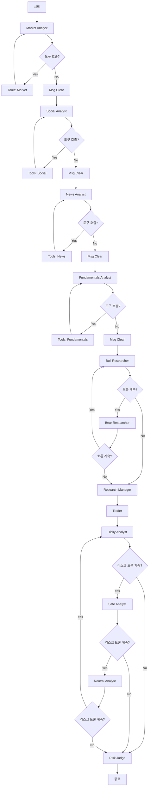

# TradingAgents 코드베이스 분석

## 📋 개요

**TradingAgents**는 실제 트레이딩 회사의 역학을 반영한 멀티 에이전트 트레이딩 프레임워크입니다. LLM 기반의 전문화된 에이전트들(펀더멘털 분석가, 감정 분석가, 기술적 분석가, 트레이더, 리스크 관리팀)이 협업하여 시장 상황을 평가하고 트레이딩 결정을 내립니다.

- **프레임워크**: LangGraph 기반
- **LLM**: OpenAI (o1-preview, gpt-4o 권장, 테스트용으로 o4-mini, gpt-4o-mini 지원)
- **데이터 소스**: yfinance, Alpha Vantage, OpenAI, Google News 등

---

## 🏗️ 아키텍처 구조

### 디렉토리 구조

```
TradingAgents/
├── tradingagents/           # 핵심 패키지
│   ├── agents/             # 에이전트 정의
│   │   ├── analysts/       # 분석가 에이전트들
│   │   │   ├── market_analyst.py
│   │   │   ├── news_analyst.py
│   │   │   ├── social_media_analyst.py
│   │   │   └── fundamentals_analyst.py
│   │   ├── researchers/    # 연구원 에이전트들
│   │   │   ├── bull_researcher.py
│   │   │   └── bear_researcher.py
│   │   ├── trader/         # 트레이더 에이전트
│   │   │   └── trader.py
│   │   ├── risk_mgmt/      # 리스크 관리 에이전트들
│   │   │   ├── aggresive_debator.py
│   │   │   ├── conservative_debator.py
│   │   │   └── neutral_debator.py
│   │   ├── managers/       # 매니저 에이전트들
│   │   │   ├── research_manager.py
│   │   │   └── risk_manager.py
│   │   └── utils/          # 유틸리티 (상태, 메모리, 헬퍼 함수)
│   ├── graph/              # 워크플로우 그래프 정의
│   │   ├── trading_graph.py      # 메인 그래프 오케스트레이터
│   │   ├── setup.py              # 그래프 설정
│   │   ├── propagation.py        # 상태 전파
│   │   ├── reflection.py         # 반성 및 학습
│   │   ├── conditional_logic.py  # 조건부 로직
│   │   └── signal_processing.py  # 신호 처리
│   ├── dataflows/          # 데이터 소스 제공자
│   │   ├── interface.py          # 라우팅 인터페이스
│   │   ├── y_finance.py          # yfinance 통합
│   │   ├── alpha_vantage_*.py    # Alpha Vantage 통합
│   │   ├── openai.py             # OpenAI 기반 데이터 수집
│   │   ├── google.py             # Google News 통합
│   │   └── local.py              # 로컬 데이터 (캐시)
│   └── default_config.py   # 기본 설정
├── cli/                    # CLI 인터페이스
│   └── main.py
└── main.py                 # 프로그래매틱 사용 예제
```

---

## 🎯 핵심 컴포넌트

### 1️⃣ Agents (에이전트)

#### **Analyst Team (분석가 팀)**

각 분석가는 특정 도메인의 데이터를 수집하고 분석하여 리포트를 생성합니다.

##### **Market Analyst** (`market_analyst.py`)
- **역할**: 기술적 지표를 사용한 시장 트렌드 분석
- **주요 도구**:
  - `get_stock_data`: 주가 데이터 수집 (OHLCV)
  - `get_indicators`: 기술적 지표 계산
- **분석 지표**: 
  - Moving Averages (SMA 50/200, EMA 10)
  - MACD (MACD, MACD Signal, MACD Histogram)
  - RSI (상대강도지수)
  - Bollinger Bands (상단/중단/하단)
  - ATR (평균진폭지수), VWMA (거래량가중이동평균)
- **출력**: `market_report` - 상세한 기술적 분석 리포트 (Markdown 표 포함)

##### **Social Media Analyst** (`social_media_analyst.py`)
- **역할**: 소셜 미디어 감정 분석
- **주요 도구**: 
  - `get_social_sentiment`: Reddit, Twitter 등 소셜 미디어 감정 스코어
- **출력**: `sentiment_report` - 시장 심리 분석 리포트

##### **News Analyst** (`news_analyst.py`)
- **역할**: 글로벌 뉴스 및 거시경제 지표 분석
- **주요 도구**: 
  - `get_global_news`: 글로벌 뉴스 수집
- **출력**: `news_report` - 뉴스 및 거시경제 영향 분석

##### **Fundamentals Analyst** (`fundamentals_analyst.py`)
- **역할**: 기업 재무 및 펀더멘털 분석
- **주요 도구**: 
  - `get_income_statement`: 손익계산서
  - `get_balance_sheet`: 재무상태표
  - `get_cash_flow`: 현금흐름표
  - `get_earnings`: 실적 발표
  - `get_insider_sentiment`: 내부자 감정
  - `get_insider_transactions`: 내부자 거래
- **출력**: `fundamentals_report` - 재무 건전성 및 내재가치 분석

#### **Researcher Team (연구원 팀)**

분석가 팀의 인사이트를 바탕으로 강세(Bull)와 약세(Bear) 관점에서 토론을 진행합니다.

##### **Bull Researcher** (`bull_researcher.py`)
- **역할**: 매수 관점에서 투자 근거 제시
- **전략**:
  - 성장 잠재력 강조
  - 경쟁 우위 강조
  - 긍정적 지표 활용
  - Bear 주장에 대한 반박
- **메모리 활용**: 과거 유사 상황에서의 교훈 반영
- **출력**: `investment_debate_state.bull_history`

##### **Bear Researcher** (`bear_researcher.py`)
- **역할**: 매도 관점에서 리스크 및 약점 지적
- **전략**:
  - 리스크 요인 강조
  - 과대평가 지적
  - 부정적 지표 강조
  - Bull 주장에 대한 반박
- **메모리 활용**: 과거 실수로부터 학습
- **출력**: `investment_debate_state.bear_history`

##### **Research Manager** (`research_manager.py`)
- **역할**: Bull/Bear 토론을 중재하고 최종 투자 계획 수립
- **의사결정**:
  - 양측 주장 요약
  - 가장 설득력 있는 근거 선택
  - **Buy/Sell/Hold** 중 하나로 결정 (Hold는 강력한 근거가 있을 때만)
- **출력**: `investment_plan` - 상세한 투자 전략 및 실행 계획

#### **Trader (트레이더)**

##### **Trader Agent** (`trader.py`)
- **역할**: Research Manager의 투자 계획을 바탕으로 트레이딩 결정
- **입력**: 
  - `investment_plan` (Research Manager의 계획)
  - 과거 메모리 (유사 상황에서의 교훈)
- **출력**: `trader_investment_plan` - 최종 거래 제안 (`FINAL TRANSACTION PROPOSAL: **BUY/HOLD/SELL**`)

#### **Risk Management Team (리스크 관리 팀)**

트레이더의 결정을 3가지 관점에서 검토하고 토론합니다.

##### **Risky Analyst** (`aggresive_debator.py`)
- **관점**: 공격적, 고위험-고수익 추구
- **강조점**: 성장 가능성, 시장 기회, 큰 수익 잠재력

##### **Conservative Analyst** (`conservative_debator.py`)
- **관점**: 보수적, 안정성 및 리스크 최소화
- **강조점**: 안전성, 변동성 회피, 지속 가능한 성장

##### **Neutral Analyst** (`neutral_debator.py`)
- **관점**: 균형 잡힌 중립적 시각
- **강조점**: 위험과 수익의 균형, 객관적 평가

##### **Risk Manager** (`risk_manager.py`)
- **역할**: 3가지 리스크 관점을 종합하여 최종 결정
- **의사결정**:
  - 각 관점의 핵심 주장 요약
  - 트레이더 계획 조정
  - 과거 실수로부터 학습
- **출력**: `final_trade_decision` - 최종 거래 결정

---

### 2️⃣ Graph System (그래프 시스템)

#### **TradingAgentsGraph** (`trading_graph.py`)

전체 워크플로우를 오케스트레이션하는 메인 클래스입니다.

**주요 메서드:**

```python
class TradingAgentsGraph:
    def __init__(self, selected_analysts, debug, config):
        """
        초기화:
        - LLM 설정 (quick_think_llm, deep_think_llm)
        - 메모리 초기화 (각 에이전트별)
        - 데이터 소스 tool nodes 생성
        - 그래프 컴파일
        """
    
    def propagate(self, company_name, trade_date):
        """
        특정 회사와 날짜에 대해 그래프 실행
        Returns: (전체 상태, 최종 결정)
        """
    
    def reflect_and_remember(self, returns_losses):
        """
        거래 결과를 바탕으로 반성하고 메모리 업데이트
        """
```

#### **GraphSetup** (`setup.py`)

LangGraph 워크플로우를 구성합니다.

**워크플로우 순서:**



**주요 특징:**
- **동적 분석가 선택**: `selected_analysts` 파라미터로 원하는 분석가만 활성화 가능
- **조건부 분기**: 각 노드에서 다음 단계 결정 (`conditional_logic.py`)
- **재귀적 토론**: `max_debate_rounds`와 `max_risk_discuss_rounds`로 토론 횟수 제어

#### **Propagation** (`propagation.py`)

상태 초기화 및 전파를 담당합니다.

```python
class Propagator:
    def create_initial_state(company_name, trade_date):
        """
        초기 상태 생성:
        - messages: 대화 히스토리
        - company_of_interest: 분석 대상 회사
        - trade_date: 트레이딩 날짜
        - investment_debate_state: 투자 토론 상태
        - risk_debate_state: 리스크 토론 상태
        - 각종 리포트 (market_report, sentiment_report 등)
        """
```

#### **Reflection** (`reflection.py`)

과거 결정에 대해 반성하고 학습합니다.

```python
class Reflector:
    def reflect_bull_researcher(current_state, returns_losses, bull_memory):
        """Bull Researcher의 분석을 평가하고 메모리에 저장"""
    
    def reflect_bear_researcher(current_state, returns_losses, bear_memory):
        """Bear Researcher의 분석을 평가하고 메모리에 저장"""
    
    def reflect_trader(current_state, returns_losses, trader_memory):
        """Trader의 결정을 평가하고 메모리에 저장"""
    
    # ... Research Manager, Risk Manager 등도 동일
```

**Reflection Process:**
1. **올바른/잘못된 결정 판단**: 수익률 기반
2. **기여 요인 분석**: 시장 지표, 뉴스, 감정, 펀더멘털 등
3. **개선 방안 제시**: 잘못된 결정에 대한 수정 방안
4. **교훈 요약**: 향후 유사 상황에 적용 가능한 인사이트

---

### 3️⃣ Dataflows (데이터 흐름)

#### **Interface** (`interface.py`)

다양한 데이터 소스를 통합하는 라우팅 시스템입니다.

**Tool Categories:**

| Category | Tools | Description |
|----------|-------|-------------|
| `core_stock_apis` | `get_stock_data` | OHLCV 주가 데이터 |
| `technical_indicators` | `get_indicators` | 기술적 지표 계산 |
| `fundamental_data` | `get_income_statement`, `get_balance_sheet`, `get_cash_flow`, `get_earnings`, `get_insider_sentiment`, `get_insider_transactions` | 기업 재무 데이터 |
| `news_data` | `get_news`, `get_global_news` | 뉴스 데이터 |

**Vendor 설정:**

```python
# default_config.py에서 설정
"data_vendors": {
    "core_stock_apis": "yfinance",        # yfinance, alpha_vantage, local
    "technical_indicators": "yfinance",   # yfinance, alpha_vantage, local
    "fundamental_data": "alpha_vantage",  # openai, alpha_vantage, local
    "news_data": "alpha_vantage",         # openai, alpha_vantage, google, local
}
```

**Fallback 메커니즘:**
- 주요 vendor가 실패하면 자동으로 대체 vendor로 전환
- Rate limit 에러 처리 (`AlphaVantageRateLimitError`)
- Local 캐시 데이터 사용 가능

---

## 🔄 데이터 흐름 및 실행 순서

### 전체 실행 플로우

```
1. [초기화]
   ├─ TradingAgentsGraph 생성
   ├─ LLM 설정 (quick_think, deep_think)
   ├─ 메모리 초기화
   └─ 그래프 컴파일

2. [전파 시작] propagate(company, date)
   └─ 초기 상태 생성

3. [분석가 팀]
   ├─ Market Analyst → market_report
   ├─ Social Analyst → sentiment_report
   ├─ News Analyst → news_report
   └─ Fundamentals Analyst → fundamentals_report

4. [연구원 팀 토론]
   ├─ Bull Researcher (강세 주장)
   ├─ Bear Researcher (약세 주장)
   ├─ (토론 반복 최대 max_debate_rounds)
   └─ Research Manager → investment_plan

5. [트레이더]
   └─ Trader → trader_investment_plan

6. [리스크 관리 팀 토론]
   ├─ Risky Analyst (공격적 관점)
   ├─ Safe Analyst (보수적 관점)
   ├─ Neutral Analyst (중립적 관점)
   ├─ (토론 반복 최대 max_risk_discuss_rounds)
   └─ Risk Manager → final_trade_decision

7. [결과 로깅]
   └─ JSON 파일로 저장 (results_dir)

8. [반성 (선택적)]
   └─ reflect_and_remember(returns_losses)
      ├─ 각 에이전트별 성과 평가
      └─ 메모리에 교훈 저장
```

### State 구조

```python
AgentState = {
    "messages": List[Message],              # 대화 히스토리
    "company_of_interest": str,             # 분석 대상 회사
    "trade_date": str,                       # 트레이딩 날짜
    
    # 분석 리포트
    "market_report": str,
    "sentiment_report": str,
    "news_report": str,
    "fundamentals_report": str,
    
    # 투자 토론 상태
    "investment_debate_state": {
        "history": str,                      # 전체 토론 이력
        "bull_history": str,                 # Bull 주장 이력
        "bear_history": str,                 # Bear 주장 이력
        "current_response": str,             # 현재 응답
        "judge_decision": str,               # 매니저 결정
        "count": int,                        # 토론 라운드 수
    },
    
    # 투자 계획 및 트레이더 결정
    "investment_plan": str,                  # Research Manager의 계획
    "trader_investment_plan": str,           # Trader의 제안
    
    # 리스크 토론 상태
    "risk_debate_state": {
        "history": str,
        "risky_history": str,
        "safe_history": str,
        "neutral_history": str,
        "latest_speaker": str,
        "current_risky_response": str,
        "current_safe_response": str,
        "current_neutral_response": str,
        "judge_decision": str,
        "count": int,
    },
    
    # 최종 결정
    "final_trade_decision": str,             # Risk Manager의 최종 결정
}
```

---

## 💾 메모리 시스템

### FinancialSituationMemory

각 에이전트는 과거 경험을 저장하고 유사 상황에서 검색합니다.

**기능:**
- **저장**: 상황(situation)과 추천(recommendation) 쌍을 저장
- **검색**: 현재 상황과 유사한 과거 사례를 semantic search로 찾기
- **학습**: 성공/실패 사례로부터 교훈 추출

**사용 예:**
```python
bull_memory.get_memories(curr_situation, n_matches=2)
# → 현재 시장 상황과 유사한 과거 2개 사례 반환
```

---

## 🛠️ 설정 및 사용법

### 기본 설정 (`default_config.py`)

```python
DEFAULT_CONFIG = {
    "project_dir": "...",
    "results_dir": "./results",
    "data_cache_dir": "...",
    
    # LLM 설정
    "llm_provider": "openai",
    "deep_think_llm": "o4-mini",          # 복잡한 판단 (Research/Risk Manager)
    "quick_think_llm": "gpt-4o-mini",     # 빠른 분석 (Analysts, Researchers)
    "backend_url": "https://api.openai.com/v1",
    
    # 토론 설정
    "max_debate_rounds": 1,               # 투자 토론 최대 라운드
    "max_risk_discuss_rounds": 1,         # 리스크 토론 최대 라운드
    "max_recur_limit": 100,               # 그래프 재귀 한계
    
    # 데이터 소스
    "data_vendors": { ... },
    "tool_vendors": { ... },
}
```

### Python 사용 예제

```python
from tradingagents.graph.trading_graph import TradingAgentsGraph
from tradingagents.default_config import DEFAULT_CONFIG

# 설정 커스터마이징
config = DEFAULT_CONFIG.copy()
config["deep_think_llm"] = "gpt-4o-mini"
config["max_debate_rounds"] = 2

# 그래프 초기화
ta = TradingAgentsGraph(debug=True, config=config)

# 실행
_, decision = ta.propagate("NVDA", "2024-05-10")
print(decision)

# 반성 (수익률 정보와 함께)
ta.reflect_and_remember(1000)  # 수익 1000
```

### CLI 사용

```bash
python -m cli.main
```

인터랙티브 UI에서:
- 티커 선택
- 날짜 선택
- LLM 모델 선택
- 분석 깊이 설정
- 실시간 진행 상황 확인

---

## 🔍 핵심 디자인 패턴

### 1. **Multi-Agent Collaboration**
- 각 에이전트는 특정 전문 분야에 집중
- 에이전트 간 정보 공유 및 협업

### 2. **Debate-Based Decision Making**
- Bull vs Bear 토론으로 다양한 관점 반영
- Risky vs Safe vs Neutral 토론으로 리스크 평가

### 3. **Memory-Augmented Learning**
- 과거 결정과 결과를 메모리에 저장
- 유사 상황에서 과거 교훈 활용

### 4. **Reflection and Improvement**
- 거래 결과를 바탕으로 각 에이전트의 판단 평가
- 지속적인 학습 및 개선

### 5. **Modular Data Sources**
- 다양한 vendor 지원 (yfinance, Alpha Vantage, OpenAI, Google)
- Fallback 메커니즘으로 안정성 확보

### 6. **LangGraph Workflow**
- 상태 기반 워크플로우
- 조건부 분기로 유연한 실행 흐름

---

## 📊 출력 예시

### 최종 결정 형식

```
Risk Management Judge: Based on the comprehensive analysis...

[상세한 분석 및 근거]

FINAL TRANSACTION PROPOSAL: **BUY**
```

### 저장 형식 (JSON)

```json
{
    "company_of_interest": "NVDA",
    "trade_date": "2024-05-10",
    "market_report": "...",
    "sentiment_report": "...",
    "news_report": "...",
    "fundamentals_report": "...",
    "investment_plan": "...",
    "trader_investment_plan": "...",
    "final_trade_decision": "..."
}
```

---

## 🎓 핵심 개념 정리

### Agent Types

| Agent Type | LLM Type | 역할 | 출력 |
|------------|----------|------|------|
| **Analysts** | Quick Think | 데이터 수집 및 분석 | 도메인별 리포트 |
| **Researchers** | Quick Think | 강세/약세 관점 토론 | 토론 히스토리 |
| **Research Manager** | Deep Think | 투자 계획 수립 | Investment Plan |
| **Trader** | Quick Think | 거래 제안 | Transaction Proposal |
| **Risk Analysts** | Quick Think | 리스크 관점 토론 | 리스크 토론 히스토리 |
| **Risk Manager** | Deep Think | 최종 결정 | Final Decision |

### Key Mechanisms

1. **Tool Calling**: LangChain의 tool binding으로 데이터 소스 호출
2. **State Management**: LangGraph의 StateGraph로 상태 전파
3. **Conditional Edges**: 토론 계속 여부, 도구 호출 여부 등 동적 결정
4. **Memory Retrieval**: Semantic search로 유사 상황 검색
5. **Reflection Prompting**: 성과 평가 및 교훈 추출

---

## 📝 요약

TradingAgents는:
- **멀티 에이전트 시스템**: 현실 트레이딩 회사처럼 역할 분담
- **토론 기반 의사결정**: 다양한 관점을 반영한 robust한 결정
- **메모리 기반 학습**: 과거 경험으로부터 지속적 개선
- **모듈화된 데이터 파이프라인**: 다양한 소스 통합 및 fallback 지원
- **LangGraph 기반**: 명확하고 유연한 워크플로우 정의

이 시스템은 **연구 목적**으로 설계되었으며, 실제 트레이딩에는 많은 변수(모델 선택, 온도, 기간, 데이터 품질 등)가 성능에 영향을 미칩니다.
