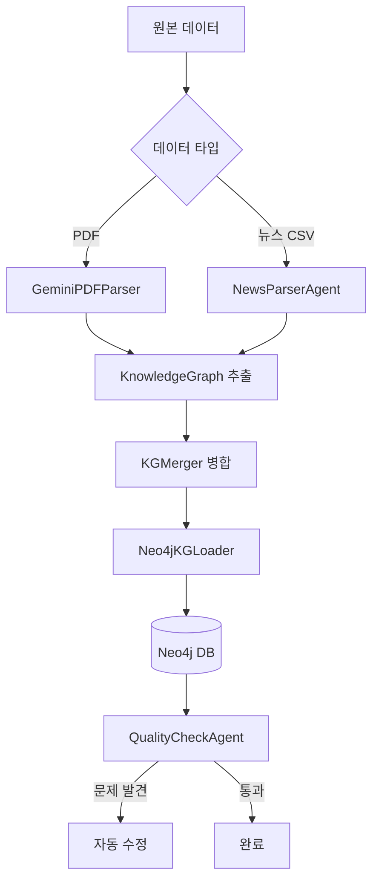
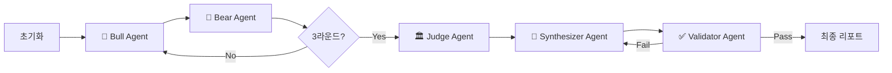

ㅂ# 📊 투자 분석 AI 에이전트 시스템 - PPT 자료

**프로젝트**: 25-2-Insightcon
**작성일**: 2024-12-24

---

## 1. 시스템 개요

### 🎯 프로젝트 목표
**Knowledge Graph 기반 Multi-Agent 투자 분석 시스템** 개발

- 반도체/IT 기업 관련 뉴스, PDF 리포트를 분석하여 Knowledge Graph 구축
- Bull/Bear 변증법 토론을 통한 객관적 투자 의견 도출
- LLM 기반 자동화된 투자 리포트 생성

### 🏗️ 핵심 아키텍처

```
┌─────────────────────────────────────────────────────────────────┐
│                    📊 투자 분석 통합 CLI (Run.py)                  │
├─────────────────────────────────────────────────────────────────┤
│  Mode 1: Query Only │ Mode 2: Rebuild KG │ Mode 3: Full E2E     │
└────────┬────────────┴─────────┬──────────┴──────────┬───────────┘
         │                      │                      │
         ▼                      ▼                      ▼
┌─────────────────┐   ┌─────────────────┐   ┌─────────────────────┐
│ Phase 1: KG 구축  │   │ Phase 1.5: JSON  │   │ Phase 2: Debate    │
│ (PDF/뉴스 파싱)   │   │ → Neo4j 주입     │   │ Workflow 실행       │
└────────┬────────┘   └────────┬────────┘   └─────────┬───────────┘
         │                      │                      │
         ▼                      ▼                      ▼
    ┌────┴────┐           ┌────┴────┐           ┌─────┴─────┐
    │Neo4j KG │ ───────▶│Neo4j KG │ ───────▶│  최종 리포트  │
    └─────────┘           └─────────┘           └───────────┘
```

---

## 2. 실행 모드 (3가지)

| 모드 | 설명 | 소요 시간 | 사용 시점 |
|-----|------|----------|----------|
| **Query Only** | 기존 Neo4j 데이터 활용, Debate만 실행 | ~30초 | KG가 이미 구축된 경우 |
| **Rebuild KG** | JSON 파일 → Neo4j 재주입 후 Debate | ~1분 | 데이터 갱신 필요 시 |
| **Full E2E** | 원본 데이터 파싱 → KG 구축 → Debate | ~5분+ | 처음 실행 시 |

---

## 3. 에이전트 아키텍처

### 🤖 Phase 1: Knowledge Graph Construction



| 에이전트 | 역할 | 주요 기능 |
|---------|-----|----------|
| **KGConstructionAgent** | KG 구축 총괄 | 파서 조율, 병합, 로드 |
| **GeminiPDFParser** | PDF 분석 | Gemini API로 PDF 내용 추출/구조화 |
| **NewsParserAgent** | 뉴스 분석 | CSV 뉴스 데이터 파싱 및 엔티티 추출 |
| **KGMerger** | KG 병합 | 여러 소스의 KG를 하나로 통합 |
| **Neo4jKGLoader** | DB 로드 | KG를 Neo4j에 주입 |
| **QualityCheckAgent** | 품질 검사 | 중복/고립 노드 탐지 및 자동 수정 |

---

### 🎭 Phase 2: Debate Workflow (LangGraph)



| 에이전트 | 역할 | 핵심 로직 & 최신 강화 사항 |
|---------|-----|--------------------------|
| **BullAgent** | 매수 논지 | P/Q/C 프레임워크 기반 Variant View 도출 |
| **BearAgent** | 매도 논지 | Margin Squeeze, Peak Cycle 등 하방 리스크 분석 |
| **JudgeAgent** | 판결 | **Data-Driven**: KG 증거(Impact Paths) 강도에 기반한 객관적 판결 (데이터 부족 시 HOLD 판정 로직 탑재) |
| **SynthesizerAgent** | 리포트 생성 | **Dynamic Extraction**: 토론 내용에서 차트 데이터(Radar, 재무)를 LLM으로 실시간 추출해 시각화 반영 |
| **ValidatorAgent** | 품질 검수 | 논리 일관성 검증 및 리포트 완성도 확인 |

---

## 4. 데이터 흐름 및 시각화

### 📊 Knowledge Graph 시각화 (Enriched Network)
- **Impact Path Visualization**: Bull/Bear가 증거로 채택한 인과 경로를 우선적으로 시각화.
- **Context Enrichment**: 특정 경로가 부족하더라도 토론 중 언급된 주요 엔티티(공급망, 매크로 지표)를 자동으로 연관 지어 풍부한 관계망 형성.
- **Weighted Layout**: 관계의 중요도에 따른 노드 배치 최적화.

### 📈 데이터 기반 자동 차트
1. **Radar Chart**: Valuation, Growth 등 5개 항목에 대해 Bull/Bear의 시각을 데이터 기반으로 수치화.
2. **Financial Trend**: 토론 중 언급된 매출, 이익률 등의 수치를 LLM이 정밀 추출하여 시계열 차트 생성.
3. **Debate Score**: 판결 신뢰도와 양측의 논리 강도를 시각적 게이지로 표현.

---

## 5. 기술 스택 & 최적화

| 분류 | 기술 | 비고 |
|-----|------|-----|
| **LLM** | Google Gemini 2.0 Flash | 멀티모달 및 긴 컨텍스트 처리 |
| **Graph DB** | Neo4j | 복잡한 공급망 및 인과관계 저장 |
| **Workflow** | LangGraph | 순차적/병렬 토론 상태 관리 |
| **Truncation** | Token Management | 1M 토큰 제한 방지를 위한 지능적 텍스트 절삭 |
| **Robustness** | Error Handling | LLM 응답 포맷(List/JSON) 자동 보정 및 예외 처리 |

---

## 6. 주요 기능 상세

### 📌 6.1 강화된 데이터 추출 로직
- **Hardcoding Zero**: 기존의 더미 데이터나 고정값을 모두 제거하고, 토론 히스토리에서 LLM이 직접 팩트를 추출하도록 전면 개편.
- **Context Awareness**: 매크로 지표, 가격 데이터, 기업 공시 정보를 토론의 증거(Evidence)로 강제 결합.

### 📌 6.2 효율적인 토론 시스템
- **No-Greeting Strategy**: 분석의 밀도를 높이기 위해 에이전트 간 불필요한 인삿말 서론 생략.
- **Token Optimization**: 대규모 토론 히스토리 발생 시 핵심 논거 위주로 Truncation을 수행하여 모델의 추론 성능 유지.

### 📌 6.3 시각화 가독성 개선
- **Log Suppression**: Matplotlib 및 라이브러리 경고를 제어하여 깔끔한 분석 환경 제공.
- **Structured Markdown**: PDF 의존성을 제거하고 브라우저/CLI에서 즉시 확인 가능한 고품질 마크다운 리포트 생성.

---

## 7. 파일 구조

```
25-2-Insightcon/
├── scripts/
│   └── run.py              # 통합 CLI 진입점
├── src/
│   ├── agents/             # AI 에이전트
│   │   ├── bull_agent.py
│   │   ├── bear_agent.py
│   │   ├── judge_agent.py
│   │   ├── synthesizer_agent.py
│   │   ├── validator_agent.py
│   │   ├── kg_construction.py
│   │   └── quality_check.py
│   ├── pipeline/           # 워크플로우
│   │   ├── debate_workflow.py
│   │   └── state.py
│   ├── dataflows/          # 데이터 처리
│   │   ├── neo4j_loader.py
│   │   └── kg_merger.py
│   ├── utils/              # 유틸리티
│   │   ├── visualizer.py
│   │   ├── report_formatter.py
│   │   └── query_intent_parser.py
│   ├── models/             # 데이터 모델
│   │   └── nodes.py
│   └── templates/          # 프롬프트
│       └── prompts.yaml
└── data/
    ├── raw/                # 원본 데이터
    ├── processed/          # 처리된 JSON
    └── outputs/            # 생성된 리포트
        ├── cli/            # 마크다운 리포트
        └── charts/         # 차트 이미지
```

---

## 8. 핵심 차별점

| 기능 | 설명 |
|-----|------|
| **Full Data-Driven** | 하드코딩 없는 순수 지식 그래프 및 토론 기반 분석 |
| **Evidence-Based Judge** | 임의의 판단이 아닌 Impact Path 증거력을 점수화하여 판결 |
| **Enriched Visualization** | 단순 노드 나열이 아닌 컨텍스트가 결합된 인텔리전트 네트워크 그래프 |
| **System Robustness** | 대량 데이터 및 다양한 쿼리 형태에 대응하는 예외 처리 루틴 |
| **Agile Execution** | 상황에 따라 KG 구축부터 빠른 쿼리까지 3단계 실행 모드 지원 |

---

## 9. 실행 예시

```bash
# 실행
poetry run python scripts/run.py

# 모드 선택
모드를 선택하세요 (1/2/3/q): 1

# 쿼리 입력
🔍 투자 분석 요청 > TSMC의 지정학적 리스크와 엔비디아 공급망 분석

# 결과
📢 [Judge 판결 결과]
   Decision: STRONG BUY (Score: 85/100)

💾 리포트 저장: data/outputs/cli/report_TSMC의_지정학적_리스크_20241224.md
```

---

## 10. 향후 발전 방향

1. **실시간 주가 데이터 연동** (Yahoo Finance, FDR)
2. **Streamlit 웹 UI 개발**
3. **포트폴리오 최적화 기능**
4. **백테스팅 시스템 연동**
5. **다국어 지원** (영문 리포트 생성)

---

*📌 이 문서는 PPT 발표 자료 작성을 위한 참고용 마크다운입니다.*
