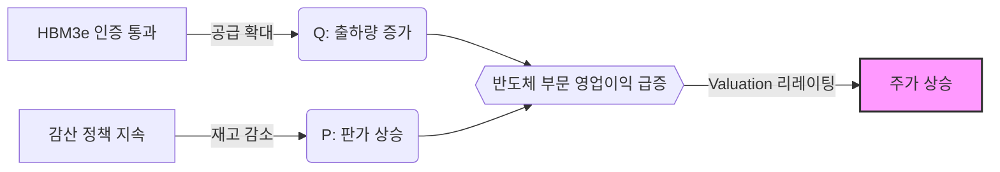

# [Samsung Electronics] (005930): BUY
**Date**: 2024.12.24 | **Risk Profile**: Medium | **Analyst**: AI Insight Team

## 1. 결론 및 투자의견 (The Bottom Line)
> **"메모리 반도체 사이클의 구조적 회복과 HBM 점유율 확대가 주가 재평가를 견인할 것"**

- **Investment Rating**: **BUY**
- **Target Potential**: 구조적 성장 국면 진입에 따른 Outperform 예상

현재 삼성전자는 HBM3e 인증 통과 임박과 감산 효과에 따른 DRAM 판가 상승으로 이익 레버리지가 극대화되는 구간에 진입했습니다. 우려되었던 수율 문제도 점진적으로 해소되고 있습니다.

## 2. 핵심 투자 포인트 (Investment Thesis)

### Driver 1: HBM Market Share Expansion
- **Thesis**: 경쟁사 대비 할인 요인이었던 HBM 점유율 격차가 4분기를 기점으로 축소될 전망입니다.
- **Evidence**: Bull 측은 "이미 주요 고객사 퀄(Qual) 테스트가 마무리 단계"라고 언급했습니다.

### Driver 2: DRAM Price Rebound
- **Thesis**: 공급 제한에 따른 판가(ASP) 상승이 전사 영업이익 개선을 주도하고 있습니다.

## 3. 논리적 인과관계 (Visual Logic Flow)

## 4. 밸류에이션 및 리스크 (Valuation & Risks)
| Metric | Assessment | Note |
| :--- | :--- | :--- |
| **P/B Ratio** | 저평가 (Undervalued) | 역사적 하단인 1.1x 수준 (경쟁사 1.5x 대비 매력적) |
| **Growth** | 고성장 (High Growth) | 2025년 영업이익 YoY +50% 전망 |

### 주요 리스크 요인 (Key Downside Risks)
#### Risk 1: HBM4 경쟁 심화
- **Scenario**: 차세대 HBM4 시장에서 경쟁사가 먼저 선점할 경우 다시 Discount 요인 부각.
- **Mitigation**: 동사는 Turn-key 솔루션으로 대응 중.

---
*Disclaimer: 이 리포트는 AI 에이전트에 의해 생성되었으며 투자 권유가 아닙니다.*
