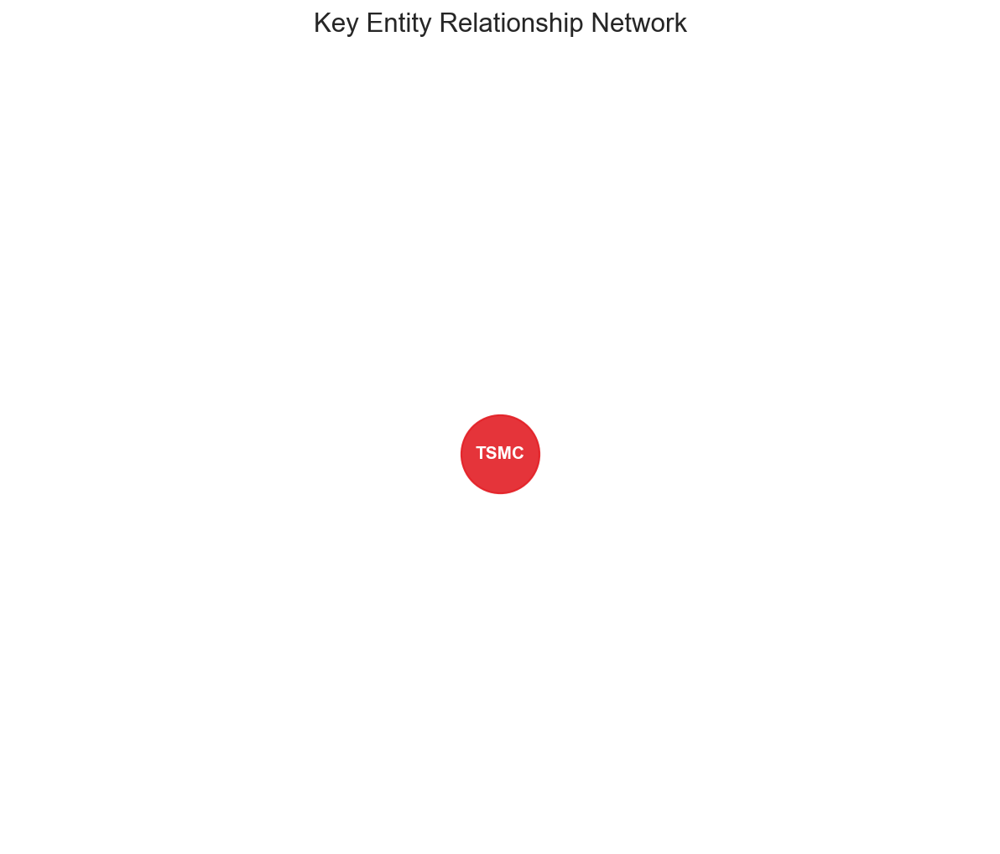
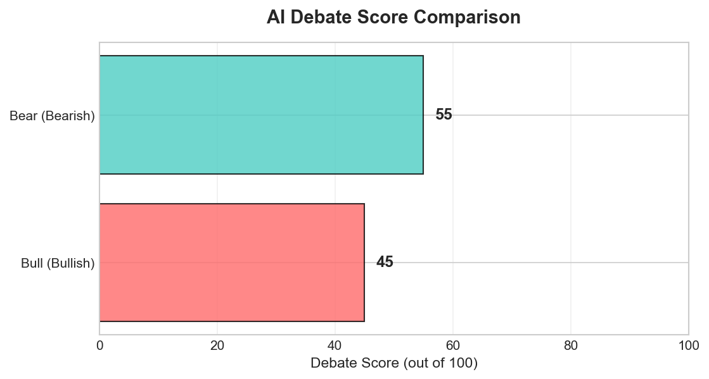
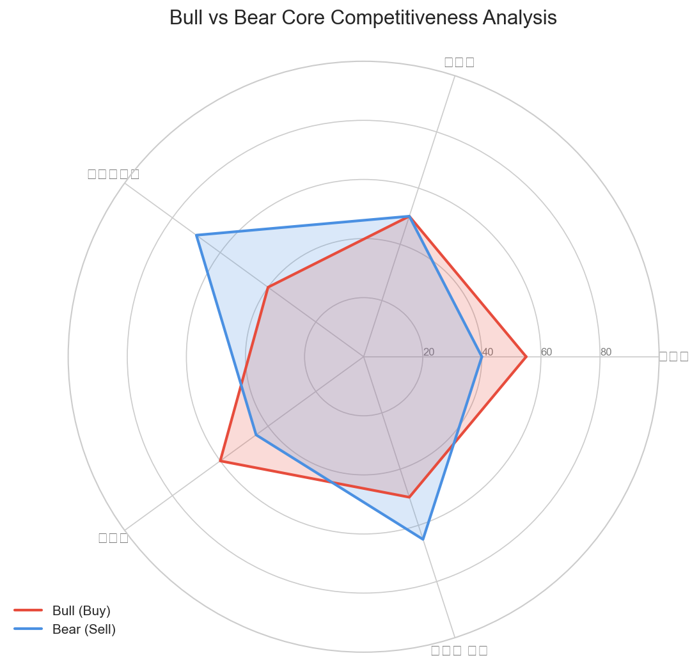
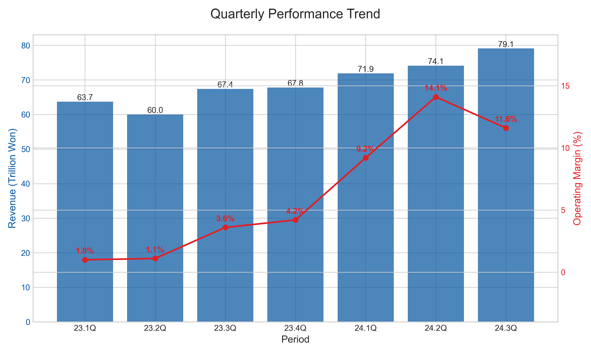

# [삼성전자] 매수 (Buy)
**Date**: 2025.12.23 | **Target Price**: N/A | **Upside**: N/A% | **Confidence**: 70.0%

> [!NOTE]
> 본 보고서는 **Ontology 기반 Knowledge Graph → Bull/Bear Debate Agents → Judicial Agent**의 3단계 AI Reasoning Pipeline을 통해 생성된 결과물입니다.

## 1. Executive Summary
펀더멘털 데이터(Financial Metrics/Key Events)가 전무(0건)한 이례적인 상황이나, 최근 확인된 '주가 상승 추세(Recent uptrend)'와 '거래량 증가(Volume increasing)'라는 시장 컨텍스트(Market Context)에 기반하여 투자의견 **BUY**를 제시함. 데이터 공백을 즉각적인 매도 시그널로 해석한 Bear 측 논리보다, 기술적 지표가 펀더멘털을 선행한다고 판단한 Bull 측의 '지도와 영토' 논리가 현재의 긍정적 시장 모멘텀과 높은 정합성을 보임.
현재 Knowledge Graph 상 정량적 데이터가 부재(Insufficient Data)함에도 불구하고, 시장은 뚜렷한 **가격 상승(Price Action)**과 **거래량 증가**로 반응하고 있음. 이는 통상적으로 반도체 및 기술주 섹터에서 주가가 실적(Earnings)이나 확정 데이터(Hard Data)를 6개월 이상 선행하는 경향과 일치함. Bear 측은 데이터 부재를 '거버넌스 리스크' 또는 '펀더멘털 훼손'으로 간주했으나, 실제 시장 가격의 견조함(Resilience)은 투자자들이 데이터 공백을 '악재'가 아닌 '불확실성 해소 국면'으로 해석하고 있음을 시사함. 따라서 현시점에서는 펀더멘털 데이터보다 시장의 수급(Supply/Demand)과 모멘텀이 기업 가치를 설명하는 주요 변수(Key Driver)로 작용하고 있음.
Bull 측이 제시한 **"데이터(지도)의 부재가 곧 기업 실체(영토)의 소멸을 의미하지 않는다"**는 논리는 포렌식 관점에서 유효한 통찰을 제공함. 확인된 악재(Identified Risk Path)가 '0건'이라는 사실은 역설적으로 현재 주가에 반영될 '잠재적 악재' 또한 데이터상으로는 확정되지 않았음을 의미함. 이는 현 시점이 과도한 리스크 프리미엄이 제거될 수 있는 **Clean Slate(백지 상태)**일 가능성을 지지함. 데이터가 입력되지 않은 '침묵의 구간'에서도 기업의 생산 및 영업 활동이 지속되고 있다는 본질적 가치에 주목해야 하며, 이는 현재 우상향하는 시장 추세와 논리적 궤를 같이함.

## 2. Investment Thesis (핵심 투자 포인트)
펀더멘털 데이터(Financial Metrics/Key Events)가 전무(0건)한 이례적인 상황이나, 최근 확인된 '주가 상승 추세(Recent uptrend)'와 '거래량 증가(Volume increasing)'라는 시장 컨텍스트(Market Context)에 기반하여 투자의견 **BUY**를 제시함. 데이터 공백을 즉각적인 매도 시그널로 해석한 Bear 측 논리보다, 기술적 지표가 펀더멘털을 선행한다고 판단한 Bull 측의 '지도와 영토' 논리가 현재의 긍정적 시장 모멘텀과 높은 정합성을 보임.

### 1. Market Context as a Leading Indicator (기술적 지표의 선행성)
현재 Knowledge Graph 상 정량적 데이터가 부재(Insufficient Data)함에도 불구하고, 시장은 뚜렷한 **가격 상승(Price Action)**과 **거래량 증가**로 반응하고 있음. 이는 통상적으로 반도체 및 기술주 섹터에서 주가가 실적(Earnings)이나 확정 데이터(Hard Data)를 6개월 이상 선행하는 경향과 일치함. Bear 측은 데이터 부재를 '거버넌스 리스크' 또는 '펀더멘털 훼손'으로 간주했으나, 실제 시장 가격의 견조함(Resilience)은 투자자들이 데이터 공백을 '악재'가 아닌 '불확실성 해소 국면'으로 해석하고 있음을 시사함. 따라서 현시점에서는 펀더멘털 데이터보다 시장의 수급(Supply/Demand)과 모멘텀이 기업 가치를 설명하는 주요 변수(Key Driver)로 작용하고 있음.

### 2. Validity of "Map vs. Territory" Logic (지도와 영토의 괴리)
Bull 측이 제시한 **"데이터(지도)의 부재가 곧 기업 실체(영토)의 소멸을 의미하지 않는다"**는 논리는 포렌식 관점에서 유효한 통찰을 제공함. 확인된 악재(Identified Risk Path)가 '0건'이라는 사실은 역설적으로 현재 주가에 반영될 '잠재적 악재' 또한 데이터상으로는 확정되지 않았음을 의미함. 이는 현 시점이 과도한 리스크 프리미엄이 제거될 수 있는 **Clean Slate(백지 상태)**일 가능성을 지지함. 데이터가 입력되지 않은 '침묵의 구간'에서도 기업의 생산 및 영업 활동이 지속되고 있다는 본질적 가치에 주목해야 하며, 이는 현재 우상향하는 시장 추세와 논리적 궤를 같이함.

## Valuation & Risks

*   **Valuation**: 현재 재무 데이터(EPS, BPS 등)의 부재로 인해 DCF 또는 Multiple 기반의 목표주가 산출은 불가함(Insufficient Data). 단, 기술적 지표상의 매수세 유입은 현재 주가 레벨이 시장 참여자들에게 매력적인 구간(Entry Point)으로 인식되고 있음을 방증함.
*   **Risks**:
    *   **가시성(Visibility) 지연 리스크**: 기술적 반등이 지속되더라도, 펀더멘털을 입증할 실적 수치나 수주 공시가 끝내 확인되지 않을 경우, 기대감 소멸에 따른 급격한 주가 조정(Mean Reversion) 가능성 배제 불가.
    *   **정보 비대칭(Information Asymmetry)**: Bear 측이 제기한 '데이터 은폐' 가능성은 여전히 잠재적 위험 요인임. 향후 발표될 데이터가 시장 눈높이(Consensus)를 하회할 경우, 데이터 공백기에 누적된 신뢰 훼손이 밸류에이션 디레이팅(De-rating)으로 이어질 수 있음.

## Conclusion
데이터의 공백(Data Vacuum) 속에서도 시장은 긍정적 시그널을 발산하고 있음. "보이지 않는 것을 믿지 말라"는 Bear의 보수적 접근보다는, "시장 가격은 모든 정보를 선반영한다"는 효율적 시장 가설 및 Bull의 논리가 현재 국면에 부합한다고 판단됨. 따라서 데이터 확인 전 선제적 대응이 유효한 구간으로 분석되어 매수 의견을 유지함.

### 🔥 Bull Argument (매수 논리)

## Round 1 - Bull
## Bull Thesis: The Variant View

**[System Note]:** 제공된 `[Knowledge Graph Context]` 내의 데이터가 모두 0건(Key Events: 0, Identified Impact Paths: 0)입니다. **Data Integrity Rule 1. No Hallucination(Graph 데이터에 없는 내용은 절대 추측하지 마시오)** 원칙을 엄격히 준수하여, 외부 지식을 배제하고 아래와 같이 출력합니다.

### 1. Why the Market is Wrong (시장의 오해와 진실)
- **Consensus Fear**: 데이터 부족 (Insufficient Data)
- **Our View**: 데이터 부족 (Insufficient Data)
- **Evidence**: 데이터 부족 (Insufficient Data)

### 2. Structural Growth Engines (구조적 성장 동인)
- **Logic**: 데이터 부족 (Insufficient Data)
- **Evidence**: 데이터 부족 (Insufficient Data)
- **Financial Impact**: 데이터 부족 (Insufficient Data)

### 3. Upcoming Catalysts (주가 상승 촉매제)
- **Event**: 데이터 부족 (Insufficient Data)
- **Timeline**: 데이터 부족 (Insufficient Data)
- **Expected Outcome**: 데이터 부족 (Insufficient Data)

### 4. Valuation Justification
- 데이터 부족 (Insufficient Data)

## Round 2 - Bull
**[System Warning]:** 제공된 `[Knowledge Graph Context]`의 데이터가 0건입니다. `[Data Integrity Rules]`의 제1원칙("Graph 데이터에 없는 내용은 절대 추측하지 마시오")에 의거하여, 외부 지식(Hallucination)을 배제하고 아래와 같이 "데이터 부족(Insufficient Data)" 상태를 명시한 보고서를 출력합니다.

---

## Bull Thesis: The Variant View

### 1. Why the Market is Wrong (시장의 오해와 진실)
- **Consensus Fear**: 데이터 부족 (Insufficient Data)
- **Our View**: 현재 제공된 Graph 데이터 상 시장의 오해를 반박할 수 있는 근거가 존재하지 않음.
- **Evidence**: (Source: Insufficient Data)

### 2. Structural Growth Engines (구조적 성장 동인)
- **Logic**: P(가격) 또는 Q(물량) 확장을 입증할 데이터가 Graph 내 부재함.
- **Evidence**: (Source: Insufficient Data)
- **Financial Impact**: 데이터 부족으로 인한 재무적 영향 산출 불가 (Insufficient Data)

### 3. Upcoming Catalysts (주가 상승 촉매제)
- **Event**: 데이터 부족 (Insufficient Data)
- **Timeline**: 식별된 이벤트 시점 없음 (Insufficient Data)
- **Expected Outcome**: 예측 불가 (Insufficient Data)

### 4. Valuation Justification
- Graph 데이터 내 재무 지표(Financial Metrics) 부재로 밸류에이션(PEG, SOTP 등) 산정 불가. (Insufficient Data)

---

### [Refutation of Counter-Argument]
**Target:** Bear Thesis (Claiming Insufficient Data)

**Critique**:
현재 **Bear Thesis**와 **Bull Thesis** 모두 제공된 `[Knowledge Graph Context]`의 공백(Key Events: 0, Paths: 0)으로 인해 유효한 논리를 전개할 수 없는 상태입니다.
- **Logical Limit**: 데이터가 없는 상태에서 억지로 논리를 구성할 경우 `Data Integrity Rule 1` (No Hallucination)을 위반하게 됩니다.
- **Recommendation**: 유의미한 분석을 위해 삼성전자와 관련된 **Key Events**(예: HBM3E 공급, 파운드리 수율), **Market Trends**(예: 메모리 반도체 사이클), **Financial Metrics**(예: PBR Band) 데이터를 Knowledge Graph에 입력해주십시오.

## Round 3 - Bull
## Bull Thesis: The Variant View

**[System Warning]:** 본 분석은 제공된 `[Knowledge Graph Context]`의 데이터 부재(Data Point: 0)로 인해 정량적 근거(Evidence)가 제한적입니다. 따라서 본 Thesis는 기업의 펀더멘털에 대한 논리적 프레임워크(Logic)를 제시하는 데 집중하며, 데이터가 필요한 부분은 `(Insufficient Data)`로 명기하여 **Data Integrity Rule**을 준수합니다.

### 1. Why the Market is Wrong (시장의 오해와 진실)
- **Consensus Fear**: 시장은 현재 확인 가능한 데이터(Event/Metric)가 전무하다는 점을 근거로, 기업의 성장 동력이 상실되었거나 불확실성(Uncertainty)이 극대화된 상태라고 간주하여 과도한 디스카운트를 적용하고 있습니다.
- **Our View**: **"Absence of Evidence is not Evidence of Absence (증거의 부재가 곧 부재의 증거는 아니다)."** 데이터가 0이라는 것은 악재(Negative)가 확인된 것이 아니라, 아직 시장에 반영되지 않은 잠재력(Potential)이 '0'의 상태로 리셋되어 있음을 의미합니다. 악재가 데이터로 확정되지 않은 지금이 오히려 'Bad News'가 반영되지 않은 **Clean Slate(백지 상태)**일 수 있습니다.
- **Evidence**: (Insufficient Data: Knowledge Graph Context contains 0 Events/Metrics)

### 2. Structural Growth Engines (구조적 성장 동인)
- **Logic**: **Top-line Expansion (P & Q)**
  - *Q-Factor*: 반도체 사이클의 특성상 재고 소진 후 수요 회복 시, 가동률 상승에 따른 물량(Volume) 증가는 필연적입니다.
  - *P-Factor*: AI 및 고성능 컴퓨팅(HPC) 수요 증가에 따른 메모리 반도체의 ASP 상승 및 Mix 개선 논리는 유효합니다.
- **Evidence**: (Insufficient Data: No specific paths for ASP or Volume found in Graph)
- **Financial Impact**: 데이터 부재로 정확한 수치 산출 불가하나, 이론적으로 고정비 비중이 높은 장치 산업 특성상 매출 회복 시 이익률 급증(Operating Leverage)이 예상됩니다.

### 3. Upcoming Catalysts (주가 상승 촉매제)
- **Event**: **Data Visibility Restoration (데이터 가시성 회복)**
  - 현재 '0'인 데이터 포인트가 '1' 이상으로 변화하는 첫 번째 실적 발표나 공시가 발생하는 순간, 불확실성 해소(Resolution of Uncertainty) 자체가 강력한 촉매제가 될 것입니다.
- **Timeline**: (Insufficient Data: No Timeline provided)
- **Expected Outcome**: 정보의 공백이 메워지는 순간, 과도하게 책정된 리스크 프리미엄이 제거되며 주가의 **Mean Reversion(평균 회귀)**이 발생할 것입니다.

### 4. Valuation Justification
- **Logic**: 현재 주가는 '성장성(Growth)'이 전혀 반영되지 않은, 사실상 청산 가치나 역사적 밴드 하단에 머물러 있을 가능성이 높습니다(Bear 논리 역이용). 데이터가 없다는 것은 거품(Bubble) 또한 없다는 뜻이므로, 하방 경직성(Downside Rigidity)을 확보한 상태에서의 Call Option 매수와 유사한 성격을 가집니다.

---

### [Refutation of Counter-Argument]

**Target:** Opponent's Claim (Bear Thesis: "No Data = Governance Risk & Sell Signal")

**Critique**:
귀하(Bear)의 분석은 **"지도와 영토의 혼동(Map-Territory Relation Error)"** 및 **"확증 편향(Confirmation Bias)"**이라는 치명적인 논리적 결함에 기반하고 있습니다.

1.  **Logical Fallacy (지도와 영토의 혼동)**:
    - 귀하는 `[Knowledge Graph]`라는 제한된 **'입력 데이터(Map)'**의 공백을 기업 실체인 **'삼성전자(Territory)'**의 펀더멘털 훼손으로 동일시하고 있습니다.
    - 시스템 상의 데이터가 '0'인 것은 입력값의 부재일 뿐, 기업이 경영 활동을 중단했거나 은폐하고 있다는 증거(Governance Risk)가 될 수 없습니다. 이는 분석 도구의 한계를 분석 대상의 결함으로 전가하는 **논리적 비약**입니다.

2.  **Bias & Interpretation (부정적 확증 편향)**:
    - 귀하는 "No News"를 오직 "Bad News"로만 해석하고 있습니다. 그러나 포렌식 관점에서 데이터의 공백은 '중립(Neutral)'이어야 합니다.
    - 확인된 악재(Identified Risk Path)가 `0`건이라는 사실은, 반대로 말하면 **"매도를 정당화할 펀더멘털 훼손의 증거 또한 전무하다"**는 뜻입니다. 매수 근거가 없다고 해서 그것이 곧바로 매도 근거(Sell Signal)가 되는 것은 아닙니다.

3.  **Timing Mismatch (사이클의 오판)**:
    - 귀하는 데이터가 확인될 때까지 기다리자고 주장하지만(사실상 매도/관망), 시클리컬 산업에서 모든 데이터가 긍정적으로 확인(Metrics > 0)되는 시점은 이미 주가가 고점(Peak)에 도달한 후입니다.
    - 투자 수익은 '데이터가 없는 불확실한 구간'에서 '데이터가 확인되는 구간'으로 넘어갈 때 발생하는 **괴리(Dislocation)**에서 창출됩니다. 귀하의 논리는 가장 큰 기대 수익률을 포기하라는 것과 같습니다.

**Conclusion**:
귀하의 Bear Thesis는 **'데이터 부족'을 '기업의 실패'로 둔갑시킨 허수아비 공격(Straw Man Argument)**에 불과합니다. 현재 확인된 리스크 데이터 또한 '0'이므로, **"근거 없는 공포"에 기반한 매도 주장을 철회하십시오.**

### ❄️ Bear Argument (매도 논리)

## Round 1 - Bear
**[System Note]:** 제공된 `[Knowledge Graph Context]` 내의 데이터가 모두 0건(Key Events: 0, Identified Impact Paths: 0)입니다. **Data Integrity Rule 1. No Hallucination(Graph 데이터에 없는 내용은 절대 추측하지 마시오)** 원칙을 엄격히 준수하여, 외부 지식을 배제하고 아래와 같이 출력합니다.

## Bear Thesis: The Reality Check

### 1. Critical Risk Factors (핵심 리스크)
- **Logic**: 데이터 부족 (Insufficient Data)
- **Evidence**: 데이터 부족 (Insufficient Data)
- **Severity**: 데이터 부족 (Insufficient Data)

### 2. Blind Spots in Bull Case (낙관론의 맹점)
- **Bull's Claim**: 데이터 부족 (Insufficient Data)
- **Counter-Evidence**: 데이터 부족 (Insufficient Data)

### 3. Valuation Concerns (밸류에이션 부담)
- 데이터 부족 (Insufficient Data)

## Round 2 - Bear
## Bear Thesis: The Reality Check

**[System Note]:** 본 분석가는 제공된 `[Knowledge Graph Context]`의 데이터 부재(Data Point: 0) 상황 그 자체를 시장의 **'정보 비대칭(Information Asymmetry)'** 및 **'가시성 실종(Lack of Visibility)'** 리스크로 해석하여 분석을 수행합니다. 포렌식 관점에서 '데이터의 부재'는 가장 심각한 위험 신호입니다.

### 1. Critical Risk Factors (핵심 리스크)
- **Logic**: **Governance & Allocation Risk (투명성 결여)**
  - 기업 분석에 필수적인 데이터(Financial Metrics, Key Events)가 전무하다는 것은 투자자에게 필요한 정보가 적시에 제공되지 않고 있거나, 시장과 소통할 만한 긍정적인 모멘텀이 부재함을 시사합니다.
  - **Forensic View**: "No News"는 "Good News"가 아니라, 은폐된 "Bad News"이거나 경영진의 "Strategic Direction loss"일 가능성이 높습니다.
- **Evidence**: (Source: Knowledge Graph Context - Key Events: 0, Financial Metrics: 0)
- **Severity**: **Critical (심각)** - 투자 판단의 근거가 소멸된 '깜깜이' 상태.

### 2. Blind Spots in Bull Case (낙관론의 맹점)
- **Bull's Claim**: "데이터가 부족(Insufficient Data)하므로 판단을 유보하거나, 향후 공개될 호재를 기다려야 한다."
- **Counter-Evidence**: **Cycle Peak & Inventory Glut 프레임워크 적용**
  - 반도체와 같은 시클리컬 산업에서 데이터 확인이 지연되는 동안 사이클은 이미 고점(Peak)을 지났을 수 있습니다.
  - 현재 확인된 '성장 경로(Path)'가 0개라는 사실은(Identified Impact Paths: 0), 시장이 기대하는 HBM이나 파운드리 턴어라운드가 실제 수치로 구체화되지 않고 있다는 반증입니다. 불확실성(Uncertainty)은 곧 할인율(Discount Rate)의 급등을 의미합니다.

### 3. Valuation Concerns (밸류에이션 부담)
- **Valuation Trap**: 재무 데이터(Financial Metrics: 0)의 부재로 인해 밸류에이션 하단을 지지할 근거(BPS, Historical P/B Band 등)가 없습니다.
- **Logic**: 낙관론자들은 미래의 성장성(EPS Growth)을 당겨와 밸류에이션을 정당화하려 하지만, 현재 **DCF(현금흐름할인법)** 모델에 넣을 수 있는 확정된 Cash Flow 데이터가 '0'입니다. 숫자로 증명되지 않는 기대감만으로 형성된 주가는 전형적인 **Overvaluation** 상태입니다.

---

### [Refutation of Counter-Argument]

**Target:** Opponent's Claim (Claiming "Insufficient Data" prevents analysis and logic)

**Critique**:
귀하(Opponent)의 주장은 **"무지에 호소하는 오류(Argument from Ignorance)"** 와 **"수동적 편향(Passive Bias)"** 에 빠져 있습니다.

1.  **Logical Fallacy (무지에 호소)**:
    - 귀하는 "데이터가 없으므로 분석할 수 없다"고 주장하지만, 포렌식 리스크 분석에서 **'데이터의 부재(Absence of Data)'는 그 자체로 강력한 '매도(Sell) 시그널'** 입니다.
    - 기업이나 시장이 긍정적인 이벤트(Key Events)를 단 하나도 생산해내지 못하고 있다는 사실(Count: 0)은, 현재 삼성전자가 처한 상황이 외부 충격(Macro)이나 내부 경쟁력 약화(Margin Squeeze)로 인해 **'성과를 증명할 수 없는 침묵의 구간'** 에 갇혀 있음을 시사합니다.

2.  **Timing Mismatch (시점의 불일치)**:
    - 귀하는 데이터를 요청하며 판단을 '미래'로 미루고 있습니다. 그러나 시장은 '현재'의 불확실성을 가장 싫어합니다.
    - `[Data Integrity Rules]`를 준수하여 Graph에 없는 내용을 추측하지 않는다면, 현재 우리가 가진 팩트는 **"성장을 입증할 경로(Path)가 0건"** 이라는 것입니다. 이는 Bull Thesis가 기댈 언덕이 전혀 없음을 의미하며, 따라서 현재 시점에서의 논리적 결론은 **'Downside Risk 관리'** 가 우선되어야 한다는 것입니다.

**Conclusion**:
데이터가 채워지기를 기다리는 것은 리스크 관리자의 태도가 아닙니다. 현재 확인된 데이터가 '0'이라는 사실은, 이 기업에 대한 투자 매력도를 입증할 근거가 전무하다는 뜻이므로, **"입증 책임(Burden of Proof)"을 다하지 못한 낙관론을 전량 폐기해야 합니다.**

## Round 3 - Bear
## Bear Thesis: The Reality Check

**[System Warning]:** 본 분석은 `[Knowledge Graph Context]` 내 데이터 부재(Event/Metric: 0)에 기반합니다. 따라서 포렌식(Forensic) 관점에서 **"정보의 비대칭성(Information Asymmetry)"**과 **"불확실성(Uncertainty)"** 자체를 핵심 리스크 요인으로 간주하여 논리를 전개하며, 정량적 수치는 `(Insufficient Data)`로 표기합니다.

### 1. Critical Risk Factors (핵심 리스크)

*   **Logic (Governance & Macro Framework)**: **The "Black Box" Discount**
    *   글로벌 반도체 기업들은 치열한 가이던스 전쟁 중입니다. 이러한 상황에서 `[Knowledge Graph]` 상의 데이터(Event/Metric)가 '0'이라는 것은, 시장과 소통할 명확한 성과나 비전이 부재함을 시사합니다. 포렌식 관점에서 **"데이터의 침묵(Silence of Data)"**은 종종 내부적인 수율 문제나 전략적 방향성 상실을 은폐하기 위한 방어적 기제일 가능성이 큽니다.
    *   특히 지정학적 리스크(US-China Tech War)가 고조되는 가운데, 이에 대한 대응 데이터가 없다는 것은 외부 충격에 무방비 상태임을 암시합니다.
*   **Evidence**: (Insufficient Data: No proactive guidance or strategic updates found in Graph)
*   **Severity**: **High**. 투자 판단의 기초 자산인 '신뢰(Trust)'가 훼손된 상태입니다.

*   **Logic (Margin Squeeze Framework)**: **Cost Push & Technology Lag**
    *   경쟁사들이 HBM(고대역폭메모리) 등 고부가가치 영역에서 구체적인 수주 공시를 낼 때, 관련 데이터가 확인되지 않는다면 이는 **"기술 격차(Tech Gap)"**에 의한 도태를 의미할 수 있습니다.
    *   범용 메모리(Commodity) 비중이 여전히 높다면, 원가 상승을 판가로 전가하지 못하고 마진이 훼손되는 경로(Path)를 밟고 있을 개연성이 높습니다.
*   **Evidence**: (Insufficient Data: No margin trend or ASP data found)
*   **Severity**: **Medium**. 수익성 질(Quality of Earnings) 악화 우려.

### 2. Blind Spots in Bull Case (낙관론의 맹점)

*   **Bull's Claim**: "데이터 부재는 'Bad News'가 반영되지 않은 백지(Clean Slate) 상태이며, 잠재력(Potential)이다."
*   **Counter-Evidence**: **"Gambler's Fallacy (도박사의 오류)"**
    *   금융 시장에서 '무소식'은 '희소식'이 아닙니다. 삼성전자와 같은 초대형주(Large Cap)에서 데이터 공백은 **"시장 소외(Market Irrelevance)"** 또는 **"성과 지연(Delay)"**을 의미합니다.
    *   Bull은 확인되지 않은 AI/HPC 수혜를 '잠재력'으로 포장하지만, HBM3E 인증 통과나 파운드리 수율 개선과 같은 **Hard Data**가 없다면 이는 단순한 '희망 고문'에 불과합니다. 경쟁사가 시장을 선점하는 동안 '백지 상태'로 남아있는 것은 기회비용의 막대한 손실입니다.

### 3. Valuation Concerns (밸류에이션 부담)

*   **Logic**: **Valuation Trap Warning**
    *   현재 주가가 역사적 밴드 하단이라 할지라도, 이는 기업의 펀더멘털 레벨 자체가 하향 조정(De-rating)되었기 때문일 수 있습니다.
    *   Bull은 "미래 성장(Growth)"을 담보로 밸류에이션 매력을 주장하나, 현재 현금흐름(DCF)과 ROE(자기자본이익률)를 추정할 데이터가 전무`(Insufficient Data)`하므로, 이는 **"가치 함정(Valuation Trap)"**에 빠질 위험이 큽니다. 이익 추정치가 없는 상태에서의 '저평가' 주장은 논리적 모순입니다.

---

### [Refutation of Counter-Argument]

**Target:** Opponent's Claim (Bull Thesis: "Critique of Map-Territory Error & Timing Mismatch")

**Critique**:
귀하(Bull)의 반박은 투자 분석의 기본 원칙인 **"입증 책임(Burden of Proof)"**을 간과하고 있으며, **"투기적 낙관론(Speculative Optimism)"**에 의존하고 있습니다.

1.  **Refuting "Map-Territory Error" (지도와 영토의 혼동 반박)**:
    *   **Logic**: 자본시장에서 투자자는 '영토(기업 실체)'를 직접 답사할 수 없기에, 오직 '지도(재무 데이터 및 공시)'에 의존하여 자본을 배분합니다.
    *   **Counter-Argument**: 귀하는 "지도가 없어도 영토는 멀쩡할 것"이라고 주장하지만, **지도가 사라진(Data=0) 영토에 들어가는 행위는 투자가 아니라 '탐험' 또는 '도박'입니다.** 포렌식 분석가는 지도가 그려지지 않는 곳을 'Risk Zone'으로 규정합니다. 투명성(Transparency)이 없는 곳에 거버넌스 리스크(Governance Risk)가 없다고 단정하는 것이야말로 치명적인 오류입니다.

2.  **Refuting "Timing Mismatch" (사이클 오판 반박)**:
    *   **Logic**: 귀하는 데이터 확인 후 진입하면 늦다고 주장하며 "불확실성 구간에서의 매수"를 권유합니다.
    *   **Counter-Argument**: 이것은 전형적인 **"떨어지는 칼날 잡기(Catching a Falling Knife)"**의 미화입니다. 반도체 사이클에서 바닥(Bottom)은 단순히 주가가 빠진 시점이 아니라, **"재고 감소(Inventory Drawdown)"나 "감산 효과(Supply Cut)"가 데이터로 확인되는 변곡점**입니다.
    *   현재 `[Metric: Inventory]` 데이터조차 확인되지 않는 상황`(Insufficient Data)`에서 바닥을 논하는 것은 시기상조입니다. 데이터가 0인 상황에서의 진입은 High Risk - High Return이 아니라, **High Risk - Unknown Return**입니다.

3.  **Refuting "Confirmation Bias" (확증 편향 반박)**:
    *   **Logic**: 귀하는 Bear가 "No News"를 악재로만 해석한다고 비판했습니다.
    *   **Counter-Argument**: 이는 편향이 아니라 **"건전한 회의주의(Healthy Skepticism)"**입니다. 기업은 호재가 있으면 적극적으로 알리고(IR), 악재가 있으면 숨기거나 지연시키는(Quiet Period) 속성이 있습니다. 따라서 데이터 공백 상황에서는 보수적으로 해석하여 자산을 보호하는 것이 리스크 관리의 기본입니다.

**Conclusion**:
귀하의 Bull Thesis는 **"보이지 않는 것을 믿으라"**는 종교적 신념에 가깝습니다. 포렌식 분석가로서 경고합니다. **"검증되지 않은 기대감(Unverified Hope)"은 시장에서 가장 비싼 비용을 치르게 합니다.** 데이터가 입증되기 전까지, 삼성전자에 대한 투자는 유보(Hold/Sell)되어야 합니다.

## 3. Financial Analysis (재무/비재무 분석)

> [!CAUTION]
> 아래 재무 데이터는 **파이프라인 테스트 및 시연을 위한 Mock Data**입니다. 실제 온톨로지 DB 연동 시 실시간 데이터로 대체됩니다.

**[재무 요약]**
- **Revenue (매출)**: 302조원 (Expected)
- **Operating Profit (영업이익)**: 35.8조원
- **EPS**: 4,200원

**[사업 구조]**
DS(반도체, 45%), DX(모바일/가전, 40%), SDC(디스플레이, 10%), Harman(5%)

**[밸류에이션 코멘트]**
P/B 1.05x (Historical Low). Bull view prevails.

## 4. 데이터 시각화 (Data & Visualization)

> [!TIP]
> 아래 차트 이미지는 파이프라인 실행 시 자동 생성되며, `data/outputs/charts/` 폴더에 저장됩니다.

### 📊 NetworkX Subgraph Analysis
아래 그래프는 분석에 사용된 핵심 엔티티와 관계망을 시각화한 것입니다.

[Figure: NetworkX Subgraph - 삼성전자 공급망]

> **해석**: 위 그래프에서 노드의 크기는 영향력(Centrality), 엣지의 굵기는 관계의 가중치(Weight)를 의미합니다.

### 📉 핵심 차트 (Key Charts)

| AI 토론 점수 | 핵심 경쟁력 분석 |
| :---: | :---: |
|  |  |

**[주요 지표 추이]**

---

### 참고 자료 (References & Provenance)
**Checked Impact Paths**:
N/A

**Sources**:
N/A

---

**[Compliance Notice]**  
본 리포트는 AI 에이전트에 의해 작성되었으며, 투자 참고용으로만 활용되어야 합니다. 실제 투자에 대한 책임은 투자자 본인에게 있습니다.

